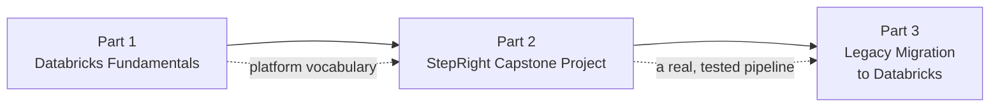

# Before you start

Three short lectures before any hands-on work: what this guide covers and how it's organized,
what you need to already know, and how the material itself is laid out. If you've read a course
syllabus before, skim this section in a couple of minutes and move on -- there's nothing here
you'll need to refer back to later.

## Lectures

| # | Lecture | Est. Read |
|---|---------|-----------|
| 1 | [About the Course]({{ '/01-databricks-fundamentals/01-before-you-start/about-the-course/' | relative_url }}) | 3 min read |
| 2 | [Course Prerequisites]({{ '/01-databricks-fundamentals/01-before-you-start/course-prerequisites/' | relative_url }}) | 3 min read |
| 3 | [How to access Course Material and Resources]({{ '/01-databricks-fundamentals/01-before-you-start/how-to-access-course-material-and-resources/' | relative_url }}) | 2 min read |

<!-- prevnext:start -->

---

| [&larr; Previous: Databricks Fundamentals]({{ '/01-databricks-fundamentals/' | relative_url }}) | [Next: About the Course &rarr;]({{ '/01-databricks-fundamentals/01-before-you-start/about-the-course/' | relative_url }}) |
|:---|---:|

<!-- prevnext:end -->
