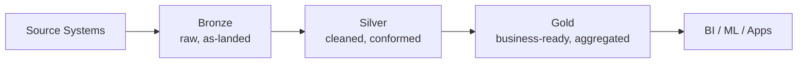

# Introduction to Data Engineering
{: .no_toc }

*Estimated read: 9 min*

Every data engineering problem, whatever the tool, comes down to the same three questions: how do
you get data in reliably, how do you transform it into something trustworthy, and how do you serve
it to the people and systems that need it -- without the whole thing quietly rotting the moment
volume or schema changes. You've solved this before with a legacy warehouse and an ETL tool. This
lecture reframes that same problem in Databricks' vocabulary, because the problem hasn't changed --
only the platform has.

## The problem, restated

In a classic warehouse stack, you likely had something like: a nightly Talend or Informatica job
pulling from source systems, landing files or database extracts somewhere, a staging schema, a set
of transformation SQL scripts or stored procedures, and a final set of reporting tables a BI tool
queried. Each of those pieces was usually a *separate system* -- separate compute, separate
scheduling, separate access control -- glued together by file drops, cron, and institutional
memory about "the order things have to run in."

**Databricks' pitch is to collapse that whole stack onto one platform**, with one storage format,
one governance layer, and one orchestration system, running on **Apache Spark** as the processing
engine underneath everything. That doesn't remove the underlying complexity of data engineering --
it removes the *integration* complexity of stitching five separate tools together and hoping their
failure modes don't compound.

## The Medallion architecture, in one paragraph

You'll get a full section on this later (**Medallion Architecture -- Design and Implementation**),
but the shape of it matters now because everything else in this guide assumes it: data lands
as-is in a **bronze** layer (minimally transformed, close to the source), gets cleaned, validated,
and conformed in a **silver** layer (the equivalent of your old "staging" or "integration" schema,
but versioned and queryable at every stage), and finally gets aggregated into business-ready
**gold** tables (your old reporting/mart layer). The names are new; the shape is one you already
built by hand with staging tables and a warehouse schema.

**Key term:** this three-layer pattern is called the **Medallion architecture**, and unlike a
warehouse's staging-to-mart pipeline, all three layers live as queryable tables in the same
governed catalog -- an analyst can query bronze directly for debugging without you building a
separate access path.

## Batch and streaming, on the same engine

In your legacy stack, "streaming" almost certainly meant a different product entirely -- a
message queue plus a separate stream-processing framework, bolted onto a warehouse built for
batch. Spark's **Structured Streaming** API treats a stream as, conceptually, a table that keeps
growing, and you write the *same* DataFrame transformations against it that you'd write against a
static batch table. On Databricks specifically, this is exposed through **Auto Loader** for
incremental file ingestion and **streaming tables** inside Lakeflow Declarative Pipelines -- both
covered in depth later in this part. The practical implication: you don't maintain two codebases
for "the batch version" and "the streaming version" of the same logic.

## Where Databricks fits versus what you've used

| Your legacy stack | Databricks equivalent |
|---|---|
| Talend / Informatica job | Lakeflow Connect ingestion, or a notebook/PySpark job |
| Cron + a scheduler tool | Lakeflow Jobs |
| Staging schema in the warehouse | Bronze/silver Delta tables |
| Warehouse GRANT statements, per-schema | Unity Catalog, centrally governed |
| Nightly full/incremental SQL scripts | Delta Lake `MERGE INTO`, streaming tables |

None of this makes the underlying data engineering easier to reason about than it was before --
data quality, schema drift, and late-arriving records are still hard problems. What changes is
that the platform gives you one place, one language (mostly SQL and Python), and one governance
model to solve them in, instead of five.

Continue to
[Apache Spark to Data Engineering Platform]({{ '/01-databricks-fundamentals/02-introduction/apache-spark-to-data-engineering-platform/' | relative_url }})
to see how Spark itself evolved from a processing engine into the platform Databricks is built on.

<!-- prevnext:start -->

---

| [&larr; Previous: Introduction]({{ '/01-databricks-fundamentals/02-introduction/' | relative_url }}) | [Next: Apache Spark to Data Engineering Platform &rarr;]({{ '/01-databricks-fundamentals/02-introduction/apache-spark-to-data-engineering-platform/' | relative_url }}) |
|:---|---:|

<!-- prevnext:end -->
