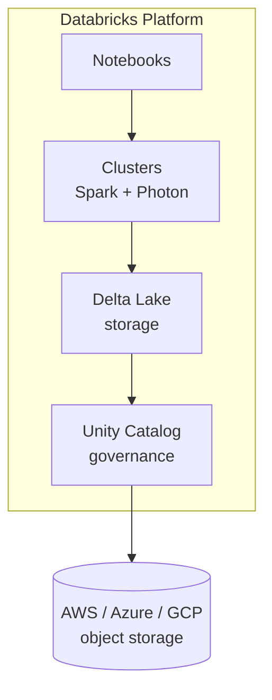

# Introduction to Databricks Platform
{: .no_toc }

*Estimated read: 6 min*

With Spark and Photon as the execution engine, Databricks builds the rest of the platform on four
pillars that recur constantly throughout this guide: **Delta Lake** for storage, **Unity Catalog**
for governance, **notebooks** for development, and **cluster management** for compute. This
lecture is a map of those four pieces before you touch any of them hands-on.

## Delta Lake: the storage layer

**Delta Lake** is an open-source storage format -- Parquet files plus a transaction log -- that
gives you ACID transactions, schema enforcement, and **time travel** (querying a table as it
existed at a prior point) on data that would otherwise just be a folder of files. If your legacy
warehouse guaranteed transactional consistency because it was a monolithic engine controlling its
own storage, Delta Lake gives you that same guarantee on top of cheap, open object storage (S3 on
AWS). It's the default table format for every table you create on Databricks unless you say
otherwise, and it gets a full dedicated section later in this part
([Delta Lake -- Deep Dive]({{ '/01-databricks-fundamentals/05-delta-lake-deep-dive/' | relative_url }})). See the official
[Delta Lake on Databricks documentation](https://docs.databricks.com/aws/en/delta/) for the
canonical reference.

## Unity Catalog: the governance layer

**Unity Catalog** is a single, centrally managed catalog of every table, view, and permission
across every workspace in your account -- the replacement for the schema-by-schema GRANT
statements you likely managed by hand in a legacy warehouse. One metastore, multiple catalogs and
schemas beneath it, with permissions inherited down that hierarchy. Its own dedicated section comes
later in this part.

## Notebooks: how you actually work

A **Databricks notebook** is a browser-based, cell-by-cell coding environment supporting Python,
SQL, Scala, and R in the same notebook (switching language per cell with a **magic command** like
`%sql`). It's the primary interface you'll use throughout this guide -- comparable to a SQL
client's query window, but with cell-level execution, inline visualizations, and real-time
co-authoring built in. See the official
[Databricks notebooks documentation](https://docs.databricks.com/aws/en/notebooks/) for the full
feature set, including the AI-assisted coding tools layered on top.

## Clusters: where code actually runs

A **cluster** is the compute -- a set of virtual machines -- that a notebook or job attaches to in
order to run Spark code. Databricks manages provisioning, autoscaling, and teardown of that
compute for you, and offers several cluster types (all-purpose, jobs, and **serverless**, where
Databricks doesn't even expose the underlying VMs to you) that you'll compare directly in the
**Working in Databricks Workspace** section.

## One platform, three clouds

Everything above runs, largely identically, on **AWS**, **Azure**, and **GCP** -- Databricks is a
consistent layer on top of whichever cloud hosts your account. This guide's hands-on sections
default to AWS, matching the audience this guide is written for, but almost nothing you learn here
is AWS-specific; the platform concepts transfer directly.
{: .important }

The next lecture, **Databricks Platform Architecture**, goes one level deeper into how these
pieces are physically deployed -- specifically the split between what Databricks operates for you
and what runs inside your own cloud account.

<!-- prevnext:start -->

---

| [&larr; Previous: Apache Spark to Data Engineering Platform]({{ '/01-databricks-fundamentals/02-introduction/apache-spark-to-data-engineering-platform/' | relative_url }}) | [Next: Databricks Platform Architecture &rarr;]({{ '/01-databricks-fundamentals/02-introduction/databricks-platform-architecture/' | relative_url }}) |
|:---|---:|

<!-- prevnext:end -->
