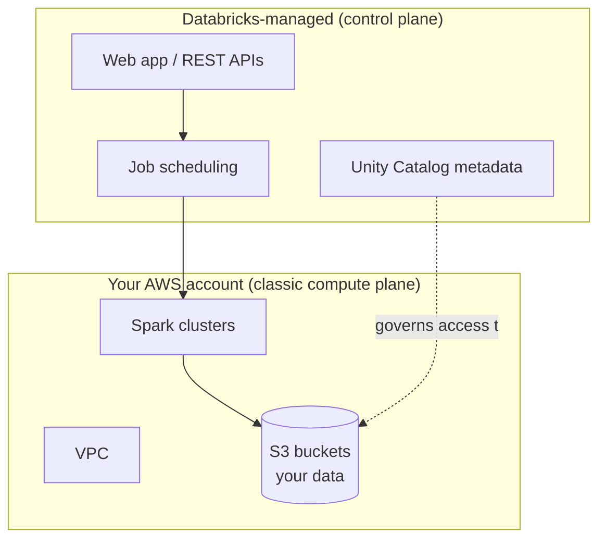

# Databricks Platform Architecture
{: .no_toc }

*Estimated read: 13 min*

This is the lecture to read carefully if you're the person who's going to be answering a security
team's questions during a migration -- Databricks' architecture is what makes it possible to run a
governed, multi-tenant SaaS platform while your actual data never has to leave your own cloud
account. That split is the single most important architectural fact about Databricks, and it's the
answer to almost every "wait, who has access to our data?" question you'll get asked later.

## Control plane vs. compute plane

Databricks splits into two planes:

- **Control plane** -- backend services Databricks operates and manages in *its own* cloud
  account: the web application, notebook management, job scheduling, cluster orchestration APIs,
  and (depending on configuration) Unity Catalog's metadata. You never provision or patch any of
  this.
- **Compute plane** -- where your data is actually processed. Depending on the compute type you
  choose, this runs either in *your* AWS account (**classic compute**) or in *Databricks'* account
  on your behalf (**serverless compute**).

**Key term:** the control plane never touches your raw table data directly -- it orchestrates
*where and how* processing happens, but with classic compute, the actual Spark jobs run inside a
VPC in your own AWS account, reading and writing to S3 buckets you own. This is the architectural
fact that lets a security-conscious enterprise (the kind you likely came from) adopt Databricks
without handing a third party direct custody of the data.
{: .important }

## Classic compute vs. serverless compute

Databricks offers two deployment models for where compute actually runs:

| | Classic compute | Serverless compute |
|---|---|---|
| Runs in | Your AWS account (a Databricks-managed VPC inside it) | Databricks' own account |
| You provision | A subnet, security groups, sometimes a customer-managed VPC | Nothing -- fully managed |
| Startup time | Seconds to minutes (cluster boot) | Near-instant |
| Billing | Databricks Units (DBUs) + underlying AWS compute cost, billed separately | Single unified DBU rate |
| Best for | Workloads needing custom networking, specific instance types, or existing VPC peering | Fast iteration, ad hoc queries, most day-to-day workloads |

Neither is universally "better" -- classic compute gives you more control over networking and
instance selection (relevant if your migration has strict data-residency or peering requirements),
while serverless removes almost all operational overhead. You'll set both up hands-on in the next
section.

## The account and workspace hierarchy

Above both planes sits an object hierarchy you'll navigate constantly:

- **Account** -- the top-level Databricks entity tied to your billing relationship (AWS Marketplace
  contract, in the paid-tier path you'll walk through next section).
- **Workspace** -- an isolated deployment within an account -- typically one per environment
  (dev/uat/prod) or team. Each workspace has its own notebooks, jobs, and cluster configuration.
- **Metastore** -- the Unity Catalog metadata layer, which can span *multiple* workspaces, giving
  you one governed set of tables visible consistently across dev, uat, and prod workspaces rather
  than duplicated per-environment catalogs.

This is a meaningfully different shape than a single monolithic warehouse instance: instead of one
engine with schemas separated by naming convention, you get physically separate workspaces (for
isolation and blast-radius control) sharing one governed catalog (for consistency).

## Multi-tenant by design

Databricks runs as a multi-tenant SaaS: many customers' control planes run on Databricks-operated
infrastructure, logically isolated from one another, while each customer's *data* plane (in the
classic compute model) stays inside that customer's own cloud account. This is why Databricks can
iterate on the platform rapidly -- upgrading the control plane doesn't require touching your data
or your compute -- while still letting you satisfy compliance requirements that mandate your data
never leaves an account you control.

## Cross-account data storage

For classic compute, the S3 buckets holding your Delta tables live in your AWS account, and
Databricks accesses them via an IAM role you grant, scoped to exactly the buckets and prefixes you
choose. This is the same "least-privilege, explicitly granted" model a well-run legacy warehouse
security team already expects -- Databricks just formalizes it as a required setup step (an IAM
role and an S3 bucket policy) rather than an internal convention.

For the full, current, official breakdown of this architecture -- including diagrams for both
classic and serverless deployment shapes -- see
[Databricks' high-level architecture documentation](https://docs.databricks.com/aws/en/getting-started/overview).
It's worth reading in full once you've finished this part; it will make far more sense after
you've actually created a workspace in the next section.

<!-- prevnext:start -->

---

| [&larr; Previous: Introduction to Databricks Platform]({{ '/01-databricks-fundamentals/02-introduction/introduction-to-databricks-platform/' | relative_url }}) | [Next: Databricks Platform Access - Paid vs Free &rarr;]({{ '/01-databricks-fundamentals/02-introduction/databricks-platform-access-paid-vs-free/' | relative_url }}) |
|:---|---:|

<!-- prevnext:end -->
