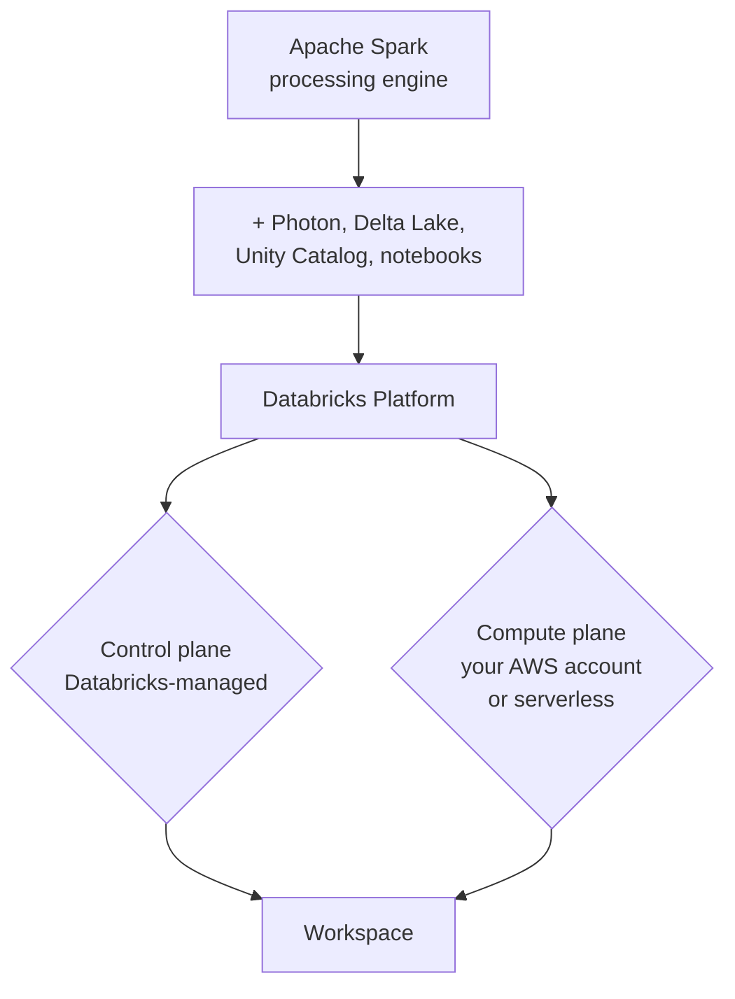

# Introduction

This section builds the mental model you'll rely on for the rest of the guide: what data
engineering on Databricks actually means, how Databricks relates to open-source Apache Spark, and
how the platform is architected under the hood -- control plane, compute plane, and the
account/workspace/metastore hierarchy. It ends with getting a real workspace in your hands, either
free or on AWS, so Section 4 onward is hands-on.

## Lectures

| # | Lecture | Est. Read |
|---|---------|-----------|
| 1 | [Introduction to Data Engineering]({{ '/01-databricks-fundamentals/02-introduction/introduction-to-data-engineering/' | relative_url }}) | 9 min read |
| 2 | [Apache Spark to Data Engineering Platform]({{ '/01-databricks-fundamentals/02-introduction/apache-spark-to-data-engineering-platform/' | relative_url }}) | 8 min read |
| 3 | [Introduction to Databricks Platform]({{ '/01-databricks-fundamentals/02-introduction/introduction-to-databricks-platform/' | relative_url }}) | 6 min read |
| 4 | [Databricks Platform Architecture]({{ '/01-databricks-fundamentals/02-introduction/databricks-platform-architecture/' | relative_url }}) | 13 min read |
| 5 | [Databricks Platform Access - Paid vs Free]({{ '/01-databricks-fundamentals/02-introduction/databricks-platform-access-paid-vs-free/' | relative_url }}) | 4 min read |
| 6 | [Creating Databricks Free Account]({{ '/01-databricks-fundamentals/02-introduction/creating-databricks-free-account/' | relative_url }}) | 4 min read |

<!-- prevnext:start -->

---

| [&larr; Previous: How to access Course Material and Resources]({{ '/01-databricks-fundamentals/01-before-you-start/how-to-access-course-material-and-resources/' | relative_url }}) | [Next: Introduction to Data Engineering &rarr;]({{ '/01-databricks-fundamentals/02-introduction/introduction-to-data-engineering/' | relative_url }}) |
|:---|---:|

<!-- prevnext:end -->
