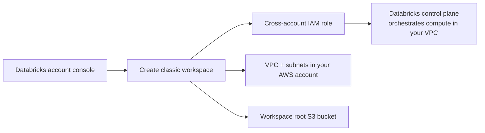

# Creating AWS Databricks Classic Workspace
{: .no_toc }

*Estimated read: 8 min*

**Classic compute** is what most Databricks documentation and enterprise deployments still assume
by default, and it's the model [Part 3's migration content]({{ '/03-legacy-migration-to-databricks/' | relative_url }})
generally assumes too, since real migrations usually need the networking control it provides. This
lecture creates one so you've seen the full setup at least once.

## What's different about classic

Unlike serverless, a classic workspace's compute runs **inside your own AWS account**, in a VPC
Databricks either creates for you or that you bring yourself (a "customer-managed VPC," relevant
if your organization has strict network topology requirements). That means more setup surface, but
direct control over networking, instance types, and connectivity to systems that aren't
internet-reachable -- exactly the kind of on-prem or private-network source systems a migration
project has to connect to.

## Creating the workspace

1. In the Databricks account console, choose **Create workspace**, then select **Classic** as the
   type.
2. Choose **Quick start** (Databricks provisions a VPC, subnets, and security groups on your
   behalf) or **customer-managed VPC** (you supply an existing VPC -- the path a real enterprise
   migration would typically use, to integrate with existing networking).
3. For a learning setup, **Quick start** is the pragmatic choice -- it creates a working, isolated
   VPC without you having to design one first.
4. Databricks provisions: a **cross-account IAM role** (so Databricks-managed compute can operate
   within your account), the **VPC and subnets**, and a **workspace storage bucket** (the S3
   bucket backing your workspace's default/root storage, distinct from any external buckets you'll
   configure later under Unity Catalog).
5. Workspace creation takes several minutes longer than serverless, since actual AWS
   infrastructure is being provisioned, not just a Databricks-side configuration.

## The IAM role, specifically

The **cross-account IAM role** Databricks assumes is scoped narrowly -- enough to launch and manage
EC2 instances for clusters within the VPC you designated, nothing broader. This is the concrete
mechanism behind the "control plane never directly touches your data" claim from the architecture
lecture: Databricks' control plane calls this role to *start compute*, and that compute (running
in your account) is what actually reads and writes your S3 data.

## Should you actually keep this running?

Not for this guide's purposes. Once you've seen the setup flow, the next lecture tears this
(and the serverless workspace) down cleanly. If you're setting up classic compute for real,
ongoing work, revisit customer-managed VPC and cluster policies before going further -- both are
outside this introductory lecture's scope.
{: .important }

<!-- prevnext:start -->

---

| [&larr; Previous: Creating AWS Databricks Serverless Workspace]({{ '/01-databricks-fundamentals/03-sign-up-for-databricks-platform-in-aws/creating-aws-databricks-serverless-workspace/' | relative_url }}) | [Next: Delete and Cleanup Databricks Workspace &rarr;]({{ '/01-databricks-fundamentals/03-sign-up-for-databricks-platform-in-aws/delete-and-cleanup-databricks-workspace/' | relative_url }}) |
|:---|---:|

<!-- prevnext:end -->
