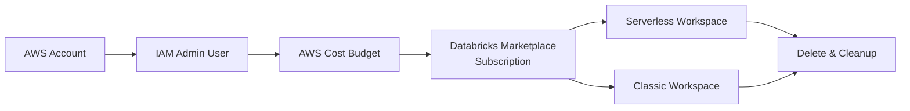

# Sign up for Databricks Platform in AWS

This section is optional if you're staying on Free Edition -- skip to
[Working in Databricks Workspace]({{ '/01-databricks-fundamentals/04-working-in-databricks-workspace/' | relative_url }})
if so. It's required groundwork if you want direct control over the AWS account your workspace
runs in, which [Part 3's migration content]({{ '/03-legacy-migration-to-databricks/' | relative_url }}) assumes: a real
AWS account, an IAM admin identity, a cost budget, an AWS Marketplace-billed Databricks
subscription, and both a serverless and a classic workspace, torn down cleanly at the end so
nothing keeps billing after you're done learning the flow.

## Lectures

| # | Lecture | Est. Read |
|---|---------|-----------|
| 1 | [Overview of Databricks Premium Platform Access]({{ '/01-databricks-fundamentals/03-sign-up-for-databricks-platform-in-aws/overview-of-databricks-premium-platform-access/' | relative_url }}) | 4 min read |
| 2 | [Creating AWS Account]({{ '/01-databricks-fundamentals/03-sign-up-for-databricks-platform-in-aws/creating-aws-account/' | relative_url }}) | 7 min read |
| 3 | [Creating AWS IAM User Account]({{ '/01-databricks-fundamentals/03-sign-up-for-databricks-platform-in-aws/creating-aws-iam-user-account/' | relative_url }}) | 7 min read |
| 4 | [Managing your AWS Cost]({{ '/01-databricks-fundamentals/03-sign-up-for-databricks-platform-in-aws/managing-your-aws-cost/' | relative_url }}) | 8 min read |
| 5 | [Creating AWS Databricks Service Contract]({{ '/01-databricks-fundamentals/03-sign-up-for-databricks-platform-in-aws/creating-aws-databricks-service-contract/' | relative_url }}) | 11 min read |
| 6 | [Creating AWS Databricks Serverless Workspace]({{ '/01-databricks-fundamentals/03-sign-up-for-databricks-platform-in-aws/creating-aws-databricks-serverless-workspace/' | relative_url }}) | 7 min read |
| 7 | [Creating AWS Databricks Classic Workspace]({{ '/01-databricks-fundamentals/03-sign-up-for-databricks-platform-in-aws/creating-aws-databricks-classic-workspace/' | relative_url }}) | 8 min read |
| 8 | [Delete and Cleanup Databricks Workspace]({{ '/01-databricks-fundamentals/03-sign-up-for-databricks-platform-in-aws/delete-and-cleanup-databricks-workspace/' | relative_url }}) | 8 min read |

<!-- prevnext:start -->

---

| [&larr; Previous: Creating Databricks Free Account]({{ '/01-databricks-fundamentals/02-introduction/creating-databricks-free-account/' | relative_url }}) | [Next: Overview of Databricks Premium Platform Access &rarr;]({{ '/01-databricks-fundamentals/03-sign-up-for-databricks-platform-in-aws/overview-of-databricks-premium-platform-access/' | relative_url }}) |
|:---|---:|

<!-- prevnext:end -->
