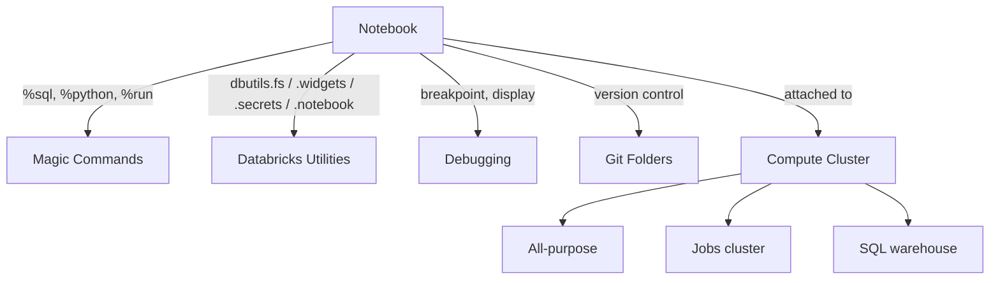

# Working in Databricks Workspace

This is where reading about Databricks turns into writing code in it: the workspace interface,
notebooks and the magic commands that make them multi-language, the full `dbutils` API for
filesystem work, parameterization, and secrets, debugging techniques, version control with Git
folders, and the compute clusters everything actually runs on. Every later section in this guide
assumes you're comfortable with everything here.

## Lectures

| # | Lecture | Est. Read |
|---|---------|-----------|
| 1 | [Introduction to Databricks Workspace]({{ '/01-databricks-fundamentals/04-working-in-databricks-workspace/introduction-to-databricks-workspace/' | relative_url }}) | 8 min read |
| 2 | [Introduction to Databricks Notebooks]({{ '/01-databricks-fundamentals/04-working-in-databricks-workspace/introduction-to-databricks-notebooks/' | relative_url }}) | 9 min read |
| 3 | [Notebook Magic Commands]({{ '/01-databricks-fundamentals/04-working-in-databricks-workspace/notebook-magic-commands/' | relative_url }}) | 11 min read |
| 4 | [Databricks Utilities and Widgets]({{ '/01-databricks-fundamentals/04-working-in-databricks-workspace/databricks-utilities-and-widgets/' | relative_url }}) | 20 min read |
| 5 | [How to Debug Notebooks]({{ '/01-databricks-fundamentals/04-working-in-databricks-workspace/how-to-debug-notebooks/' | relative_url }}) | 5 min read |
| 6 | [Workspace Files vs Git Folders]({{ '/01-databricks-fundamentals/04-working-in-databricks-workspace/workspace-files-vs-git-folders/' | relative_url }}) | 13 min read |
| 7 | [Databricks Compute Cluster]({{ '/01-databricks-fundamentals/04-working-in-databricks-workspace/databricks-compute-cluster/' | relative_url }}) | 19 min read |
| 8 | [Check Your Knowledge]({{ '/01-databricks-fundamentals/04-working-in-databricks-workspace/check-your-knowledge/' | relative_url }}) | Quiz |

<!-- prevnext:start -->

---

| [&larr; Previous: Delete and Cleanup Databricks Workspace]({{ '/01-databricks-fundamentals/03-sign-up-for-databricks-platform-in-aws/delete-and-cleanup-databricks-workspace/' | relative_url }}) | [Next: Introduction to Databricks Workspace &rarr;]({{ '/01-databricks-fundamentals/04-working-in-databricks-workspace/introduction-to-databricks-workspace/' | relative_url }}) |
|:---|---:|

<!-- prevnext:end -->
