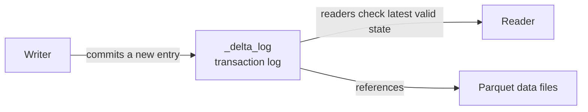

# What is Delta Lake and why it matters
{: .no_toc }

*Estimated read: 17 min*

This section is the one to slow down for. **Delta Lake** is the single piece of Databricks that
most directly replaces what a warehouse engine's storage layer used to guarantee for you --
transactional consistency, schema control, and a queryable history -- but built on top of cheap,
open object storage instead of a proprietary engine. Every later section of this guide assumes
everything here.

## The problem with plain files

Before Delta Lake, "a table" on a data lake typically meant a folder of Parquet or CSV files with
a schema inferred (or assumed) on read. That approach has real structural problems a legacy
warehouse never exposed you to, because the warehouse engine solved them internally:

- **No atomicity.** If a write job fails halfway through writing files, readers can see a partial,
  inconsistent table -- some new files present, others not, with no single point where the table
  was "correct."
- **No isolation.** A reader querying while a writer is mid-write can see an inconsistent mix of
  old and new files.
- **No schema enforcement.** Nothing stops a writer from silently changing column types or adding
  unexpected columns -- the failure shows up downstream, in whatever job reads the corrupted
  schema next, far from its actual cause.
- **No history.** Once new files overwrite old ones, the previous state is gone -- no equivalent of
  a warehouse's transaction log to audit "what did this look like yesterday."

## What Delta Lake actually is

**Delta Lake** is Parquet files plus a **transaction log** -- a sequential, JSON-based record of
every change ever made to the table, stored alongside the data files themselves in a `_delta_log`
directory. Every read and write goes through this log, which is what turns a folder of files into
something with **ACID** guarantees: Atomicity (a write either fully commits or doesn't happen),
Consistency (readers never see a partial write), Isolation (concurrent operations don't corrupt
each other), and Durability (once committed, it's committed).

**Key term:** the **transaction log** is the entire mechanism -- it's an ordered sequence of JSON
files, each describing what changed (files added, files removed, schema changes, metadata
updates). A table's current state is just "replay the log from the last checkpoint forward."
Every capability covered later in this section -- time travel, `MERGE INTO`, schema enforcement --
is built directly on top of this log, not a separate feature bolted on.
{: .important }

## Why this matters coming from a legacy warehouse

If you're used to a warehouse engine, the instinct is to assume this transactional consistency is
just "how tables work" -- it's easy to underrate how much engineering exists to provide it, because
a monolithic engine controlling its own proprietary storage got it for free. Delta Lake's
contribution is providing that same guarantee on top of **open, commodity object storage** (S3),
which is what makes the rest of the Lakehouse story work: cheap storage, open file format (still
just Parquet underneath), but warehouse-grade correctness.

## Delta Lake vs. a plain Parquet table

| | Plain Parquet folder | Delta table |
|---|---|---|
| Atomic writes | No | Yes |
| Concurrent read/write safety | No | Yes |
| Schema enforcement | No | Yes (unless explicitly relaxed) |
| Query historical versions | No | Yes (time travel) |
| `UPDATE` / `DELETE` / `MERGE` | Not natively | Yes |
| Default table format on Databricks | No | Yes |

## Open source, not Databricks-proprietary

Delta Lake is an open-source project (part of the Linux Foundation's Delta Lake project), not a
closed Databricks format -- other engines (Spark outside Databricks, Trino, Flink) can read and
write it too. Databricks is the primary contributor and the platform where it's most deeply
integrated (Photon acceleration, Unity Catalog governance, Liquid Clustering), but choosing Delta
Lake doesn't lock your data into a single vendor's proprietary storage format the way some legacy
warehouse engines effectively did.

For the complete, current official reference -- including the underlying file layout and log
checkpoint mechanics only summarized here -- see
[What is Delta Lake in Databricks?](https://docs.databricks.com/aws/en/delta/)

The rest of this section builds outward from this foundation: creating and managing tables next,
then reading/writing, time travel, maintenance (`OPTIMIZE`/`VACUUM`), rollback, `MERGE INTO`,
`DELETE`/`UPDATE`, schema evolution, the newer variant type, and table constraints.

<!-- prevnext:start -->

---

| [&larr; Previous: Delta Lake - Deep Dive]({{ '/01-databricks-fundamentals/05-delta-lake-deep-dive/' | relative_url }}) | [Next: Creating and Managing Delta tables &rarr;]({{ '/01-databricks-fundamentals/05-delta-lake-deep-dive/creating-and-managing-delta-tables/' | relative_url }}) |
|:---|---:|

<!-- prevnext:end -->
