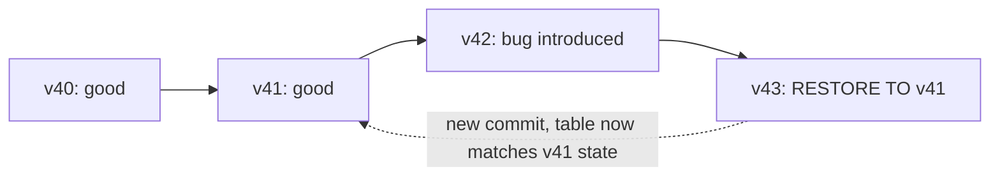

# RESTORE and Rollback Strategies
{: .no_toc }

*Estimated read: 9 min*

Time travel lets you *query* a prior version. `RESTORE` lets you actually *revert* the table to
one -- the closest Delta Lake equivalent to a warehouse point-in-time restore, except it runs in
seconds against the transaction log rather than replaying a backup.

## The `RESTORE` command

```sql
RESTORE TABLE main.default.orders TO VERSION AS OF 42;
RESTORE TABLE main.default.orders TO TIMESTAMP AS OF '2026-08-01T00:00:00.000Z';
```

`RESTORE` makes the table's **current** state match a prior version -- but critically, it does
this by adding a **new commit** to the transaction log, not by deleting the intervening history.
The bad versions between the restore point and now still exist in the log and remain queryable via
time travel; they're just no longer what the table currently reflects.



**Key term:** this is why `RESTORE` is safer than it sounds -- it's not destructive rollback, it's
**forward-only correction**. If the restore itself turns out to be wrong, you can `RESTORE` again
to undo it, because that operation is in the log too.
{: .important }

## `RESTORE` vs. manually re-running a pipeline

Compare the two ways to recover from a bad load:

| | `RESTORE TABLE` | Re-run the pipeline from source |
|---|---|---|
| Speed | Seconds, regardless of table size | As slow as the original pipeline run |
| Requires source data still available | No | Yes |
| Requires re-deriving downstream tables | Depends on your DAG | Always |
| Best for | Undoing a bad write against *this* table specifically | Source data itself was wrong, needs reprocessing |

For a bad `MERGE`, a mistaken `DELETE`, or an accidental full overwrite -- exactly the kind of
mistake a legacy warehouse would need a backup restore or a manually maintained undo script for --
`RESTORE` is almost always faster and simpler than reprocessing.

## The retention constraint still applies

`RESTORE` can only target a version still within the table's retention window -- if `VACUUM` has
already physically deleted the data files a version depends on, `RESTORE` to that version fails,
for the same underlying reason time travel to it would fail. This is the direct, practical
consequence of the retention tradeoff from the previous lecture: a table with aggressive
(short) retention has a correspondingly short rollback window.

## A rollback runbook worth keeping

```text
1. DESCRIBE HISTORY table -- identify the last known-good version
2. SELECT * FROM table VERSION AS OF <good_version> -- confirm it looks right
3. RESTORE TABLE table TO VERSION AS OF <good_version>
4. Re-verify downstream tables that consumed the bad version --
   they may need reprocessing even after the source table is restored
```

Step 4 is the one people skip under pressure and regret later: restoring a bronze table doesn't
automatically un-corrupt a silver or gold table that already processed the bad bronze data.
[Part 3's reconciliation content]({{ '/03-legacy-migration-to-databricks/12-the-reconciliation-stack-proving-semantic-parity/' | relative_url }})
covers exactly this kind of downstream-impact tracing in depth, in the higher-stakes context of a
migration cutover.

<!-- prevnext:start -->

---

| [&larr; Previous: OPTIMIZE, VACUUM and Data Retention]({{ '/01-databricks-fundamentals/05-delta-lake-deep-dive/optimize-vacuum-and-data-retention/' | relative_url }}) | [Next: MERGE INTO - the Delta Upsert Engine &rarr;]({{ '/01-databricks-fundamentals/05-delta-lake-deep-dive/merge-into-the-delta-upsert-engine/' | relative_url }}) |
|:---|---:|

<!-- prevnext:end -->
