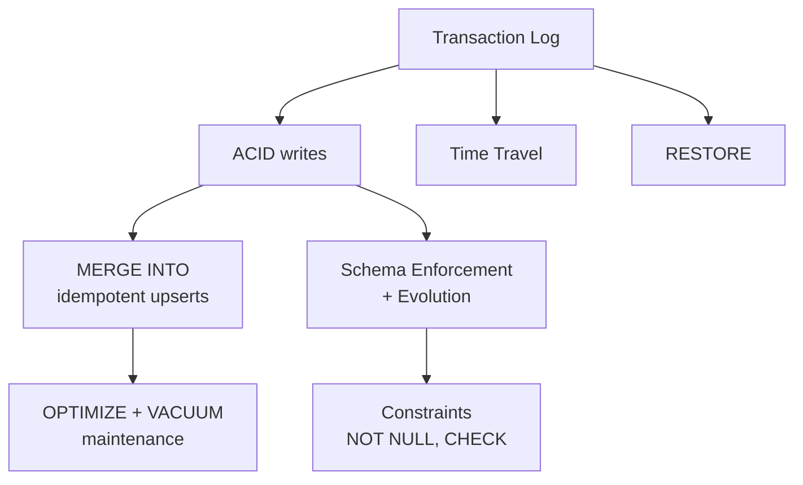

# Delta Lake - Deep Dive

The storage layer underneath every table in this guide: what Delta Lake actually is and why its
transaction log matters, creating and managing tables, batch vs. streaming reads/writes, time
travel and rollback, routine maintenance (`OPTIMIZE`/`VACUUM`), the `MERGE INTO` upsert engine,
idempotent writes, schema enforcement and evolution, the `VARIANT` type, and table constraints.
This is the longest section in Part 1 for a reason -- it's the foundation everything from Unity
Catalog onward assumes you already know cold.

## Lectures

| # | Lecture | Est. Read |
|---|---------|-----------|
| 1 | [What is Delta Lake and why it matters]({{ '/01-databricks-fundamentals/05-delta-lake-deep-dive/what-is-delta-lake-and-why-it-matters/' | relative_url }}) | 17 min read |
| 2 | [Creating and Managing Delta tables]({{ '/01-databricks-fundamentals/05-delta-lake-deep-dive/creating-and-managing-delta-tables/' | relative_url }}) | 15 min read |
| 3 | [Reading and writing Delta - batch and streaming]({{ '/01-databricks-fundamentals/05-delta-lake-deep-dive/reading-and-writing-delta-batch-and-streaming/' | relative_url }}) | 14 min read |
| 4 | [Time Travel - querying historical versions]({{ '/01-databricks-fundamentals/05-delta-lake-deep-dive/time-travel-querying-historical-versions/' | relative_url }}) | 10 min read |
| 5 | [OPTIMIZE, VACUUM and Data Retention]({{ '/01-databricks-fundamentals/05-delta-lake-deep-dive/optimize-vacuum-and-data-retention/' | relative_url }}) | 16 min read |
| 6 | [RESTORE and Rollback Strategies]({{ '/01-databricks-fundamentals/05-delta-lake-deep-dive/restore-and-rollback-strategies/' | relative_url }}) | 9 min read |
| 7 | [MERGE INTO - the Delta Upsert Engine]({{ '/01-databricks-fundamentals/05-delta-lake-deep-dive/merge-into-the-delta-upsert-engine/' | relative_url }}) | 17 min read |
| 8 | [DELETE, UPDATE and Idempotent writes]({{ '/01-databricks-fundamentals/05-delta-lake-deep-dive/delete-update-and-idempotent-writes/' | relative_url }}) | 11 min read |
| 9 | [Schema Enforcement and Schema Evolution]({{ '/01-databricks-fundamentals/05-delta-lake-deep-dive/schema-enforcement-and-schema-evolution/' | relative_url }}) | 14 min read |
| 10 | [Type Widening and the Variant Data Type]({{ '/01-databricks-fundamentals/05-delta-lake-deep-dive/type-widening-and-the-variant-data-type/' | relative_url }}) | 13 min read |
| 11 | [Table constraints - NOT NULL, CHECK, and Identity Columns]({{ '/01-databricks-fundamentals/05-delta-lake-deep-dive/table-constraints-not-null-check-and-identity-columns/' | relative_url }}) | 11 min read |
| 12 | [Check Your Knowledge]({{ '/01-databricks-fundamentals/05-delta-lake-deep-dive/check-your-knowledge/' | relative_url }}) | Quiz |

<!-- prevnext:start -->

---

| [&larr; Previous: Check Your Knowledge]({{ '/01-databricks-fundamentals/04-working-in-databricks-workspace/check-your-knowledge/' | relative_url }}) | [Next: What is Delta Lake and why it matters &rarr;]({{ '/01-databricks-fundamentals/05-delta-lake-deep-dive/what-is-delta-lake-and-why-it-matters/' | relative_url }}) |
|:---|---:|

<!-- prevnext:end -->
