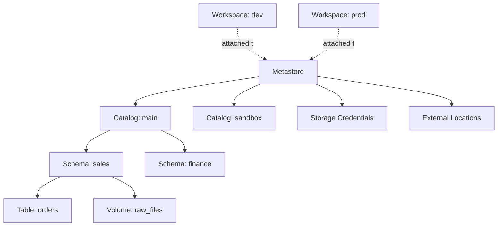

# Why Unity Catalog - Architecture
{: .no_toc }

*Estimated read: 13 min*

Every table you built in the previous section lived in a default catalog you never had to think
about. That stops being adequate the moment more than one team, environment, or data sensitivity
level exists -- which is immediately, in any real organization. **Unity Catalog** is Databricks'
answer to the schema-by-schema, workspace-by-workspace GRANT sprawl a legacy warehouse eventually
accumulates.

## The three-level namespace

Every table, view, volume, or function in Unity Catalog is addressed as
**`catalog.schema.object`** -- one level more than the `schema.table` you're likely used to:

```sql
SELECT * FROM main.sales.orders;
--            └──┘ └───┘ └────┘
--          catalog schema  table
```

**Key term:** the extra **catalog** level is what lets you cleanly separate environments (dev,
uat, prod), business domains, or sensitivity tiers, *without* relying on naming-convention
prefixes on schema names -- the workaround a lot of single-namespace warehouse setups eventually
resort to (`dev_sales`, `uat_sales`, `prod_sales` as separate schemas, hand-managed).
{: .important }

## The metastore: one governance layer, many workspaces

Sitting above the catalog level is the **metastore** -- the top-level container for Unity
Catalog's entire object graph, and, critically, **the thing that can span multiple workspaces**.
One metastore, attached to your dev, uat, and prod workspaces alike, means the same governed
tables, the same permission grants, and the same audit log are consistent everywhere -- not three
separately-administered catalogs that happen to look similar.



## Metastore-level objects: storage credentials, external locations, connections

Not everything lives inside the catalog.schema.object hierarchy. **Storage credentials**,
**external locations**, and **connections** (to federated external data sources -- covered
hands-on in [Part 3]({{ '/03-legacy-migration-to-databricks/04-lakehouse-federation-migrate-without-migrating/' | relative_url }}))
sit directly under the metastore, one level above catalogs. They're the plumbing that connects
Unity Catalog's governance to actual cloud storage -- covered in full in the next two lectures.

## Managed vs. external, at the catalog-governance level

You saw managed vs. external at the *table* level in the previous section. Unity Catalog applies
the same distinction more broadly: **managed** storage (Databricks controls the file lifecycle
entirely) vs. **external** storage (you point Unity Catalog at storage you control, via an
external location). Both are governed identically from a permissions standpoint -- the difference
is purely about who owns the physical file lifecycle underneath.

## Cross-workspace visibility, and why that's the point

Because one metastore can serve every workspace in your account, a table created in a `dev`
workspace is visible (subject to permissions) from `uat` and `prod` workspaces too -- not
duplicated, not resynced, the same object. This is what makes a genuinely consistent
dev -> uat -> prod promotion story possible: the *table definitions and permissions* travel with
your code through Git folders and CI/CD, while the *underlying governed catalog* stays centrally
managed regardless of which workspace a job happens to run in.

## Mapping this onto what you already know

| Legacy warehouse concept | Unity Catalog equivalent |
|---|---|
| Database instance | Metastore |
| Schema-naming-convention environment separation (`dev_x`, `prod_x`) | Catalog-level separation (`dev`, `prod` catalogs) |
| DBA-managed GRANT statements, per schema | Centrally governed grants (next few lectures) |
| Linked server / external table pointer | External location |
| Service account for ETL jobs | Service principal (covered in the identity lecture) |

For the complete, current official architecture reference -- including the full securable-object
model beyond what this lecture summarizes -- see
[Unity Catalog overview](https://docs.databricks.com/aws/en/data-governance/unity-catalog/).

The next lecture makes this concrete: actually setting up a metastore and catalog structure by
hand.

<!-- prevnext:start -->

---

| [&larr; Previous: Unity Catalog - Governance from day one]({{ '/01-databricks-fundamentals/06-unity-catalog-governance-from-day-one/' | relative_url }}) | [Next: Implementing Unity Catalog Architecture &rarr;]({{ '/01-databricks-fundamentals/06-unity-catalog-governance-from-day-one/implementing-unity-catalog-architecture/' | relative_url }}) |
|:---|---:|

<!-- prevnext:end -->
