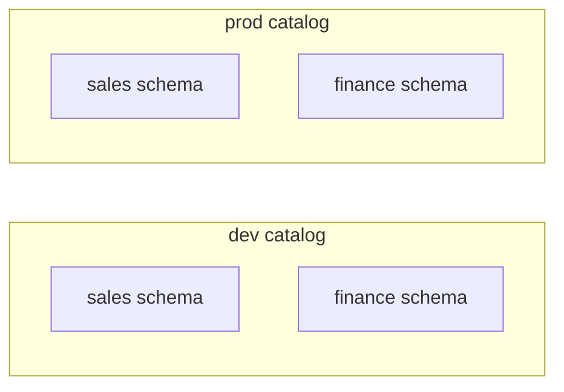

# Implementing Unity Catalog Architecture
{: .no_toc }

*Estimated read: 9 min*

If you're on Databricks Free Edition or created a workspace after November 2023, Unity Catalog is
already enabled and a metastore already exists for your account -- this lecture is about building
a deliberate catalog/schema structure on top of it, not enabling the feature itself.

## Designing catalogs before creating them

A common, effective pattern -- and the one this guide uses from here forward -- separates catalogs
by **environment** first, schemas by **domain** within each:

```sql
CREATE CATALOG IF NOT EXISTS dev;
CREATE CATALOG IF NOT EXISTS uat;
CREATE CATALOG IF NOT EXISTS prod;

CREATE SCHEMA IF NOT EXISTS dev.sales;
CREATE SCHEMA IF NOT EXISTS dev.finance;
CREATE SCHEMA IF NOT EXISTS prod.sales;
```



**Why environment-first, not domain-first:** a `dev`/`uat`/`prod` split at the *catalog* level
means an entire environment's access can be granted or revoked with one permission change at the
top of the hierarchy, and a runaway dev query can never accidentally touch prod data -- they're
different catalogs, not just different schemas a careless `USE` statement could cross into.
{: .important }

## Alternative: domain-first, environment as a schema suffix

Some organizations instead separate by business domain at the catalog level
(`sales`, `finance`, `marketing` catalogs), with environment reflected in schema naming
(`sales.dev_orders`, `sales.prod_orders`). This trades the strong environment isolation above for
easier cross-environment discovery within one domain. Neither pattern is universally correct --
[Part 3's governance-migration content]({{ '/03-legacy-migration-to-databricks/15-unity-catalog-and-the-privilege-migration/' | relative_url }})
covers the tradeoff in more depth for organizations migrating an existing, already-large privilege
structure.

## Verifying the structure

```sql
SHOW CATALOGS;
SHOW SCHEMAS IN dev;
SHOW TABLES IN dev.sales;
```

The same `SHOW`-style exploration commands you'd expect from any SQL engine, scoped to Unity
Catalog's three-level namespace.

## What this guide uses going forward

For the rest of Part 1 and Part 2's StepRight project, examples default to a single working
catalog for simplicity (matching most learning setups on Free Edition, which typically provisions
one default catalog). Where an example specifically needs to demonstrate cross-catalog isolation
(the next lecture, and the access-control lectures later in this section), it calls out the
multi-catalog structure explicitly.

<!-- prevnext:start -->

---

| [&larr; Previous: Why Unity Catalog - Architecture]({{ '/01-databricks-fundamentals/06-unity-catalog-governance-from-day-one/why-unity-catalog-architecture/' | relative_url }}) | [Next: Catalogs, External Locations and Storage Credentials &rarr;]({{ '/01-databricks-fundamentals/06-unity-catalog-governance-from-day-one/catalogs-external-locations-and-storage-credentials/' | relative_url }}) |
|:---|---:|

<!-- prevnext:end -->
