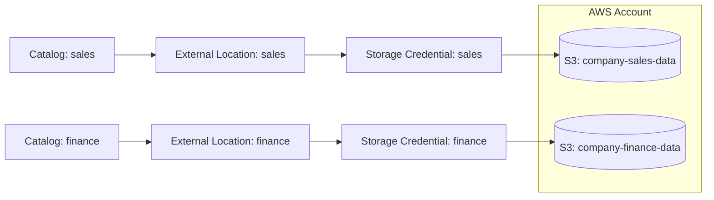

# Catalogs, External Locations and Storage Credentials
{: .no_toc }

*Estimated read: 15 min*

This lecture connects Unity Catalog's governance model to actual S3 buckets -- the mechanism that
lets two catalogs point at two genuinely separate S3 buckets, with workspace access controlled
independently, so one team can never accidentally (or deliberately) see another team's data.

## Storage credentials: the IAM connection

A **storage credential** is an authentication mechanism tying Unity Catalog to a specific IAM
role in your AWS account -- the role Databricks assumes to actually read/write S3 on Unity
Catalog's behalf.

```sql
CREATE STORAGE CREDENTIAL sales_data_credential
WITH (
  AWS_IAM_ROLE = 'arn:aws:iam::123456789012:role/unity-catalog-sales-role'
);
```

**Key term:** only users who need to *create* external locations should hold direct permissions on
a storage credential -- once an external location exists referencing it, most users interact with
the external location (or the tables/volumes built on it), never the credential directly. This
mirrors a legacy warehouse practice of tightly scoping who holds raw connection-string or linked-
server credentials, versus who queries through the resulting linked object.
{: .important }

## External locations: storage credential plus a path

```sql
CREATE EXTERNAL LOCATION sales_bucket_location
URL 's3://company-sales-data/'
WITH (STORAGE CREDENTIAL sales_data_credential);

CREATE EXTERNAL LOCATION finance_bucket_location
URL 's3://company-finance-data/'
WITH (STORAGE CREDENTIAL finance_data_credential);
```

An **external location** authorizes access to a specific S3 path, using a specific storage
credential -- multiple external locations can reuse the same credential if they share underlying
IAM permissions, or use entirely separate credentials (as above) for genuinely separate buckets
with separate IAM roles. This is the object that actually gets referenced when creating external
tables or volumes, or as a catalog's default managed storage location.

## Two catalogs, two buckets, real isolation

```sql
CREATE CATALOG sales
MANAGED LOCATION 's3://company-sales-data/unity-catalog-managed/';

CREATE CATALOG finance
MANAGED LOCATION 's3://company-finance-data/unity-catalog-managed/';
```

Setting a catalog's **managed location** to a path under a specific external location means every
managed table created in that catalog physically lives in that catalog's own bucket -- a sales
analyst granted access to the `sales` catalog has no path, even accidentally, to data physically
stored in the finance bucket. This is meaningfully stronger isolation than schema-level naming
conventions inside one shared storage location, where a misconfigured permission can leak across
"logical" boundaries that aren't actually physically separate.



## Preventing cross-team visibility: the actual grant

Creating separate buckets and credentials sets up the *possibility* of isolation -- the grants
below make it real:

```sql
GRANT USE CATALOG, USE SCHEMA, SELECT ON CATALOG sales TO `sales-team`;
GRANT USE CATALOG, USE SCHEMA, SELECT ON CATALOG finance TO `finance-team`;
-- No cross-grants -- sales-team has no privileges on the finance catalog at all
```

Without any grant on the `finance` catalog, `sales-team` members can't even see that it exists in
their Catalog Explorer view -- the isolation is enforced at discovery, not just query execution.

## Volumes: governed access to non-tabular files

A **volume** is Unity Catalog's governed abstraction for files that aren't structured tables --
raw landing files, model artifacts, unstructured documents:

```sql
CREATE VOLUME sales.landing.raw_files
LOCATION 's3://company-sales-data/landing/raw/';
```

Volumes get the same grant-based access control as tables, which is what makes them the right
landing zone for bronze-layer ingestion (Section 8) -- governed from the moment a file lands,
rather than becoming governed only once it's loaded into a table.

For the complete, current official reference on storage credential and external location setup,
including IAM trust policy specifics beyond this lecture's scope, see
[Create and manage external locations](https://docs.databricks.com/aws/en/connect/unity-catalog/external-locations).

<!-- prevnext:start -->

---

| [&larr; Previous: Implementing Unity Catalog Architecture]({{ '/01-databricks-fundamentals/06-unity-catalog-governance-from-day-one/implementing-unity-catalog-architecture/' | relative_url }}) | [Next: Identity in Unity Catalog - Users, Groups, and Service Principals &rarr;]({{ '/01-databricks-fundamentals/06-unity-catalog-governance-from-day-one/identity-in-unity-catalog-users-groups-and-service-principals/' | relative_url }}) |
|:---|---:|

<!-- prevnext:end -->
