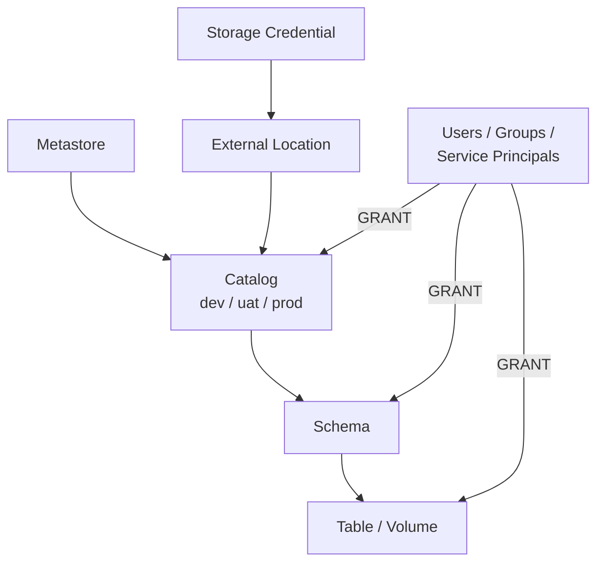

# Unity Catalog - Governance from day one

The governance layer sitting on top of every table from Section 5: the metastore/catalog/schema
hierarchy, connecting that hierarchy to real S3 storage via storage credentials and external
locations, identity (users, groups, service principals), and the full `GRANT` permissions model --
built hands-on into a realistic dev/uat/prod structure with row- and column-level controls at the
end. "Governance from day one" is the point: bolting this on after pipelines already exist is far
harder than designing it first, which is why this section comes before any actual pipeline-
building sections.

## Lectures

| # | Lecture | Est. Read |
|---|---------|-----------|
| 1 | [Why Unity Catalog - Architecture]({{ '/01-databricks-fundamentals/06-unity-catalog-governance-from-day-one/why-unity-catalog-architecture/' | relative_url }}) | 13 min read |
| 2 | [Implementing Unity Catalog Architecture]({{ '/01-databricks-fundamentals/06-unity-catalog-governance-from-day-one/implementing-unity-catalog-architecture/' | relative_url }}) | 9 min read |
| 3 | [Catalogs, External Locations and Storage Credentials]({{ '/01-databricks-fundamentals/06-unity-catalog-governance-from-day-one/catalogs-external-locations-and-storage-credentials/' | relative_url }}) | 15 min read |
| 4 | [Identity in Unity Catalog - Users, Groups, and Service Principals]({{ '/01-databricks-fundamentals/06-unity-catalog-governance-from-day-one/identity-in-unity-catalog-users-groups-and-service-principals/' | relative_url }}) | 12 min read |
| 5 | [Implementing Users, Groups, and Access Control]({{ '/01-databricks-fundamentals/06-unity-catalog-governance-from-day-one/implementing-users-groups-and-access-control/' | relative_url }}) | 13 min read |
| 6 | [Unity Catalog Permissions Model - GRANT]({{ '/01-databricks-fundamentals/06-unity-catalog-governance-from-day-one/unity-catalog-permissions-model-grant/' | relative_url }}) | 15 min read |
| 7 | [Implementing Unity Catalog Permission for Catalog and Schema]({{ '/01-databricks-fundamentals/06-unity-catalog-governance-from-day-one/implementing-unity-catalog-permission-for-catalog-and-schema/' | relative_url }}) | 12 min read |
| 8 | [Unity Catalog Permissions for Tables and Volumns]({{ '/01-databricks-fundamentals/06-unity-catalog-governance-from-day-one/unity-catalog-permissions-for-tables-and-volumns/' | relative_url }}) | 11 min read |
| 9 | [Check Your Knowledge]({{ '/01-databricks-fundamentals/06-unity-catalog-governance-from-day-one/check-your-knowledge/' | relative_url }}) | Quiz |

<!-- prevnext:start -->

---

| [&larr; Previous: Check Your Knowledge]({{ '/01-databricks-fundamentals/05-delta-lake-deep-dive/check-your-knowledge/' | relative_url }}) | [Next: Why Unity Catalog - Architecture &rarr;]({{ '/01-databricks-fundamentals/06-unity-catalog-governance-from-day-one/why-unity-catalog-architecture/' | relative_url }}) |
|:---|---:|

<!-- prevnext:end -->
