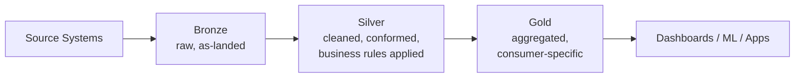

# What is Medallion Architecture
{: .no_toc }

*Estimated read: 6 min*

You've seen bronze/silver/gold mentioned since the first section of this guide. This is where it
gets a full, dedicated treatment -- the design pattern that governs how every pipeline in
[Part 2's StepRight project]({{ '/02-stepright-capstone-project/' | relative_url }}) is structured.

## The three layers, precisely defined

- **Bronze** -- raw data, landed close to source format, with minimal transformation. The direct
  analogue of a staging schema, except queryable and governed from the moment it lands, not a
  transient holding area.
- **Silver** -- cleaned, validated, conformed data -- deduplicated, typed correctly, business rules
  applied. This is where "is this data trustworthy" gets decided.
- **Gold** -- aggregated, business-ready, consumer-specific. What a dashboard, an executive report,
  or a downstream application actually queries.

**Key term:** each layer's data quality is a strict function of the layer before it -- **you never
skip a layer**, even under deadline pressure. A gold table built directly from a source system,
bypassing silver's validation, inherits every quality problem the source has, with no layer left
to catch it.
{: .important }

## Why not just one clean layer?

The natural question from a warehouse background: why not just clean data once, on the way in?
Two reasons the layered approach earns its complexity:

1. **Debuggability.** When a gold number looks wrong, you can trace it backward -- was silver
   wrong, or did gold's aggregation logic introduce the error? A single-layer design collapses
   that diagnostic path into "somewhere in this one big transformation."
2. **Reusability.** Multiple gold tables for different consumers (finance, marketing, operations)
   can all build from the *same* silver layer, rather than each team re-deriving cleaned data from
   raw source independently -- avoiding the "five slightly different versions of customer" problem
   a lot of legacy warehouses eventually accumulate.

## Preventing a data swamp

A **data swamp** is what a data lake becomes without this discipline: files landed with no
consistent structure, no clear ownership of "is this trustworthy," no path from raw to usable. The
Medallion pattern isn't decoration -- it's the specific structural discipline that keeps a lake
from becoming a swamp, by making "how trustworthy is this data" a property of *which layer it's
in*, checkable at a glance.

## What the rest of this section covers

The next three lectures design each layer in turn -- what belongs in bronze, what silver's
validation responsibilities actually are, and why gold tables are usually materialized rather than
views. The section closes with a review lecture connecting the design decisions back to real
tradeoffs.

For the official Databricks framing of this pattern, including additional real-world examples
beyond this lecture's scope, see
[Medallion lakehouse architecture](https://docs.databricks.com/aws/en/lakehouse/medallion).

<!-- prevnext:start -->

---

| [&larr; Previous: Medallion Architecture - Design and Implementation]({{ '/01-databricks-fundamentals/07-medallion-architecture-design-and-implementation/' | relative_url }}) | [Next: Designing the Bronze Layer &rarr;]({{ '/01-databricks-fundamentals/07-medallion-architecture-design-and-implementation/designing-the-bronze-layer/' | relative_url }}) |
|:---|---:|

<!-- prevnext:end -->
