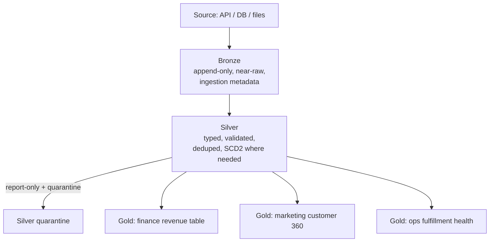

# Architecture Review and Design Decisions
{: .no_toc }

*Estimated read: 6 min*

A short lecture connecting the last three back into a single set of design decisions -- the
checklist worth having in front of you the first few times you design a new pipeline's layer
structure, until it becomes automatic.

## The full picture, end to end

One silver layer feeding multiple, consumer-specific gold tables is the payoff of keeping the
layers' responsibilities cleanly separated -- exactly what Part 2's StepRight capstone builds, with
distinct gold tables for revenue, customer 360, product performance, clickstream, and fulfillment,
all from the same underlying silver.

## The decisions that matter most, revisited

| Decision | Bronze | Silver | Gold |
|---|---|---|---|
| Schema rigidity | Flexible (`VARIANT` where source is unstable) | Strict, enforced | Strict, consumer-shaped |
| Mutability | Append-only | Updated via `MERGE`, quarantine for bad rows | Refreshed (table) or computed live (view) |
| Owns "is this correct"? | No | Yes | Inherits silver's correctness, adds aggregation logic |
| Typical consumer | Data engineers debugging, audit | Data engineers, analysts building gold | Dashboards, executives, downstream apps |

## The mistake worth naming explicitly

The most common Medallion anti-pattern isn't getting one layer's design wrong -- it's **skipping a
layer under deadline pressure**: a "quick" gold table built directly from bronze because silver's
validation logic isn't ready yet. This debt compounds, because every consumer of that gold table
now implicitly depends on bronze data that was never actually validated -- and untangling that
dependency later, once other things have been built on top of it, is far more expensive than
building silver first would have been.
{: .important }

## Where this goes next

This closes out the conceptual half of Part 1. Sections 8-10 -- **Lakeflow Connect**, **Lakeflow
Declarative Pipelines**, and **Lakeflow Jobs** -- are the three pillars that actually *implement*
this bronze/silver/gold pattern in production: ingestion, transformation, and orchestration,
respectively. Everything designed conceptually in this section becomes concrete, runnable pipeline
code starting with the next section's knowledge check.

<!-- prevnext:start -->

---

| [&larr; Previous: Designing the Gold Layer]({{ '/01-databricks-fundamentals/07-medallion-architecture-design-and-implementation/designing-the-gold-layer/' | relative_url }}) | [Next: Check Your Knowledge &rarr;]({{ '/01-databricks-fundamentals/07-medallion-architecture-design-and-implementation/check-your-knowledge/' | relative_url }}) |
|:---|---:|

<!-- prevnext:end -->
