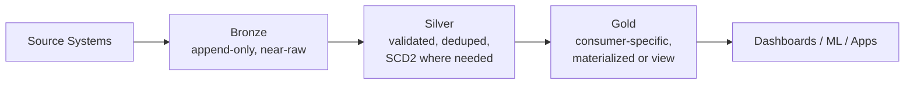

# Medallion Architecture - Design and Implementation

The design pattern that structures every pipeline in this guide: bronze (raw, near-source,
auditable), silver (cleaned, validated, conformed), and gold (aggregated, consumer-specific).
This section designs each layer's responsibilities in turn, works through a real gold-table example
end to end, and closes with a review of the tradeoffs and the most common anti-pattern -- skipping
a layer under deadline pressure. Sections 8-10 then implement this pattern with real Lakeflow
tooling.

## Lectures

| # | Lecture | Est. Read |
|---|---------|-----------|
| 1 | [What is Medallion Architecture]({{ '/01-databricks-fundamentals/07-medallion-architecture-design-and-implementation/what-is-medallion-architecture/' | relative_url }}) | 6 min read |
| 2 | [Designing the Bronze Layer]({{ '/01-databricks-fundamentals/07-medallion-architecture-design-and-implementation/designing-the-bronze-layer/' | relative_url }}) | 9 min read |
| 3 | [Designing the Silver Layer]({{ '/01-databricks-fundamentals/07-medallion-architecture-design-and-implementation/designing-the-silver-layer/' | relative_url }}) | 12 min read |
| 4 | [Designing the Gold Layer]({{ '/01-databricks-fundamentals/07-medallion-architecture-design-and-implementation/designing-the-gold-layer/' | relative_url }}) | 6 min read |
| 5 | [Architecture Review and Design Decisions]({{ '/01-databricks-fundamentals/07-medallion-architecture-design-and-implementation/architecture-review-and-design-decisions/' | relative_url }}) | 6 min read |
| 6 | [Check Your Knowledge]({{ '/01-databricks-fundamentals/07-medallion-architecture-design-and-implementation/check-your-knowledge/' | relative_url }}) | Quiz |

<!-- prevnext:start -->

---

| [&larr; Previous: Check Your Knowledge]({{ '/01-databricks-fundamentals/06-unity-catalog-governance-from-day-one/check-your-knowledge/' | relative_url }}) | [Next: What is Medallion Architecture &rarr;]({{ '/01-databricks-fundamentals/07-medallion-architecture-design-and-implementation/what-is-medallion-architecture/' | relative_url }}) |
|:---|---:|

<!-- prevnext:end -->
