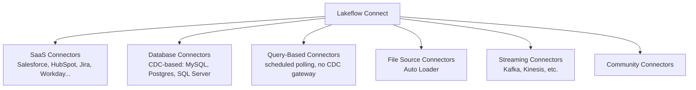

# What is Lakeflow Connect - The Ingestion Pillar
{: .no_toc }

*Estimated read: 11 min*

Everything in this guide so far assumed data was already sitting in a table. This section is
about how it actually gets there -- **Lakeflow Connect**, the first of three pillars (Connect,
Declarative Pipelines, Jobs) that together make up Databricks' production data engineering
tooling. This lecture is the map; the next six lectures get hands-on with each pattern.

## The problem Lakeflow Connect solves

If your prior tooling was Talend or a similar ETL platform, you already know the shape of this
problem: connect to a source (a SaaS app's API, a relational database, files landing in storage),
handle authentication, figure out what's new since the last run, and land it reliably -- ideally
without hand-writing a bespoke connector for every single source type. **Lakeflow Connect** is
Databricks' managed answer: a library of pre-built connectors plus a general-purpose framework
(Auto Loader) for anything not covered by a specific connector.

## Six connector categories

- **SaaS connectors** -- pre-built integrations with common business applications (Salesforce,
  HubSpot, Jira, Workday, and more), authenticating via the application's own API.
- **Database connectors with CDC** -- capture inserts/updates/deletes directly from a database's
  change stream (e.g. MySQL binlog, Postgres logical replication), typically via a gateway process.
- **Query-based connectors** -- poll a source database directly on a schedule, without needing a
  CDC gateway or staging storage -- simpler to set up, less real-time than CDC.
- **File source connectors (Auto Loader)** -- incremental ingestion of files landing in cloud
  storage, covered in depth in this section's fifth lecture.
- **Streaming connectors** -- direct ingestion from message systems like Kafka or Kinesis.
- **Community connectors** -- broader ecosystem integrations beyond Databricks' own managed set.

## Incremental by default

**Key term:** every Lakeflow Connect pattern shares one behavior worth internalizing up front: the
**first run ingests everything available**, and **every subsequent run ingests only what's new**
since the last run -- automatically, without you hand-writing watermark logic. This is the same
incremental-processing benefit the streaming API gave you in Section 5, applied specifically to
the ingestion layer.
{: .important }

## Where ingestion pipelines actually run

A Lakeflow Connect ingestion pipeline runs on **serverless compute** by default, with Databricks
handling orchestration -- automatic job creation, retries with exponential backoff on transient
failures, and monitoring via event logs and cost tracking built in, rather than infrastructure you
provision and babysit yourself.

## What the rest of this section covers

The next five lectures work through the concrete patterns in roughly increasing complexity: a
no-code SaaS ingestion pipeline, a query-based database connector, a CDC-based database connector,
Auto Loader for files, and the production concerns (schema evolution, bad records) that apply
across all of them. The section closes with a direct decision guide -- which tool for which
situation -- and a knowledge check.

For the complete, current official reference across every connector category, see
[Lakeflow Connect overview](https://docs.databricks.com/aws/en/ingestion/lakeflow-connect/).

<!-- prevnext:start -->

---

| [&larr; Previous: Lakeflow Connect - Ingestion Pillar]({{ '/01-databricks-fundamentals/08-lakeflow-connect-ingestion-pillar/' | relative_url }}) | [Next: Ingesting Data to Bronze Layer from a SaaS Application &rarr;]({{ '/01-databricks-fundamentals/08-lakeflow-connect-ingestion-pillar/ingesting-data-to-bronze-layer-from-a-saas-application/' | relative_url }}) |
|:---|---:|

<!-- prevnext:end -->
