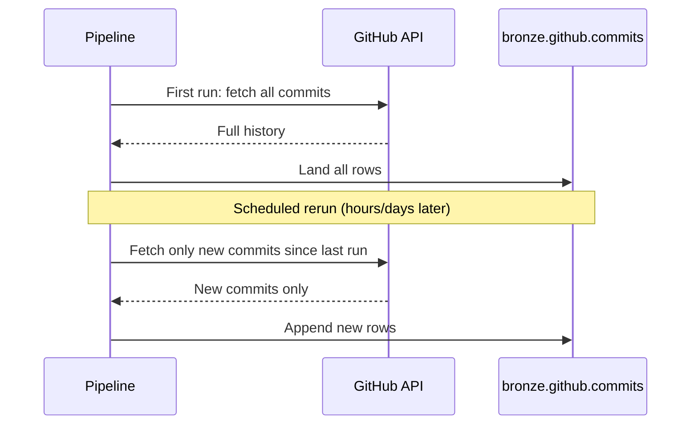

# Ingesting Data to Bronze Layer from a SaaS Application
{: .no_toc }

*Estimated read: 16 min*

A walk-through, end to end, of the simplest and most common ingestion pattern: pulling data from a
SaaS application's API into a bronze table, with no custom API code -- the example here uses
GitHub (commits and issues), a pattern that generalizes directly to Salesforce, HubSpot, Jira, or
any other supported SaaS connector.

## Step 1: create a connection

A **connection** is a Unity Catalog-governed object holding the authentication details for a
source -- a personal access token, OAuth credentials, or an API key, depending on the source.

```sql
CREATE CONNECTION github_connection
TYPE github
OPTIONS (
  personal_access_token secret('github-creds', 'pat')
);
```

Notice this pulls the token from a **secret scope** (Section 4's `dbutils.secrets`), not a
hardcoded value -- the connection object references credentials, it doesn't store them in plain
text in the DDL itself.

## Step 2: create an ingestion pipeline

Through the UI (**Data Ingestion -> Add data -> GitHub**) or declaratively:

```python
# Pipeline definition (simplified representation of the no-code UI flow)
pipeline_config = {
    "connection": "github_connection",
    "source_catalog": "my_org/my_repo",
    "objects": ["commits", "issues"],
    "destination_catalog": "bronze",
    "destination_schema": "github",
}
```

The **no-code pipeline** builder walks through: which connection to use, which objects from the
source to pull (here, `commits` and `issues` -- GitHub's API exposes these as distinct
resources), and which bronze catalog/schema to land them in. No custom pagination, rate-limiting,
or authentication-refresh code -- Databricks' managed connector handles all of that internally.

## Step 3: first run vs. incremental runs



The first pipeline run pulls the full available history; every run after that pulls only what's
new -- the incremental behavior from the previous lecture, handled entirely by the managed
connector.

## What lands in bronze

```sql
DESCRIBE bronze.github.commits;
-- sha, author, message, committed_at, _ingested_at, _pipeline_run_id, ...
```

The destination is a **streaming table** (Section 9 covers this table type in full) -- append-only,
with ingestion metadata columns added automatically alongside the source fields, following exactly
the bronze design principles from Section 7: minimal transformation, full fidelity to source,
audit metadata included.

## Monitoring the pipeline

```sql
SELECT * FROM event_log(TABLE(bronze.github.commits))
ORDER BY timestamp DESC
LIMIT 20;
```

Every Lakeflow Connect pipeline writes to an **event log** -- queryable directly as a table --
recording each run, rows processed, and any errors. This is the same event-log pattern
[Part 2's StepRight project uses for data quality monitoring]({{ '/02-stepright-capstone-project/07-stepright-data-quality-monitoring/' | relative_url }}),
applied here specifically to ingestion health.

## Why this beats hand-writing a connector

| Hand-written API integration | Lakeflow Connect SaaS connector |
|---|---|
| You handle pagination, rate limits, retries | Managed internally |
| You track "what's new since last run" yourself | Automatic incremental behavior |
| You build monitoring/alerting from scratch | Built-in event log |
| Custom code to maintain per source | Configuration, not code, for supported sources |

For a supported SaaS source, reaching for a managed connector first -- rather than defaulting to a
custom API integration -- is almost always the right call; custom code is worth it specifically
when a source isn't supported, which is exactly where the next lecture's query-based pattern (for
databases without a managed CDC connector) becomes relevant.

<!-- prevnext:start -->

---

| [&larr; Previous: What is Lakeflow Connect - The Ingestion Pillar]({{ '/01-databricks-fundamentals/08-lakeflow-connect-ingestion-pillar/what-is-lakeflow-connect-the-ingestion-pillar/' | relative_url }}) | [Next: Incremental Ingestion from Database Using Query Based Connector &rarr;]({{ '/01-databricks-fundamentals/08-lakeflow-connect-ingestion-pillar/incremental-ingestion-from-database-using-query-based-connector/' | relative_url }}) |
|:---|---:|

<!-- prevnext:end -->
