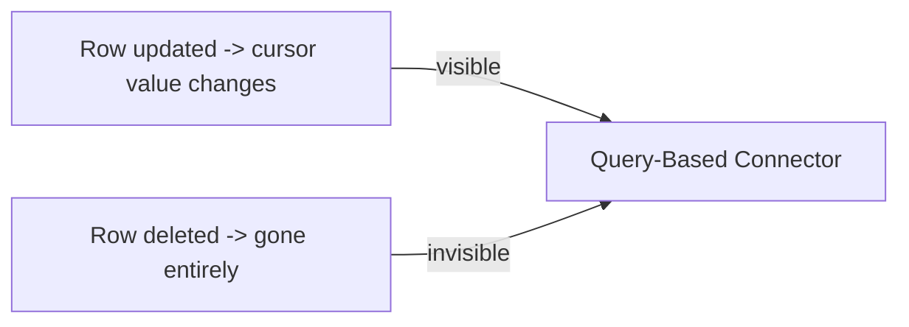

# Incremental Ingestion from Database Using Query Based Connector
{: .no_toc }

*Estimated read: 15 min*

For a relational database source without CDC infrastructure available -- no binlog access, no
logical replication configured, or simply a source where CDC setup isn't worth the operational
overhead -- **query-based connectors** poll the source directly on a schedule instead, using a
**cursor column** to identify what's new.

## The cursor column pattern

```sql
CREATE CONNECTION legacy_orders_db
TYPE postgresql
OPTIONS (
  host secret('db-creds', 'host'),
  user secret('db-creds', 'user'),
  password secret('db-creds', 'password')
);
```

A **cursor column** is a monotonically increasing column on the source table -- typically an
`updated_at` timestamp or an auto-incrementing ID -- that the connector uses to identify "rows
added or changed since the last run":

```text
Pipeline configuration:
  source table: orders
  cursor column: updated_at
  destination: bronze.legacy.orders
```

On each run, the connector effectively issues:

```sql
-- Conceptually, what the connector does on your behalf
SELECT * FROM orders WHERE updated_at > :last_processed_cursor_value
```

...then persists the new maximum cursor value for the next run. This is the exact
`max(updated_at)`-based incremental pattern many legacy ETL jobs already implement by hand -- the
managed connector just tracks the watermark state for you, reliably, instead of you maintaining a
separate control table.

## Why deletes are difficult with this pattern

**Key term:** query-based, cursor-driven ingestion can only see rows that still **exist** in the
source with an updated cursor value -- a row physically **deleted** from the source produces no
trace for the cursor query to find. This is a structural limitation, not a configuration mistake:
if a source row is deleted, this pattern has no way to know.
{: .important }



Two practical ways to handle this, if delete-tracking genuinely matters for your source:

1. **Soft deletes at the source.** If the source system itself marks rows as deleted (a
   `is_deleted` flag) rather than physically removing them, the cursor pattern picks up that flag
   change like any other update.
2. **Switch to a CDC-based connector**, covered in the next lecture, which does see physical
   deletes directly from the database's change stream.

If neither is available and deletes matter for correctness, a periodic full reconciliation
(comparing a full source extract against bronze to detect vanished rows) is the fallback -- more
expensive, but the only option against a source with no soft-delete support and no CDC access.

## Configuring the pipeline

```python
pipeline_config = {
    "connection": "legacy_orders_db",
    "source_table": "public.orders",
    "cursor_column": "updated_at",
    "destination_catalog": "bronze",
    "destination_schema": "legacy",
    "destination_table": "orders",
}
```

Schedule this like any other pipeline (Section 10's Lakeflow Jobs), and each run pulls forward
from the last cursor value automatically.

## When to reach for this vs. a managed CDC connector

| | Query-based connector | CDC-based connector |
|---|---|---|
| Setup complexity | Lower -- just a cursor column and connection | Higher -- requires binlog/logical replication access |
| Sees deletes | No (without a soft-delete flag) | Yes |
| Latency | As frequent as your schedule allows | Can be closer to real-time |
| Source access required | Standard read query access | Elevated access to the database's change stream |

For a legacy warehouse migration where the source DBA team is understandably cautious about
granting binlog-level access, query-based ingestion is often the pragmatic starting point --
[Part 3's ingestion decision content]({{ '/03-legacy-migration-to-databricks/10-the-ingestion-decision-tree/' | relative_url }})
covers this exact tradeoff at real migration scale.

<!-- prevnext:start -->

---

| [&larr; Previous: Ingesting Data to Bronze Layer from a SaaS Application]({{ '/01-databricks-fundamentals/08-lakeflow-connect-ingestion-pillar/ingesting-data-to-bronze-layer-from-a-saas-application/' | relative_url }}) | [Next: Incremental CDC from Database Using Managed Connector &rarr;]({{ '/01-databricks-fundamentals/08-lakeflow-connect-ingestion-pillar/incremental-cdc-from-database-using-managed-connector/' | relative_url }}) |
|:---|---:|

<!-- prevnext:end -->
