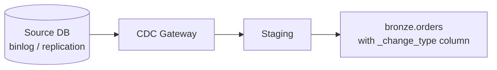

# Incremental CDC from Database Using Managed Connector
{: .no_toc }

*Estimated read: 10 min*

Where the previous lecture's query-based connector polls and infers what changed, a **CDC-based
connector** reads the database's own change stream directly -- seeing every insert, update, and
**delete** as it happens, with no cursor-column blind spot.

## What CDC actually reads

For MySQL, this means the **binlog** (binary replication log); for Postgres, **logical
replication** (via a replication slot); for SQL Server, **CDC tables** or the transaction log,
depending on configuration. In every case, the source database is already generating this stream
for its own replication purposes -- the connector reads it, rather than the connector generating
extra query load against the live database the way polling does.

## Setting up a CDC connection

```sql
CREATE CONNECTION mysql_cdc_connection
TYPE mysql
OPTIONS (
  host secret('db-creds', 'host'),
  user secret('db-creds', 'cdc_user'),
  password secret('db-creds', 'cdc_password')
);
```

The database user for CDC typically needs **elevated replication privileges** -- `REPLICATION
SLAVE`/`REPLICATION CLIENT` on MySQL, `REPLICATION` role on Postgres -- distinctly more access than
a read-only query user needs. This is worth flagging explicitly to whoever administers the source
database; it's a real conversation to have, not a checkbox.
{: .important }

## The gateway

CDC-based ingestion typically runs through a **gateway** process -- a component that connects to
the source's replication stream and stages changes before they're processed into your bronze
table. This is more infrastructure than the query-based pattern's simple polling, which is the
tradeoff for getting delete visibility and lower latency.



## What lands in bronze, differently from query-based

```sql
DESCRIBE bronze.orders_cdc;
-- order_id, customer_id, order_total, ..., _change_type, _commit_timestamp
```

CDC-sourced bronze tables include a **`_change_type`** column (`insert`, `update`, `delete`) --
explicit, per-row change semantics the query-based pattern simply can't provide. This is directly
what enables accurate SCD Type 2 modeling in silver (Section 7, and hands-on again in
[Part 2's StepRight silver layer]({{ '/02-stepright-capstone-project/03-stepright-transformation-layers/' | relative_url }})):
a `delete` change type can close out a dimension record's current-version flag correctly, something
a query-based source has no signal for at all.

## CDC vs. query-based: the decision in one line

If you need accurate deletes, near-real-time latency, and the source database team can grant
replication-level access -- use CDC. If deletes don't matter for your use case, replication access
isn't available, or setup simplicity matters more than latency -- query-based is the pragmatic
default. Neither is universally "better"; they trade setup complexity and source access
requirements for delete visibility and latency.

<!-- prevnext:start -->

---

| [&larr; Previous: Incremental Ingestion from Database Using Query Based Connector]({{ '/01-databricks-fundamentals/08-lakeflow-connect-ingestion-pillar/incremental-ingestion-from-database-using-query-based-connector/' | relative_url }}) | [Next: File-Based Ingestion with Auto Loader &rarr;]({{ '/01-databricks-fundamentals/08-lakeflow-connect-ingestion-pillar/file-based-ingestion-with-auto-loader/' | relative_url }}) |
|:---|---:|

<!-- prevnext:end -->
