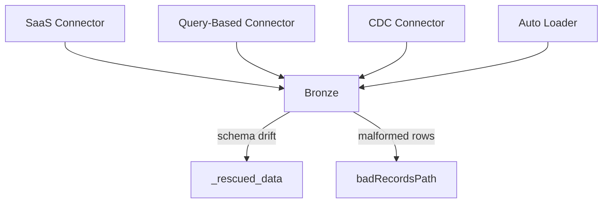

# Lakeflow Connect - Ingestion Pillar

The first of three Lakeflow pillars, and how data actually gets into bronze: managed SaaS
connectors, query-based and CDC-based database ingestion, Auto Loader for files, and the
production realities of schema drift and bad records. Closes with a direct decision guide for
choosing the right tool per source.

## Lectures

| # | Lecture | Est. Read |
|---|---------|-----------|
| 1 | [What is Lakeflow Connect - The Ingestion Pillar]({{ '/01-databricks-fundamentals/08-lakeflow-connect-ingestion-pillar/what-is-lakeflow-connect-the-ingestion-pillar/' | relative_url }}) | 11 min read |
| 2 | [Ingesting Data to Bronze Layer from a SaaS Application]({{ '/01-databricks-fundamentals/08-lakeflow-connect-ingestion-pillar/ingesting-data-to-bronze-layer-from-a-saas-application/' | relative_url }}) | 16 min read |
| 3 | [Incremental Ingestion from Database Using Query Based Connector]({{ '/01-databricks-fundamentals/08-lakeflow-connect-ingestion-pillar/incremental-ingestion-from-database-using-query-based-connector/' | relative_url }}) | 15 min read |
| 4 | [Incremental CDC from Database Using Managed Connector]({{ '/01-databricks-fundamentals/08-lakeflow-connect-ingestion-pillar/incremental-cdc-from-database-using-managed-connector/' | relative_url }}) | 10 min read |
| 5 | [File-Based Ingestion with Auto Loader]({{ '/01-databricks-fundamentals/08-lakeflow-connect-ingestion-pillar/file-based-ingestion-with-auto-loader/' | relative_url }}) | 15 min read |
| 6 | [Incremental Ingestion, Schema Evolution and Bad Records in Production]({{ '/01-databricks-fundamentals/08-lakeflow-connect-ingestion-pillar/incremental-ingestion-schema-evolution-and-bad-records-in-production/' | relative_url }}) | 12 min read |
| 7 | [Choosing the Right Ingestion Tool]({{ '/01-databricks-fundamentals/08-lakeflow-connect-ingestion-pillar/choosing-the-right-ingestion-tool/' | relative_url }}) | 4 min read |
| 8 | [Check Your Knowledge]({{ '/01-databricks-fundamentals/08-lakeflow-connect-ingestion-pillar/check-your-knowledge/' | relative_url }}) | Quiz |

<!-- prevnext:start -->

---

| [&larr; Previous: Check Your Knowledge]({{ '/01-databricks-fundamentals/07-medallion-architecture-design-and-implementation/check-your-knowledge/' | relative_url }}) | [Next: What is Lakeflow Connect - The Ingestion Pillar &rarr;]({{ '/01-databricks-fundamentals/08-lakeflow-connect-ingestion-pillar/what-is-lakeflow-connect-the-ingestion-pillar/' | relative_url }}) |
|:---|---:|

<!-- prevnext:end -->
