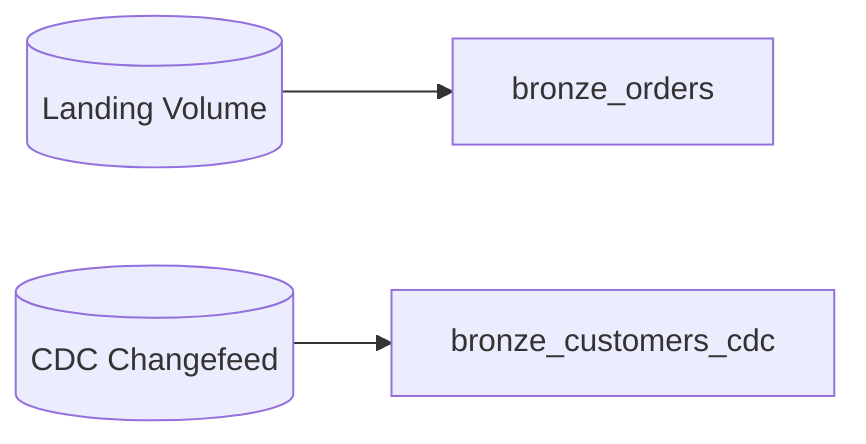

# Building the Bronze layer - Auto Loader as a Streaming Table
{: .no_toc }

*Estimated read: 22 min*

From syntax to a real, deployed pipeline. This lecture builds a genuine bronze layer for a
multi-source orders pipeline -- files via Auto Loader and a CDC feed -- as SDP streaming tables,
end to end: project structure, pipeline configuration, the code itself, and how to actually run
and inspect it.

## Project structure

```text
steprightproject/
├── transformations/
│   ├── bronze_orders.py
│   └── bronze_customers_cdc.py
└── pipeline.yml
```

SDP pipelines are typically organized as a set of transformation files (one or a few tables per
file, grouped logically) plus a `pipeline.yml` configuration referencing them -- this is the shape
[Part 2's StepRight project]({{ '/02-stepright-capstone-project/' | relative_url }}) uses throughout, developed in a Git
folder (Section 4) for proper version control.

## The pipeline configuration

```yaml
# pipeline.yml
name: steprightproject-bronze
catalog: dev
schema: steprightproject
serverless: true
continuous: false
libraries:
  - glob:
      include: transformations/**
```

- **`catalog`/`schema`** -- the Unity Catalog destination for every table this pipeline produces,
  set once here rather than per table.
- **`serverless: true`** -- run on Databricks-managed serverless compute (Section 4's compute
  lecture) rather than a manually configured classic cluster.
- **`continuous: false`** -- run in **triggered** mode: process everything currently available,
  then stop, rather than running continuously. Matches the `availableNow=True` trigger behavior
  from Section 5, and is the right default for most scheduled batch-shaped pipelines (triggered by
  Lakeflow Jobs in Section 10).

## Bronze table 1: file-based orders via Auto Loader

```python
# transformations/bronze_orders.py
import dlt as dp
from pyspark.sql.functions import current_timestamp, col

@dp.table(
    name="bronze_orders",
    comment="Raw order files landed via Auto Loader, minimally transformed"
)
def bronze_orders():
    return (
        spark.readStream
        .format("cloudFiles")
        .option("cloudFiles.format", "json")
        .option("cloudFiles.schemaLocation", "/Volumes/dev/steprightproject/checkpoints/bronze_orders_schema/")
        .option("cloudFiles.schemaEvolutionMode", "rescue")
        .load("/Volumes/dev/steprightproject/landing/orders/")
        .select(
            "*",
            col("_metadata.file_path").alias("_source_file"),
            current_timestamp().alias("_ingested_at")
        )
    )
```

Notice everything from Sections 7 and 8 shows up here, just wrapped in a `@dp.table` decorator
instead of manual `readStream`/`writeStream` code: `cloudFiles` for incremental file ingestion,
`rescue` mode for schema drift resilience, and explicit `_source_file`/`_ingested_at` metadata
columns following bronze design principles. **What SDP removed**: the `checkpointLocation` for
the *write* side, and any manual `writeStream`/`trigger` call at all -- the framework handles
committing this table's output incrementally on its own.
{: .important }

## Bronze table 2: CDC feed for customers

```python
# transformations/bronze_customers_cdc.py
import dlt as dp

@dp.table(
    name="bronze_customers_cdc",
    comment="Raw CDC change feed for customers, from the managed CDC connector"
)
def bronze_customers_cdc():
    return spark.readStream.table("dev.raw_cdc.customers_changefeed")
```

This assumes a Lakeflow Connect CDC connector (Section 8) already lands raw changes into
`dev.raw_cdc.customers_changefeed` -- this table simply brings that feed into the pipeline's own
governed schema, with the same minimal-transformation bronze discipline as the file-based table
above.

## Data quality at bronze: light, structural checks only

Per Section 7's bronze design rules, avoid business-logic validation here -- but *structural*
expectations (not business rules) are reasonable even at bronze:

```python
@dp.table(name="bronze_orders")
@dp.expect("has_source_file", "_source_file IS NOT NULL")
def bronze_orders():
    ...
```

This checks that the ingestion metadata itself is populated correctly -- a pipeline-plumbing
concern, not a business rule about order data, so it doesn't violate bronze's "no business logic"
principle from Section 7.

## Deploying and running the pipeline

Through the workspace UI: **Workflows -> Pipelines -> Create pipeline**, pointing at the
`pipeline.yml` (or configuring equivalently through the UI form). Via the Databricks CLI, for a
Git-folder-based, CI/CD-friendly workflow:

```bash
databricks pipelines create --json @pipeline.yml
databricks pipelines start --pipeline-id <pipeline-id>
```

## Reading the pipeline graph

Once running, the UI shows a **dependency graph** view -- every table as a node, edges showing
which tables feed which, and per-node status (running, completed, failed) updated live. This is
the direct visual payoff of SDP's declarative dependency inference: you didn't draw this graph, it
was derived from your table definitions referencing each other.



## Inspecting results and the event log

```sql
SELECT * FROM dev.steprightproject.bronze_orders LIMIT 20;

SELECT * FROM event_log(TABLE(dev.steprightproject.bronze_orders))
WHERE event_type = 'flow_progress'
ORDER BY timestamp DESC;
```

The **event log** (introduced in Section 8's SaaS ingestion lecture) is equally central here --
every SDP table's processing history, including expectation pass/fail counts, is queryable
directly, without you building separate logging infrastructure.

## Common first-run mistakes

- **Referencing a table by the wrong name.** SDP infers dependencies from table references --
  a typo in `spark.readStream.table("bronze_oders")` (misspelled) doesn't fail loudly at
  definition time the way a compile error would; it fails when the pipeline actually tries to
  resolve the dependency graph. Double-check table names carefully.
- **Forgetting `schemaLocation` is per-source, not shared.** Reusing one `schemaLocation` path
  across two genuinely different Auto Loader sources causes schema-inference confusion between
  them -- give each source its own dedicated schema location path.
- **Expecting continuous mode when you configured triggered mode, or vice versa.** `continuous:
  false` pipelines run once and stop; if you expected it to keep watching for new files
  indefinitely, that's a `continuous: true` pipeline, or a `continuous: false` pipeline triggered
  repeatedly by a Lakeflow Job schedule (Section 10) -- know which model you actually want before
  debugging why a pipeline "isn't picking up new files."
{: .important }

## What's built so far

Two bronze tables, fully governed under Unity Catalog, incrementally processed, with schema drift
resilience and structural quality checks -- built with roughly a third of the code the equivalent
manual Sections 5-8 approach would have needed. The next lecture builds silver on top of this,
introducing AUTO CDC's SCD Type 2 handling for real.

<!-- prevnext:start -->

---

| [&larr; Previous: SDP API - Flow types, Destination Types, and Syntax]({{ '/01-databricks-fundamentals/09-lakeflow-spark-declarative-pipelines-transformation-pillar/sdp-api-flow-types-destination-types-and-syntax/' | relative_url }}) | [Next: Building the Silver layer - AUTO CDC and SCD Type 2 &rarr;]({{ '/01-databricks-fundamentals/09-lakeflow-spark-declarative-pipelines-transformation-pillar/building-the-silver-layer-auto-cdc-and-scd-type-2/' | relative_url }}) |
|:---|---:|

<!-- prevnext:end -->
