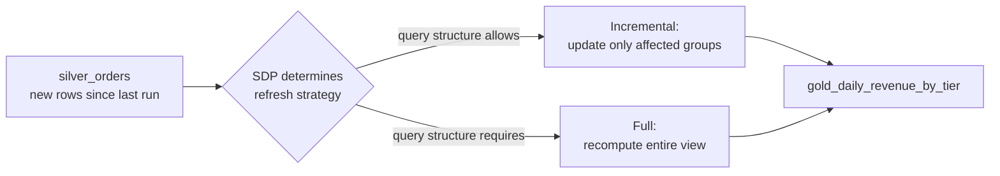
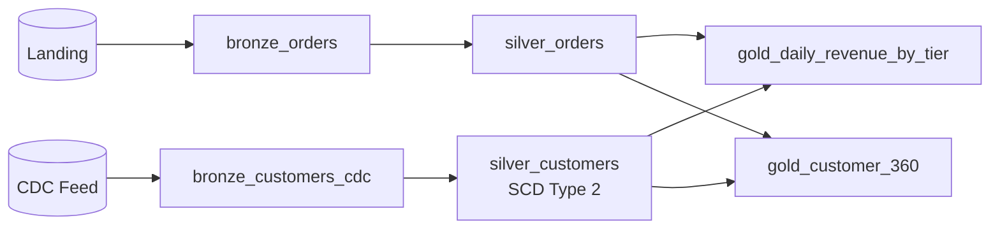

# Building the Gold layer - Materialized Views and Incremental Refresh
{: .no_toc }

*Estimated read: 12 min*

Completing the pipeline from the last two lectures: a gold materialized view joining silver orders
and silver customers, and the mechanics of how SDP keeps a materialized view current without
always fully recomputing it.

## The gold materialized view

```python
# transformations/gold_daily_revenue.py
import dlt as dp

@dp.materialized_view(
    name="gold_daily_revenue_by_tier",
    comment="Daily revenue by customer tier, for the finance dashboard"
)
def gold_daily_revenue_by_tier():
    orders = spark.read.table("silver_orders")
    customers = (spark.read.table("silver_customers")
        .filter("__END_AT IS NULL"))  # current customer state only

    return (orders.join(customers, "customer_id")
        .groupBy("order_date", "customer_tier")
        .agg({"order_total": "sum"})
        .withColumnRenamed("sum(order_total)", "total_revenue"))
```

Notice the join against silver customers filters to `__END_AT IS NULL` -- the current-version
filter from the previous lecture, applied here so gold reflects each customer's *current* tier,
not a historical snapshot mixed across versions.

## Full vs. incremental materialized view refresh

**Key term:** a materialized view's refresh can be **full** (recompute the entire result from
scratch) or **incremental** (compute only the delta implied by new upstream data, where the
query's structure allows it -- e.g. simple aggregations SDP can determine don't require touching
every historical row again). Which one happens is determined automatically by SDP based on the
query's structure, not something you configure directly for most queries.
{: .important }



Simple, grouping aggregations over append-only sources are the most likely candidates for
incremental refresh; complex joins, window functions spanning arbitrary history, or non-
deterministic logic are more likely to require a full recompute. You don't need to memorize the
exact eligibility rules to use materialized views effectively -- just know that simpler, more
additive aggregation logic gives SDP more room to optimize refresh cost automatically.

## Multiple gold views from the same silver layer

Exactly the pattern from Section 7's Medallion review lecture, now expressed in SDP:

```python
@dp.materialized_view(comment="Customer 360 for marketing")
def gold_customer_360():
    return (spark.read.table("silver_customers").filter("__END_AT IS NULL")
        .join(spark.read.table("silver_orders").groupBy("customer_id").count(), "customer_id"))

@dp.materialized_view(comment="Product performance for merchandising")
def gold_product_performance():
    return spark.read.table("silver_order_items").groupBy("product_id").sum("quantity", "revenue")
```

Both read from the same underlying silver tables independently -- no duplicated cleaning or
validation logic between them, exactly the reuse benefit Section 7 argued for conceptually, now
concretely built.

## The complete pipeline graph



Three layers, five tables, one pipeline, fully dependency-ordered and incrementally processed --
built across this section's last three lectures with a fraction of the manual streaming/checkpoint
code the same result would require using only Sections 5-8's techniques directly.

This is exactly the shape [Part 2's StepRight project]({{ '/02-stepright-capstone-project/' | relative_url }}) scales up
to a full production data engineering project, with real business logic, unit tests, and CI/CD
layered on top of the same core pattern built here.

<!-- prevnext:start -->

---

| [&larr; Previous: Building the Silver layer - AUTO CDC and SCD Type 2]({{ '/01-databricks-fundamentals/09-lakeflow-spark-declarative-pipelines-transformation-pillar/building-the-silver-layer-auto-cdc-and-scd-type-2/' | relative_url }}) | [Next: SDP Design Decisions and Production Patterns &rarr;]({{ '/01-databricks-fundamentals/09-lakeflow-spark-declarative-pipelines-transformation-pillar/sdp-design-decisions-and-production-patterns/' | relative_url }}) |
|:---|---:|

<!-- prevnext:end -->
