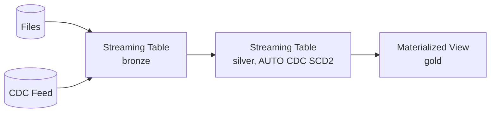

# Lakeflow Spark Declarative Pipelines - Transformation Pillar

The second Lakeflow pillar, and where the imperative streaming/`MERGE` code from Sections 5-8
gets replaced by declarative table definitions: core concepts (pipelines, flows, destinations),
the complete syntax reference, and a full hands-on build of a real bronze -> silver -> gold
pipeline -- Auto Loader as a streaming table, `AUTO CDC` with SCD Type 2, and a gold materialized
view -- closing with the production judgment calls that separate a demo pipeline from one you'd
trust in production.

## Lectures

| # | Lecture | Est. Read |
|---|---------|-----------|
| 1 | [What is Lakeflow SDP - Why it Replaces Manual Pipelines]({{ '/01-databricks-fundamentals/09-lakeflow-spark-declarative-pipelines-transformation-pillar/what-is-lakeflow-sdp-why-it-replaces-manual-pipelines/' | relative_url }}) | 8 min read |
| 2 | [Core concepts - Pipelines, Flows, Destinations, and the Python API]({{ '/01-databricks-fundamentals/09-lakeflow-spark-declarative-pipelines-transformation-pillar/core-concepts-pipelines-flows-destinations-and-the-python-api/' | relative_url }}) | 9 min read |
| 3 | [SDP API - Flow types, Destination Types, and Syntax]({{ '/01-databricks-fundamentals/09-lakeflow-spark-declarative-pipelines-transformation-pillar/sdp-api-flow-types-destination-types-and-syntax/' | relative_url }}) | 24 min read |
| 4 | [Building the Bronze layer - Auto Loader as a Streaming Table]({{ '/01-databricks-fundamentals/09-lakeflow-spark-declarative-pipelines-transformation-pillar/building-the-bronze-layer-auto-loader-as-a-streaming-table/' | relative_url }}) | 22 min read |
| 5 | [Building the Silver layer - AUTO CDC and SCD Type 2]({{ '/01-databricks-fundamentals/09-lakeflow-spark-declarative-pipelines-transformation-pillar/building-the-silver-layer-auto-cdc-and-scd-type-2/' | relative_url }}) | 13 min read |
| 6 | [Building the Gold layer - Materialized Views and Incremental Refresh]({{ '/01-databricks-fundamentals/09-lakeflow-spark-declarative-pipelines-transformation-pillar/building-the-gold-layer-materialized-views-and-incremental-refresh/' | relative_url }}) | 12 min read |
| 7 | [SDP Design Decisions and Production Patterns]({{ '/01-databricks-fundamentals/09-lakeflow-spark-declarative-pipelines-transformation-pillar/sdp-design-decisions-and-production-patterns/' | relative_url }}) | 8 min read |
| 8 | [Check Your Knowledge]({{ '/01-databricks-fundamentals/09-lakeflow-spark-declarative-pipelines-transformation-pillar/check-your-knowledge/' | relative_url }}) | Quiz |

<!-- prevnext:start -->

---

| [&larr; Previous: Check Your Knowledge]({{ '/01-databricks-fundamentals/08-lakeflow-connect-ingestion-pillar/check-your-knowledge/' | relative_url }}) | [Next: What is Lakeflow SDP - Why it Replaces Manual Pipelines &rarr;]({{ '/01-databricks-fundamentals/09-lakeflow-spark-declarative-pipelines-transformation-pillar/what-is-lakeflow-sdp-why-it-replaces-manual-pipelines/' | relative_url }}) |
|:---|---:|

<!-- prevnext:end -->
