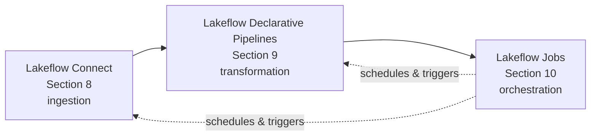
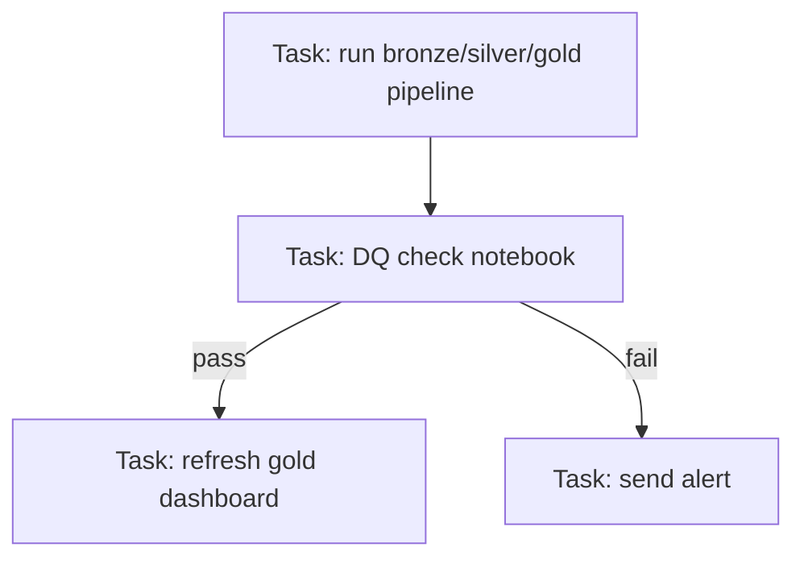

# What is Lakeflow Jobs - and where it fits
{: .no_toc }

*Estimated read: 8 min*

Section 8 got data into bronze. Section 9 transformed it through silver into gold. Neither runs on
its own schedule -- **Lakeflow Jobs** is the third pillar: what actually triggers, schedules,
sequences, and monitors everything you've built so far, in production.

## The three pillars, completed

**Key term:** a **job** is Databricks' unit of scheduled, orchestrated work -- one or more
**tasks**, wired together in a **DAG** (directed acyclic graph), run on a schedule or trigger, with
retries, dependencies, and monitoring built in. If your prior tooling used a dedicated scheduler
(Airflow, a cron-driven Talend scheduler, or a warehouse's own job scheduler), Lakeflow Jobs is the
direct equivalent -- native to Databricks, aware of pipelines and notebooks as first-class task
types.
{: .important }

## Task types

A job can mix several task types in one DAG:

- **Notebook task** -- run a specific notebook, optionally with parameters.
- **Pipeline task** -- trigger an SDP pipeline run (Section 9's pipelines become one task in a
  larger job).
- **Python script task** -- run a `.py` file directly, useful for logic that doesn't need a
  notebook's interactive shape.
- **SQL task** -- run a SQL query or dashboard refresh.
- **dbt task**, **JAR task**, and others -- less common in this guide's scope, but available for
  broader tooling integration.

## Why orchestration is a separate pillar from transformation

It's tempting to assume Section 9's SDP pipelines are "done" once they run correctly once -- but a
pipeline with no schedule just sits there. Lakeflow Jobs answers the questions SDP itself
deliberately doesn't: *when* does this run, *what else* has to run before or after it, *what
happens on failure*, and *who gets notified*. Keeping this cleanly separate from transformation
logic (SDP) means a pipeline's internal logic doesn't need to know anything about its own
schedule -- the same separation of concerns a well-run legacy ETL platform enforced between "the
transformation logic" and "the scheduler config."

## What a realistic job looks like

One job, three or four tasks, a real dependency chain including a conditional branch on data
quality results -- exactly the shape the next several lectures build hands-on, and the pattern
[Part 2's StepRight orchestration section]({{ '/02-stepright-capstone-project/05-stepright-orchestration-and-job-scheduling/' | relative_url }})
scales up to a full four-task production job.

## What the rest of this section covers

Building a first job with a schedule and notifications, parameterizing jobs (widgets and job
parameters, connecting back to Section 4's `dbutils.widgets`), passing values between tasks and
using repair runs, multi-task DAGs with control flow and backfill, automating job management via
REST API/CLI, and closing with production design patterns -- the final section of Part 1 before
Part 2's full capstone project.

For the complete official reference, see [Lakeflow Jobs overview](https://docs.databricks.com/aws/en/jobs/).

<!-- prevnext:start -->

---

| [&larr; Previous: Lakeflow Jobs - The Orchestration Pillar]({{ '/01-databricks-fundamentals/10-lakeflow-jobs-the-orchestration-pillar/' | relative_url }}) | [Next: Your first job - pipeline task, schedule, and job-level config &rarr;]({{ '/01-databricks-fundamentals/10-lakeflow-jobs-the-orchestration-pillar/your-first-job-pipeline-task-schedule-and-job-level-config/' | relative_url }}) |
|:---|---:|

<!-- prevnext:end -->
