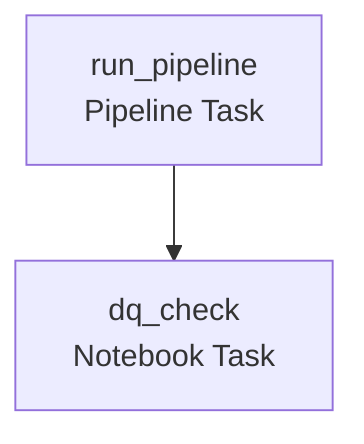

# Your first job - pipeline task, schedule, and job-level config
{: .no_toc }

*Estimated read: 17 min*

A complete, working job: run the Medallion pipeline from Section 9 daily, follow it with a data
quality check, schedule it, and get notified on failure.

## Creating the job: UI walkthrough

1. **Workflows -> Create job.**
2. **Add task 1**, type **Pipeline**: select the SDP pipeline from Section 9. This task type
   triggers a full pipeline run and waits for it to complete before the job considers this task
   done.
3. **Add task 2**, type **Notebook**: a data-quality check notebook, with a dependency on task 1
   (**Depends on: task 1**) -- so it only runs after the pipeline succeeds.
4. **Set a schedule**: Cron syntax or the UI's simple scheduler (e.g. "Daily at 2:00 AM"), plus a
   timezone.
5. **Configure notifications**: email addresses to notify on job start, success, or failure.

## The same job, as YAML (asset bundle style)

```yaml
resources:
  jobs:
    daily_medallion_pipeline:
      name: "Daily Medallion Pipeline"
      schedule:
        quartz_cron_expression: "0 0 2 * * ?"
        timezone_id: "America/New_York"
      email_notifications:
        on_failure: ["data-eng-team@company.com"]
      tasks:
        - task_key: run_pipeline
          pipeline_task:
            pipeline_id: ${var.pipeline_id}
        - task_key: dq_check
          depends_on:
            - task_key: run_pipeline
          notebook_task:
            notebook_path: /Repos/steprightproject/notebooks/dq_check
```

This YAML form is what a real project keeps in a Git folder (Section 4) and deploys via CI/CD
(Part 2's final section) -- the UI walkthrough above and this file describe the exact same job.

## Reading the DAG



**Key term:** `depends_on` is what turns a flat list of tasks into an actual **DAG** -- without it,
tasks with no dependency relationship run in parallel by default, which is sometimes what you
want (independent bronze ingestion tasks, for instance) and sometimes not (a downstream
transformation that must wait for ingestion to finish first). Declare dependencies explicitly
rather than relying on task ordering in a config file, which has no bearing on actual execution
order.
{: .important }

## Job-level vs. task-level configuration

Some settings apply to the whole job; others can be overridden per task:

| Setting | Job-level | Per-task override |
|---|---|---|
| Schedule/trigger | Yes | No -- schedule is job-wide |
| Compute (cluster) | Default for all tasks | Yes -- a task can specify its own cluster |
| Notifications | Yes | Yes, additional per-task notifications possible |
| Timeout | Yes | Yes |
| Retry policy | Yes | Yes |

A common pattern: set a sensible job-level default (e.g. retry twice, 1-hour timeout), and
override only for a specific task that genuinely needs different behavior (a long-running backfill
task needing a longer timeout, for instance).

## Triggers beyond a fixed schedule

Beyond cron-style schedules, jobs also support:

- **File arrival triggers** -- start a job when new files land in a specified cloud storage
  location, useful for event-driven ingestion rather than a fixed schedule guessing at arrival
  timing.
- **Continuous mode** -- for jobs that should effectively always be running, restarting
  automatically if they stop.
- **Manual/API-triggered** -- run on demand, covered in this section's REST API/CLI lecture.

## Verifying the job actually works

After creating it, use **Run now** to trigger a manual execution before trusting the schedule --
confirming the pipeline task succeeds, the DQ check runs after it (not in parallel), and a
deliberately-broken test run actually triggers the failure notification. Testing the failure path
explicitly (not just the happy path) is the same discipline from Section 6's access-control
testing, applied here to job reliability.
{: .important }

<!-- prevnext:start -->

---

| [&larr; Previous: What is Lakeflow Jobs - and where it fits]({{ '/01-databricks-fundamentals/10-lakeflow-jobs-the-orchestration-pillar/what-is-lakeflow-jobs-and-where-it-fits/' | relative_url }}) | [Next: Parameterizing jobs - Passing Parameters to Notebook Task &rarr;]({{ '/01-databricks-fundamentals/10-lakeflow-jobs-the-orchestration-pillar/parameterizing-jobs-passing-parameters-to-notebook-task/' | relative_url }}) |
|:---|---:|

<!-- prevnext:end -->
