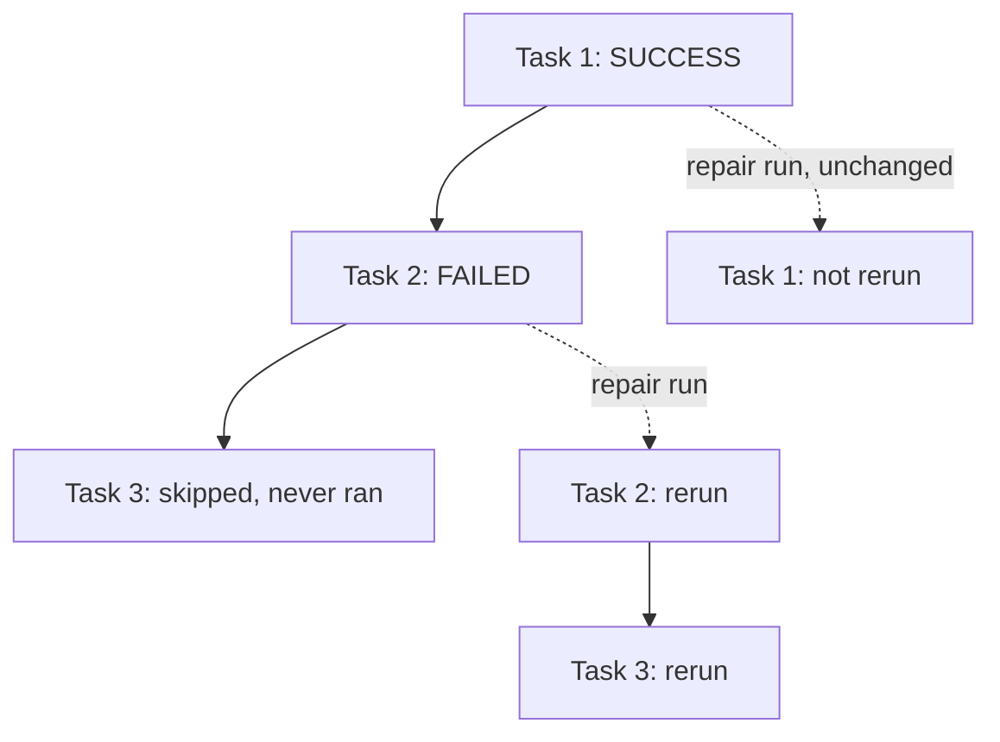

# Passing Parameters to Python Script Task, Task Value, Repair Runs
{: .no_toc }

*Estimated read: 13 min*

Three related mechanics: how a **Python script task** (not a notebook) receives parameters,
how one task passes a value **forward** to a later task in the same job, and how to recover from a
partial job failure without rerunning everything.

## Python script tasks receive parameters as command-line arguments

Unlike a notebook task's `dbutils.widgets`, a Python script task gets its parameters as standard
`sys.argv` command-line arguments:

```yaml
tasks:
  - task_key: reconcile_orders
    python_wheel_task:
      package_name: "steprightproject"
      entry_point: "reconcile"
      parameters: ["--run_date", "{{job.parameters.run_date}}", "--environment", "prod"]
```

```python
# reconcile.py
import argparse

parser = argparse.ArgumentParser()
parser.add_argument("--run_date", required=True)
parser.add_argument("--environment", required=True)
args = parser.parse_args()

print(f"Reconciling {args.run_date} in {args.environment}")
```

Same underlying idea as notebook widgets -- values flow from the job configuration into the running
code -- but through the standard Python argument-parsing pattern rather than a Databricks-specific
API, since a script task doesn't have a notebook's cell-based execution context.

## Task values: passing data forward between tasks

**Key term:** a **task value** is a small piece of data one task explicitly sets, which a
*downstream* task in the same job run can read -- the mechanism for passing computed results
forward through a DAG, not just static configuration.
{: .important }

```python
# In an upstream task
dbutils.jobs.taskValues.set(key="row_count", value=row_count)
dbutils.jobs.taskValues.set(key="quality_passed", value=True)
```

```python
# In a downstream task, depends_on the upstream task
row_count = dbutils.jobs.taskValues.get(
    taskKey="run_pipeline", key="row_count", default=0
)
if row_count == 0:
    dbutils.notebook.exit("No rows processed -- skipping downstream steps")
```

This is what lets a data-quality task make a genuine decision based on what an earlier task
actually found -- "did the pipeline process a suspiciously low row count" -- rather than every
task in the DAG running blind to what happened before it.

## Repair runs: fixing a partial failure without a full rerun

When a multi-task job run fails partway through, **Repair run** re-executes **only the failed and
downstream-dependent tasks** -- tasks that already succeeded are left alone, not rerun:



This matters for cost and time on a job with an expensive early task (a large pipeline run,
say) followed by a cheap task that happens to fail -- Repair run avoids paying for the expensive
task again just to retry the cheap one.

**The idempotency caveat, worth restating explicitly:** a repair reruns each unsuccessful task
**from the beginning**, not from wherever it failed mid-execution. If that task isn't idempotent
(Section 5's idempotent-writes lecture), a repair run can duplicate partial work the failed
attempt already committed before it crashed. This is exactly why Section 5 emphasized `MERGE
INTO`-based writes over plain `INSERT` for pipeline logic -- idempotent tasks make repair runs
safe; non-idempotent ones make them risky.
{: .important }

## Putting it together

```text
1. Task fails partway through a run
2. Diagnose the cause in the Jobs UI (error message, logs)
3. Fix the underlying issue (config, data, code)
4. Repair run -- only the failed task and anything downstream of it reruns
5. Confirm task values and outputs from the repaired run are correct
```

For the complete official reference on repair runs, including UI-specific diagnostic tools, see
[Repair job run failures](https://docs.databricks.com/aws/en/jobs/repair-job-failures).

<!-- prevnext:start -->

---

| [&larr; Previous: Parameterizing jobs - Passing Parameters to Notebook Task]({{ '/01-databricks-fundamentals/10-lakeflow-jobs-the-orchestration-pillar/parameterizing-jobs-passing-parameters-to-notebook-task/' | relative_url }}) | [Next: Multi-task DAGs - Control Flow, Retries, and Backfill &rarr;]({{ '/01-databricks-fundamentals/10-lakeflow-jobs-the-orchestration-pillar/multi-task-dags-control-flow-retries-and-backfill/' | relative_url }}) |
|:---|---:|

<!-- prevnext:end -->
