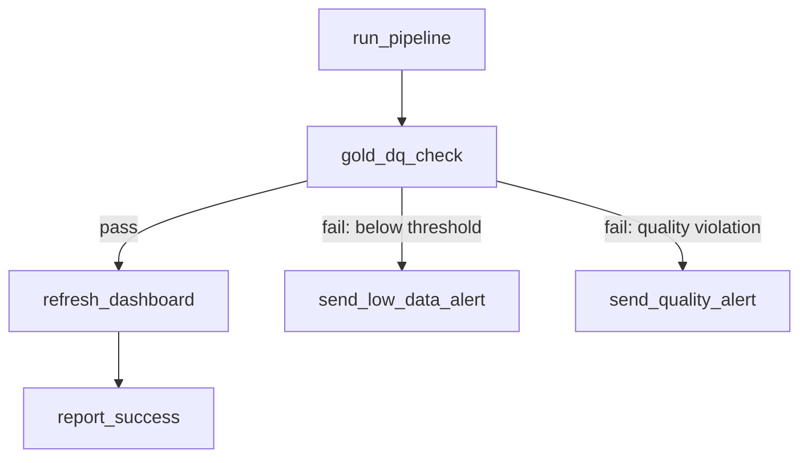

# Multi-task DAGs - Control Flow, Retries, and Backfill
{: .no_toc }

*Estimated read: 21 min*

Everything from this section so far scales up here: a realistic multi-task DAG with conditional
branching on data quality results, alerting, retry policy, and the specific pattern for
**backfilling** a job across a historical date range.

## The DAG for this lecture



One pipeline run, a gold-layer data quality gate, and two distinct failure paths depending on
*what kind* of problem was found -- not just pass/fail, but differentiated alerting based on the
failure category.

## Control flow: `Run if` conditions

```yaml
tasks:
  - task_key: gold_dq_check
    depends_on: [{task_key: run_pipeline}]
    notebook_task:
      notebook_path: /Repos/steprightproject/notebooks/gold_dq_check

  - task_key: refresh_dashboard
    depends_on: [{task_key: gold_dq_check}]
    run_if: ALL_SUCCESS
    notebook_task:
      notebook_path: /Repos/steprightproject/notebooks/refresh_dashboard

  - task_key: send_low_data_alert
    depends_on: [{task_key: gold_dq_check}]
    run_if: AT_LEAST_ONE_FAILED
    notebook_task:
      notebook_path: /Repos/steprightproject/notebooks/alert_low_data
```

`run_if` conditions (`ALL_SUCCESS`, `AT_LEAST_ONE_FAILED`, `ALL_DONE`, and others) control whether
a task runs based on its dependencies' outcomes -- this is what makes a **conditional branch**
possible: `refresh_dashboard` only runs on success, while an alert task specifically runs *only*
on failure, rather than every task blindly waiting for "all dependencies finished, regardless of
outcome."

## Differentiating failure types with task values

```python
# gold_dq_check notebook
row_count = spark.table("gold.daily_revenue_by_tier").filter("order_date = current_date()").count()
expected_min = 100

if row_count == 0:
    dbutils.jobs.taskValues.set(key="failure_type", value="no_data")
    dbutils.notebook.exit("FAIL: no rows found")
elif row_count < expected_min:
    dbutils.jobs.taskValues.set(key="failure_type", value="low_data")
    dbutils.notebook.exit(f"FAIL: only {row_count} rows, expected at least {expected_min}")
else:
    dbutils.jobs.taskValues.set(key="failure_type", value=None)
    dbutils.notebook.exit("PASS")
```

A downstream alert task reads `failure_type` via `dbutils.jobs.taskValues.get(...)` (previous
lecture) to route to the right notification -- a **low data warning** (volume below an expected
threshold, but not zero) is a meaningfully different signal than **no data at all**, and often
warrants different urgency and different people notified.

## Retry policy

```yaml
tasks:
  - task_key: run_pipeline
    max_retries: 2
    min_retry_interval_millis: 60000
    retry_on_timeout: true
    pipeline_task:
      pipeline_id: ${var.pipeline_id}
```

**Key term:** retries handle **transient** failures (a momentary network blip, a brief source
system outage) automatically -- but retrying a task that failed for a *persistent* reason (bad
data, a genuine bug) just delays the inevitable failure notification while burning compute on
repeated identical attempts. Set retry counts based on how likely a failure genuinely is to be
transient for that specific task, not as a blanket "more retries is safer" default.
{: .important }

## Backfill: running a job across a historical date range

A **backfill** reruns a job's logic for a range of past dates -- common after fixing a bug that
affected several days of processing, or when standing up a new pipeline against historical data
for the first time.

```python
# backfill_runner.py -- triggers the job once per date in a range via the Jobs API
from datetime import date, timedelta
import requests

start = date(2026, 8, 1)
end = date(2026, 8, 14)
current = start

while current <= end:
    requests.post(
        f"{DATABRICKS_HOST}/api/2.2/jobs/run-now",
        headers={"Authorization": f"Bearer {TOKEN}"},
        json={
            "job_id": JOB_ID,
            "job_parameters": {"run_date": current.isoformat()}
        }
    )
    current += timedelta(days=1)
```

This uses the Jobs REST API (covered fully in the next lecture) to trigger the same job repeatedly,
once per historical date, reusing the job's existing parameterization (`run_date`, from earlier in
this section) rather than writing separate one-off backfill logic.

**Idempotency matters even more here than for a normal rerun.** Backfilling fourteen days means
running each day's logic potentially against data that's already partially there from a prior
attempt -- non-idempotent writes compound across every date in the range, not just one. The
`MERGE INTO`-based pipeline design from Sections 5 and 9 is what makes this backfill genuinely safe
to run repeatedly.
{: .important }

## Threshold-based reporting

Beyond pass/fail, a **threshold-based** check compares a metric against an expected range rather
than a fixed value -- useful when "normal" daily volume itself varies (weekday vs. weekend order
counts, for instance):

```python
avg_last_7_days = spark.sql("""
    SELECT avg(daily_count) FROM (
      SELECT order_date, count(*) AS daily_count
      FROM silver.orders
      WHERE order_date BETWEEN current_date() - 7 AND current_date() - 1
      GROUP BY order_date
    )
""").collect()[0][0]

today_count = spark.table("silver.orders").filter("order_date = current_date()").count()

if today_count < avg_last_7_days * 0.5:
    dbutils.jobs.taskValues.set(key="failure_type", value="low_data")
```

Comparing against a rolling average rather than a hardcoded constant is what
[Part 2's StepRight data quality monitoring section]({{ '/02-stepright-capstone-project/07-stepright-data-quality-monitoring/' | relative_url }})
builds out fully, with a real dashboard tracking these thresholds over time.

## What this lecture ties together

Control flow, differentiated alerting, retries scoped to actual failure likelihood, and safe
backfill -- this is the difference between a job that merely runs and one a team actually trusts
enough to stop watching manually every morning. The next lecture covers automating job management
itself (creation, updates, triggering) via the REST API and CLI, closing out the hands-on portion
of this section.

<!-- prevnext:start -->

---

| [&larr; Previous: Passing Parameters to Python Script Task, Task Value, Repair Runs]({{ '/01-databricks-fundamentals/10-lakeflow-jobs-the-orchestration-pillar/passing-parameters-to-python-script-task-task-value-repair-runs/' | relative_url }}) | [Next: Automating Jobs - REST API and Databricks CLI &rarr;]({{ '/01-databricks-fundamentals/10-lakeflow-jobs-the-orchestration-pillar/automating-jobs-rest-api-and-databricks-cli/' | relative_url }}) |
|:---|---:|

<!-- prevnext:end -->
