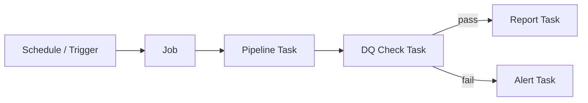

# Lakeflow Jobs - The Orchestration Pillar

The third and final Lakeflow pillar, and Part 1's closing section: scheduling and orchestrating
everything built in Sections 8 and 9. Tasks and DAGs, building a first scheduled job, parameter
passing to both notebook and Python script tasks, task values and repair runs, multi-task DAGs
with conditional branching and safe backfill, automating job management via REST API/CLI and
asset bundles, and the production patterns that make a job something a team actually trusts.

## Lectures

| # | Lecture | Est. Read |
|---|---------|-----------|
| 1 | [What is Lakeflow Jobs - and where it fits]({{ '/01-databricks-fundamentals/10-lakeflow-jobs-the-orchestration-pillar/what-is-lakeflow-jobs-and-where-it-fits/' | relative_url }}) | 8 min read |
| 2 | [Your first job - pipeline task, schedule, and job-level config]({{ '/01-databricks-fundamentals/10-lakeflow-jobs-the-orchestration-pillar/your-first-job-pipeline-task-schedule-and-job-level-config/' | relative_url }}) | 17 min read |
| 3 | [Parameterizing jobs - Passing Parameters to Notebook Task]({{ '/01-databricks-fundamentals/10-lakeflow-jobs-the-orchestration-pillar/parameterizing-jobs-passing-parameters-to-notebook-task/' | relative_url }}) | 16 min read |
| 4 | [Passing Parameters to Python Script Task, Task Value, Repair Runs]({{ '/01-databricks-fundamentals/10-lakeflow-jobs-the-orchestration-pillar/passing-parameters-to-python-script-task-task-value-repair-runs/' | relative_url }}) | 13 min read |
| 5 | [Multi-task DAGs - Control Flow, Retries, and Backfill]({{ '/01-databricks-fundamentals/10-lakeflow-jobs-the-orchestration-pillar/multi-task-dags-control-flow-retries-and-backfill/' | relative_url }}) | 21 min read |
| 6 | [Automating Jobs - REST API and Databricks CLI]({{ '/01-databricks-fundamentals/10-lakeflow-jobs-the-orchestration-pillar/automating-jobs-rest-api-and-databricks-cli/' | relative_url }}) | 14 min read |
| 7 | [Jobs Design Decisions and Production Patterns]({{ '/01-databricks-fundamentals/10-lakeflow-jobs-the-orchestration-pillar/jobs-design-decisions-and-production-patterns/' | relative_url }}) | 5 min read |
| 8 | [Check Your Knowledge]({{ '/01-databricks-fundamentals/10-lakeflow-jobs-the-orchestration-pillar/check-your-knowledge/' | relative_url }}) | Quiz |

<!-- prevnext:start -->

---

| [&larr; Previous: Check Your Knowledge]({{ '/01-databricks-fundamentals/09-lakeflow-spark-declarative-pipelines-transformation-pillar/check-your-knowledge/' | relative_url }}) | [Next: What is Lakeflow Jobs - and where it fits &rarr;]({{ '/01-databricks-fundamentals/10-lakeflow-jobs-the-orchestration-pillar/what-is-lakeflow-jobs-and-where-it-fits/' | relative_url }}) |
|:---|---:|

<!-- prevnext:end -->
