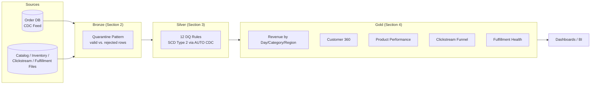

# What are we building-StepRight Architecture Walkthrough
{: .no_toc }

*Estimated read: 19 min*

Part 1 gave you eight sections' worth of individual Databricks capabilities. This lecture is the
blueprint for the project that spends the rest of Part 2 wiring them together: **StepRight**, a
direct-to-consumer footwear and apparel retailer whose data platform you're about to build from an
empty catalog to a deployed, tested, monitored production job.

## The business behind the data

StepRight sells shoes and apparel through its own web storefront. Like most retailers that grew
past a single Excel-and-email operation, it now runs on a handful of disconnected systems: an
operational order-management database that customer support and fulfillment both write to, a
product catalog maintained by merchandising, warehouse inventory snapshots from a 3PL, clickstream
logs from the website, and a shipment feed from the carrier integration. None of these systems
were built to talk to each other, and the "reporting" that stitches them together today is a
nightly export-to-spreadsheet process that a single analyst maintains by hand -- the same failure
mode as the hand-built Talend jobs and end-of-month spreadsheet reconciliations that show up
constantly in Part 3's legacy migration stories. StepRight's ask is the one you'll hear from every
real stakeholder: trustworthy, timely, governed numbers, without hiring an analyst per report.

## The two ingestion patterns

Every source StepRight has falls into one of two shapes, and Section 2 builds a dedicated bronze
pipeline for each:

- **Change data capture (CDC).** The order-management database's core operational tables --
  **orders**, **order items**, and **customers** -- change constantly and need near-real-time
  propagation without StepRight's engineering team writing custom polling code. This uses the same
  managed CDC connector pattern from [Part 1, Section 8]({{ '/01-databricks-fundamentals/08-lakeflow-connect-ingestion-pillar/' | relative_url }}):
  Lakeflow Connect lands a raw change feed, and the bronze layer reads it as a stream.
- **Batch file drops.** Product catalog updates, inventory snapshots, clickstream events, and
  fulfillment updates arrive as files -- JSON or CSV, dropped on a schedule rather than streamed
  row by row -- landing in source-specific subfolders of a governed volume and picked up by Auto
  Loader, exactly as in [Part 1, Section 7]({{ '/01-databricks-fundamentals/07-medallion-architecture-design-and-implementation/' | relative_url }})
  and [Section 8]({{ '/01-databricks-fundamentals/08-lakeflow-connect-ingestion-pillar/' | relative_url }}).

Section 1 (this section) builds the landing zone both patterns depend on before either pipeline
exists.

## Medallion architecture, end to end

The layer boundaries follow the same discipline Part 1, Section 7 laid out: **bronze** is a
faithful, minimally transformed copy of the source with a quarantine pattern for structurally bad
rows; **silver** is where business data quality rules actually apply, with **AUTO CDC** handling
Type 2 history for the CDC-sourced tables (`orders`, `order_items`, `customers`); **gold** is
purpose-built, denormalized tables for specific consumers -- finance wants daily revenue by
category and region, marketing wants a customer 360 view, merchandising wants product velocity
against inventory, growth wants a clickstream funnel, and operations wants delivery health. Five
different gold tables, one shared silver layer underneath them -- the payoff of medallion
architecture done right.

## What sits around the pipeline

A pipeline that only transforms data isn't a project a team can trust in production. Sections 5
through 8 build everything around the transformation logic itself:

| Section | What it adds | Why it exists |
|---|---|---|
| 5. Orchestration and Job Scheduling | A Lakeflow Job wiring ingestion, DQ checks, transformation, and reporting into one scheduled, parameterized run | Someone has to trigger this daily without a human clicking "run" |
| 6. Unit Testing | Pytest-based tests against the transformation logic itself, with a Spark fixture | Catch a broken discount calculation before it reaches silver, not after |
| 7. Data Quality Monitoring | A dashboard and alerts built on the pipeline event log and quarantine counts | Prove the data is trustworthy instead of asserting it |
| 8. Integration Testing, Packaging, and Deployment | Databricks Asset Bundles, a dev/UAT/prod promotion path, and a CI/CD pipeline | Get this out of your personal workspace and into something a team can safely redeploy |

## Where Section 1 fits

Everything above depends on a landing zone existing first. This section does four things, each
its own lecture: plans the project's folder structure and the six-step skeleton every later
section extends (Lecture 2); provisions the actual Git folder, catalog, schema, and volume in
Databricks (Lecture 3); designs a test data strategy that stands in for access to StepRight's real
production database (Lecture 4); and seeds a first "batch zero" of realistic data with a
Faker-based generator so Section 2's bronze pipelines have something real to read on day one
(Lecture 5). By the end of this section, `dev.step_right` exists, has a governed landing volume
with data in it, and Section 2 can start writing pipeline code against real tables instead of an
empty schema.
{: .important }

## A note on scale

StepRight is deliberately small enough to run end to end on modest compute and generated data --
a few thousand customers, tens of thousands of orders -- while still being structurally honest
about a real retail platform: multiple sources, multiple ingestion patterns, real data quality
problems (missing foreign keys, out-of-range discounts, duplicate CDC events), and a real
deployment story. Every pattern you build here -- bronze quarantine, silver DQ gates, AUTO CDC
history, tested and orchestrated jobs -- is the same pattern Part 3 applies at legacy-warehouse
scale. The scale changes; the architecture doesn't.

<!-- prevnext:start -->

---

| [&larr; Previous: StepRight - Project Foundation]({{ '/02-stepright-capstone-project/01-stepright-project-foundation/' | relative_url }}) | [Next: Project Structure - Planning the Initial Project Structure &rarr;]({{ '/02-stepright-capstone-project/01-stepright-project-foundation/project-structure-planning-the-initial-project-structure/' | relative_url }}) |
|:---|---:|

<!-- prevnext:end -->

