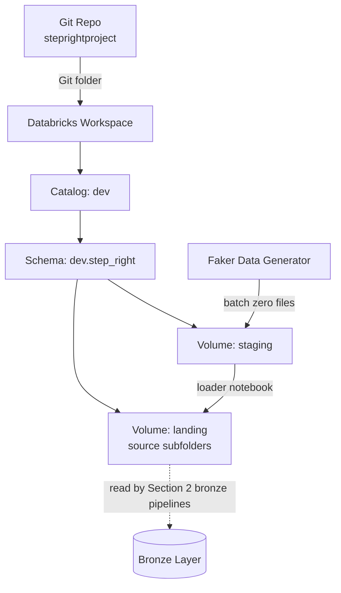

# StepRight - Project Foundation

Every pipeline in Sections 2 through 8 reads from and writes to objects this section creates --
skipping it means retrofitting a catalog, schema, and volume structure underneath code that's
already running, which is exactly the kind of rework a real project avoids by doing setup first.
This section stands up StepRight's Databricks footprint (Git folder, catalog, schema, landing
volume), defines a test data strategy that stands in for access to a production order system, and
seeds a first batch of realistic data so every later section has something real to ingest, not a
placeholder.

## Lectures

| # | Lecture | Est. Read |
|---|---------|-----------|
| 1 | [What are we building-StepRight Architecture Walkthrough]({{ '/02-stepright-capstone-project/01-stepright-project-foundation/what-are-we-building-stepright-architecture-walkthrough/' | relative_url }}) | 19 min read |
| 2 | [Project Structure - Planning the Initial Project Structure]({{ '/02-stepright-capstone-project/01-stepright-project-foundation/project-structure-planning-the-initial-project-structure/' | relative_url }}) | 6 min read |
| 3 | [Environment Setup - Repo, Catalog, Schema, and Volume]({{ '/02-stepright-capstone-project/01-stepright-project-foundation/environment-setup-repo-catalog-schema-and-volume/' | relative_url }}) | 9 min read |
| 4 | [Test Data Strategy - Planning your Test Data Preparation]({{ '/02-stepright-capstone-project/01-stepright-project-foundation/test-data-strategy-planning-your-test-data-preparation/' | relative_url }}) | 7 min read |
| 5 | [Seed the Project - Data Generator and Loader Notebook]({{ '/02-stepright-capstone-project/01-stepright-project-foundation/seed-the-project-data-generator-and-loader-notebook/' | relative_url }}) | 8 min read |
| 6 | [Download Project Source Code]({{ '/02-stepright-capstone-project/01-stepright-project-foundation/download-project-source-code/' | relative_url }}) | 2 min read |

<!-- prevnext:start -->

---

| [&larr; Previous: StepRight Capstone Project]({{ '/02-stepright-capstone-project/' | relative_url }}) | [Next: What are we building-StepRight Architecture Walkthrough &rarr;]({{ '/02-stepright-capstone-project/01-stepright-project-foundation/what-are-we-building-stepright-architecture-walkthrough/' | relative_url }}) |
|:---|---:|

<!-- prevnext:end -->

