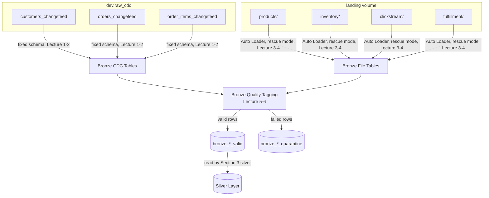

# StepRight - Ingestion Layer

With `dev.step_right` provisioned and batch zero seeded, this section builds the first layer that
actually runs: bronze. StepRight's two source shapes -- Lakeflow Connect's CDC feed and Auto
Loader's file drops -- get separate pipelines because they fail differently and need different
schema discipline, and both feed a shared quarantine pattern so a structurally broken row gets
flagged and set aside instead of silently corrupting everything downstream in silver.

## Lectures

| # | Lecture | Est. Read |
|---|---------|-----------|
| 1 | [Planning and Designing Bronze Pipeline for CDC Sources]({{ '/02-stepright-capstone-project/02-stepright-ingestion-layer/planning-and-designing-bronze-pipeline-for-cdc-sources/' | relative_url }}) | 7 min read |
| 2 | [Developing Bronze Pipeline for CDC Sources]({{ '/02-stepright-capstone-project/02-stepright-ingestion-layer/developing-bronze-pipeline-for-cdc-sources/' | relative_url }}) | 19 min read |
| 3 | [Planning and Designing Bronze Pipeline for File Sources]({{ '/02-stepright-capstone-project/02-stepright-ingestion-layer/planning-and-designing-bronze-pipeline-for-file-sources/' | relative_url }}) | 3 min read |
| 4 | [Developing Bronze SDP Pipeline for File Sources]({{ '/02-stepright-capstone-project/02-stepright-ingestion-layer/developing-bronze-sdp-pipeline-for-file-sources/' | relative_url }}) | 5 min read |
| 5 | [Design Source Data Quality Monitoring in Bronze Layer]({{ '/02-stepright-capstone-project/02-stepright-ingestion-layer/design-source-data-quality-monitoring-in-bronze-layer/' | relative_url }}) | 9 min read |
| 6 | [Developing Quarantine Pattern in Bronze Layer]({{ '/02-stepright-capstone-project/02-stepright-ingestion-layer/developing-quarantine-pattern-in-bronze-layer/' | relative_url }}) | 13 min read |

<!-- prevnext:start -->

---

| [&larr; Previous: Download Project Source Code]({{ '/02-stepright-capstone-project/01-stepright-project-foundation/download-project-source-code/' | relative_url }}) | [Next: Planning and Designing Bronze Pipeline for CDC Sources &rarr;]({{ '/02-stepright-capstone-project/02-stepright-ingestion-layer/planning-and-designing-bronze-pipeline-for-cdc-sources/' | relative_url }}) |
|:---|---:|

<!-- prevnext:end -->

