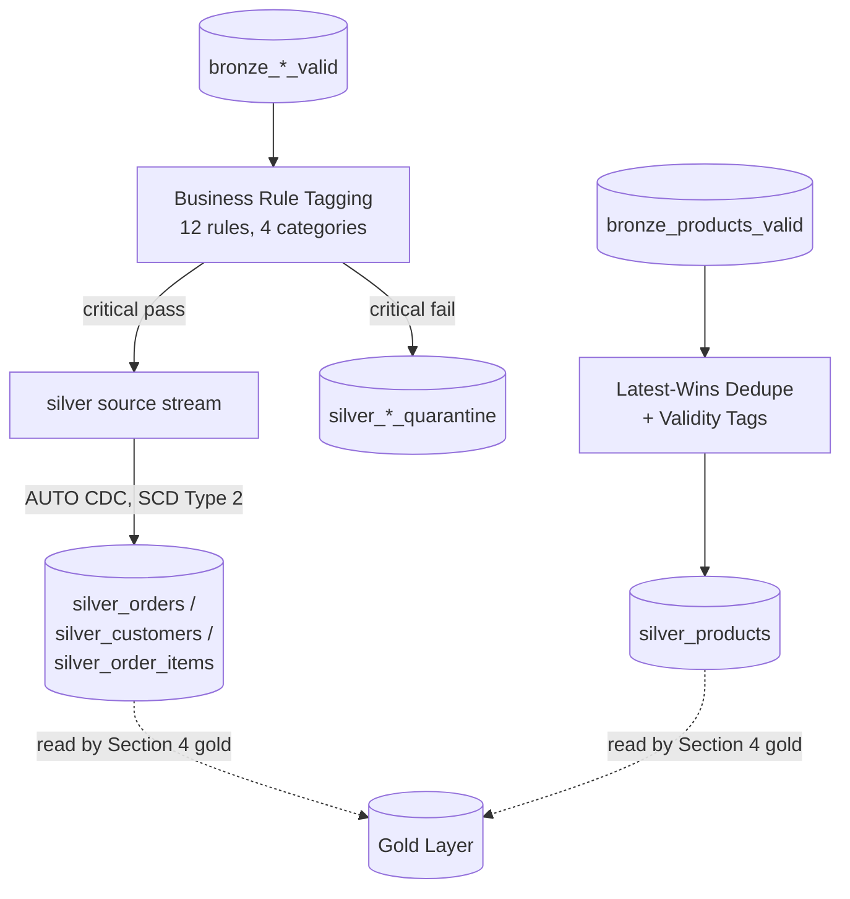

# StepRight - Transformation Layers

Bronze proved StepRight's data is structurally usable; silver decides whether it's *correct*. This
section is where twelve business rules get applied, where `orders`, `customers`, and
`order_items` gain full SCD Type 2 history via `AUTO CDC`, and where the report-only-by-default,
quarantine-when-critical philosophy that Section 4's gold tables will lean on entirely gets built
for real.

## Lectures

| # | Lecture | Est. Read |
|---|---------|-----------|
| 1 | [Design the Silver Layer Data Quality Rules and Approach]({{ '/02-stepright-capstone-project/03-stepright-transformation-layers/design-the-silver-layer-data-quality-rules-and-approach/' | relative_url }}) | 10 min read |
| 2 | [Planning and Designing Silver Pipeline for CDC Sources]({{ '/02-stepright-capstone-project/03-stepright-transformation-layers/planning-and-designing-silver-pipeline-for-cdc-sources/' | relative_url }}) | 10 min read |
| 3 | [Developing Silver Pipeline for AUTO CDC Sources]({{ '/02-stepright-capstone-project/03-stepright-transformation-layers/developing-silver-pipeline-for-auto-cdc-sources/' | relative_url }}) | 15 min read |
| 4 | [Planning and Designing Silver Pipeline for File Sources]({{ '/02-stepright-capstone-project/03-stepright-transformation-layers/planning-and-designing-silver-pipeline-for-file-sources/' | relative_url }}) | 2 min read |
| 5 | [Developing Silver SDP Pipeline for File Sources]({{ '/02-stepright-capstone-project/03-stepright-transformation-layers/developing-silver-sdp-pipeline-for-file-sources/' | relative_url }}) | 6 min read |

<!-- prevnext:start -->

---

| [&larr; Previous: Developing Quarantine Pattern in Bronze Layer]({{ '/02-stepright-capstone-project/02-stepright-ingestion-layer/developing-quarantine-pattern-in-bronze-layer/' | relative_url }}) | [Next: Design the Silver Layer Data Quality Rules and Approach &rarr;]({{ '/02-stepright-capstone-project/03-stepright-transformation-layers/design-the-silver-layer-data-quality-rules-and-approach/' | relative_url }}) |
|:---|---:|

<!-- prevnext:end -->

