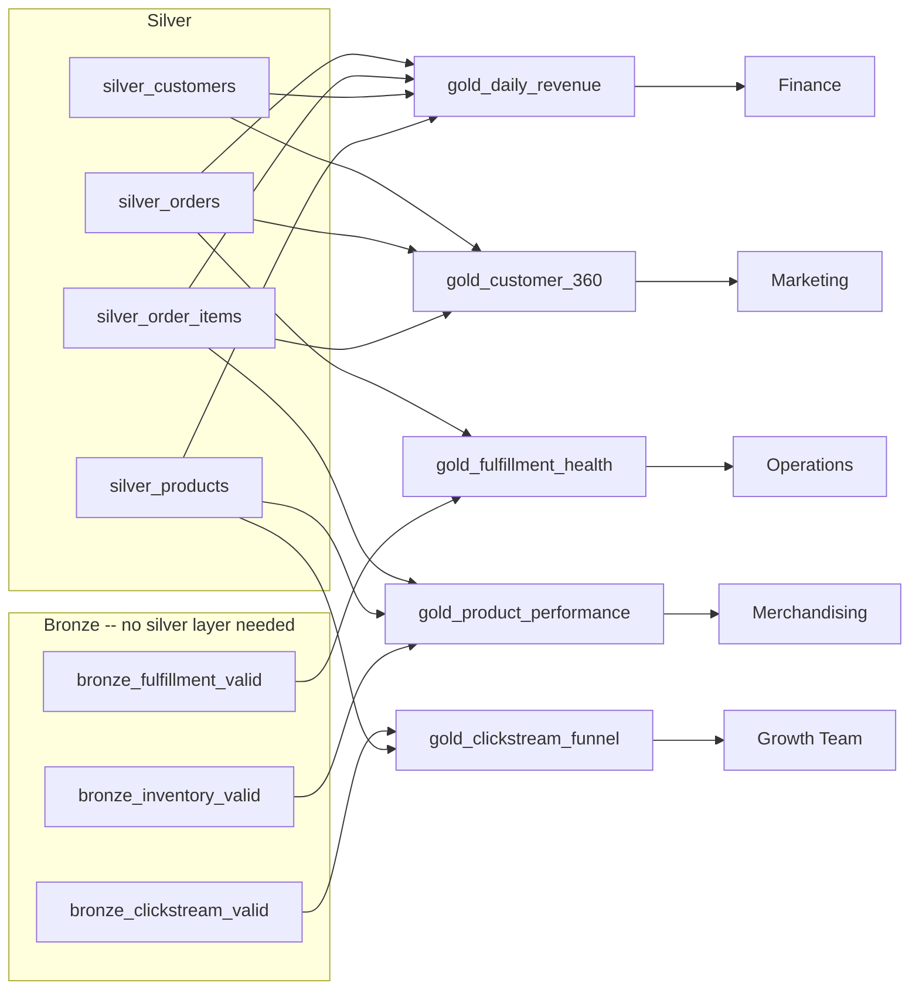

# StepRight - Gold Layer Reporting and Analysis

Section 3 left four clean, current-state-queryable silver tables and three bronze tables that never
needed business rules of their own. This section is where that shared foundation finally earns its
keep: five denormalized **gold** tables, each built for one specific consumer -- finance, marketing,
merchandising, growth, and operations -- instead of one generic "reporting layer" that satisfies
nobody well. Every gold table here is a Lakeflow Declarative Pipelines **materialized view**, the
same primitive [Part 1, Section 9]({{ '/01-databricks-fundamentals/09-lakeflow-spark-declarative-pipelines-transformation-pillar/' | relative_url }})
introduced, now doing real work: joining SCD Type 2 history at its current version, reconciling a
bronze table that skipped silver entirely, and turning row-level facts into the daily rollups a
dashboard actually queries.

## Lectures

| # | Lecture | Est. Read |
|---|---------|-----------|
| 1 | [Revenue Computation by Day, Category, Region]({{ '/02-stepright-capstone-project/04-stepright-gold-layer-reporting-and-analysis/revenue-computation-by-day-category-region/' | relative_url }}) | 10 min read |
| 2 | [Customer 360 for Marketing]({{ '/02-stepright-capstone-project/04-stepright-gold-layer-reporting-and-analysis/customer-360-for-marketing/' | relative_url }}) | 4 min read |
| 3 | [Product Performance and Sales Velocity for Merchandising]({{ '/02-stepright-capstone-project/04-stepright-gold-layer-reporting-and-analysis/product-performance-and-sales-velocity-for-merchandising/' | relative_url }}) | 5 min read |
| 4 | [Clickstream Funnel Analysis for Growth Teams]({{ '/02-stepright-capstone-project/04-stepright-gold-layer-reporting-and-analysis/clickstream-funnel-analysis-for-growth-teams/' | relative_url }}) | 4 min read |
| 5 | [Product Delivery and Fulfilment Health for Operations]({{ '/02-stepright-capstone-project/04-stepright-gold-layer-reporting-and-analysis/product-delivery-and-fulfilment-health-for-operations/' | relative_url }}) | 5 min read |

<!-- prevnext:start -->

---

| [&larr; Previous: Developing Silver SDP Pipeline for File Sources]({{ '/02-stepright-capstone-project/03-stepright-transformation-layers/developing-silver-sdp-pipeline-for-file-sources/' | relative_url }}) | [Next: Revenue Computation by Day, Category, Region &rarr;]({{ '/02-stepright-capstone-project/04-stepright-gold-layer-reporting-and-analysis/revenue-computation-by-day-category-region/' | relative_url }}) |
|:---|---:|

<!-- prevnext:end -->

