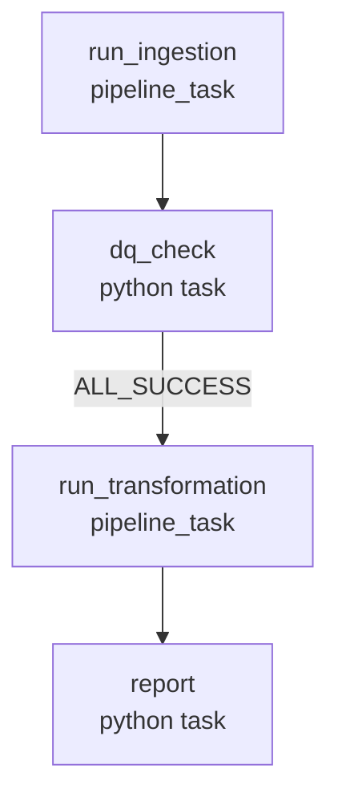

# Design the Orchestration and Job Flow
{: .no_toc }

*Estimated read: 5 min*

Sections 2 through 4 built everything StepRight needs to turn raw source data into five gold
tables finance, marketing, merchandising, growth, and operations can query -- but every one of
those runs happened because someone clicked "start" in the workspace UI. Nothing here runs on a
schedule yet, and nothing stops bad bronze data from silently reaching the gold layer. This
lecture designs the **Lakeflow Job** that fixes both problems before Lecture 4 builds it for real.

## From three manual runs to one daily job

As things stand, producing a fresh day of gold tables means three separate manual steps: start the
bronze pipeline, wait, then start whatever pipeline builds silver and gold, and hope nobody
forgets to check whether bronze actually landed clean data first. That's exactly the kind of
babysitting a legacy Control-M or Autosys batch chain existed to eliminate, and it's what a
Lakeflow Job does here: one scheduled trigger, a defined task order, and automatic failure
propagation if an early step goes wrong.

The manifest for this section settles on four tasks: **run ingestion**, **DQ check**, **run
transformation**, and **report**. That ordering is deliberate, not arbitrary -- the DQ check
sits *between* ingestion and transformation, not after everything, because the whole point of
gating is to stop bad bronze data before silver's `AUTO CDC` merges or gold's materialized views
build on top of it, not to discover the problem after every downstream table has already been
rebuilt from it.

## Why the DQ gate can't live inside one pipeline

Section 2's bronze pipeline (`steprightproject-bronze-cdc`) was defined with `libraries: - glob:
{include: transformations/**}` -- a wildcard broad enough that it would just as happily pick up
Section 3's `silver_cdc.py` and Section 4's `gold_reporting.py` the moment those files landed in
the same `transformations/` folder, folding bronze, silver, and gold into one growing pipeline
DAG. That worked fine while nothing needed to happen *between* layers. It stops working the moment
orchestration needs a real checkpoint: a Lakeflow Declarative Pipelines update runs its whole
graph as one unit, and there's no supported way to pause a pipeline mid-DAG for an external Python
check and only continue if that check passes.

A Lakeflow Job task, by contrast, can be exactly that checkpoint -- but only if ingestion and
transformation are two separate pipeline resources the job can trigger, inspect, and gate
independently.
{: .important }

## Splitting one pipeline into two scoped ones

This section narrows `steprightproject-bronze-cdc`'s glob to just the bronze files it was always
conceptually about, and introduces a second pipeline, `steprightproject-silver-gold`, scoped to
everything Sections 3 and 4 added:

| Pipeline | Glob scope | Built in |
|---|---|---|
| `steprightproject-bronze-cdc` | `transformations/bronze_*.py`, `transformations/bronze_*.sql` | Section 2 |
| `steprightproject-silver-gold` | `transformations/silver_*.py`, `transformations/gold_*.py`, `transformations/gold_*.sql` | Sections 3-4 |

Bronze Lecture 4 already flagged this as "a reasonable choice once a real team owns file-based
sources and CDC sources separately and wants independent deploy/monitor/alert boundaries" -- the
same reasoning extends one step further here: ingestion and transformation now need independent
*trigger* boundaries too, so a job task can run one, check the result, and only run the other if
that check passes. `transformations/dq_helpers.py`, a shared module imported by both pipelines
rather than a table-producing file itself, isn't matched by either glob and needs no change.

## The four-task DAG



`run_ingestion` triggers `steprightproject-bronze-cdc`; `dq_check` (Lecture 2) reads that run's
quarantine counts and fails the task outright if the quarantine rate crosses a threshold;
`run_transformation`, gated with `run_if: ALL_SUCCESS` on `dq_check`, triggers
`steprightproject-silver-gold` only when bronze passed; `report` (Lecture 3) runs last and prints
a summary -- bronze, silver, gold counts, quarantines, run date -- straight into the job run's own
logs. [Part 1, Section 10's multi-task DAG lecture]({{ '/01-databricks-fundamentals/10-lakeflow-jobs-the-orchestration-pillar/multi-task-dags-control-flow-retries-and-backfill/' | relative_url }})
covered `run_if` conditions in general; this is the concrete case they were building toward.

## One `run_date`, threaded through every task

Every layer this job touches is date-scoped in some way -- bronze's Auto Loader batches, silver's
CDC merges, gold's daily rollups -- and all four tasks need to agree on *which* date they're
processing, especially if the job runs past midnight or gets manually re-triggered for a specific
day. The fix is a single **job parameter**, `run_date`, declared once at the job level and
referenced by every task rather than each task computing `current_date()` independently:

```yaml
parameters:
  - name: run_date
    default: "{{job.trigger.time.iso_date}}"
```

This is the same job-parameter mechanic [Part 1, Section 10, Lecture 3]({{ '/01-databricks-fundamentals/10-lakeflow-jobs-the-orchestration-pillar/parameterizing-jobs-passing-parameters-to-notebook-task/' | relative_url }})
introduced, applied here so `dq_check` and `report` -- the two Python tasks -- read the exact same
`run_date` the scheduled trigger fired with, the Databricks-native version of a batch date
variable a legacy Control-M chain would pass down through every step of a nightly run rather than
letting each script independently ask the OS for "today."

## What's next

Lecture 2 builds `dq_check`: the Python task that reads bronze's quarantine counts for `run_date`
and decides, with real thresholds, whether `run_transformation` gets to run at all. Lecture 3
builds `report`. Lecture 4 assembles all four tasks into the actual job resource and turns this
design into something that runs on a schedule.

<!-- prevnext:start -->

---

| [&larr; Previous: StepRight - Orchestration and Job Scheduling]({{ '/02-stepright-capstone-project/05-stepright-orchestration-and-job-scheduling/' | relative_url }}) | [Next: Job Pipeline Data Quality and Health Check Implementation &rarr;]({{ '/02-stepright-capstone-project/05-stepright-orchestration-and-job-scheduling/job-pipeline-data-quality-and-health-check-implementation/' | relative_url }}) |
|:---|---:|

<!-- prevnext:end -->

