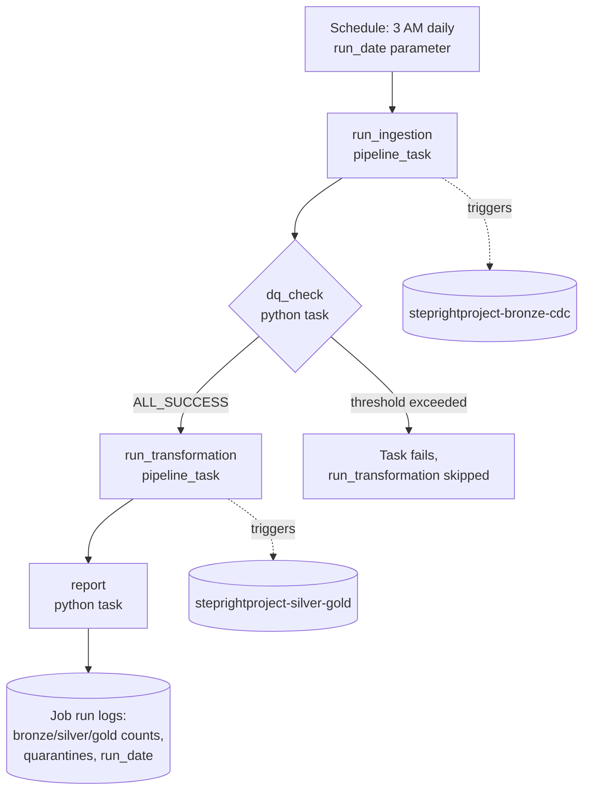

# StepRight - Orchestration and Job Scheduling

Section 4 left five gold tables that only update when someone manually starts a pipeline run --
production-ready in structure, but not yet in operation. This section closes that gap: a single
**Lakeflow Job** that triggers bronze ingestion, gates transformation on a real data quality
check, runs silver and gold, and reports the full result into its own logs, all on a schedule with
no human in the loop. The design decision at its center -- splitting one growing pipeline into two
scoped ones so a job task can gate between them -- is as important as the job itself.

## Lectures

| # | Lecture | Est. Read |
|---|---------|-----------|
| 1 | [Design the Orchestration and Job Flow]({{ '/02-stepright-capstone-project/05-stepright-orchestration-and-job-scheduling/design-the-orchestration-and-job-flow/' | relative_url }}) | 5 min read |
| 2 | [Job Pipeline Data Quality and Health Check Implementation]({{ '/02-stepright-capstone-project/05-stepright-orchestration-and-job-scheduling/job-pipeline-data-quality-and-health-check-implementation/' | relative_url }}) | 6 min read |
| 3 | [Job Data Quality and Health Reporting in the Job Logs]({{ '/02-stepright-capstone-project/05-stepright-orchestration-and-job-scheduling/job-data-quality-and-health-reporting-in-the-job-logs/' | relative_url }}) | 10 min read |
| 4 | [Creating the Orchestration Job]({{ '/02-stepright-capstone-project/05-stepright-orchestration-and-job-scheduling/creating-the-orchestration-job/' | relative_url }}) | 8 min read |

<!-- prevnext:start -->

---

| [&larr; Previous: Product Delivery and Fulfilment Health for Operations]({{ '/02-stepright-capstone-project/04-stepright-gold-layer-reporting-and-analysis/product-delivery-and-fulfilment-health-for-operations/' | relative_url }}) | [Next: Design the Orchestration and Job Flow &rarr;]({{ '/02-stepright-capstone-project/05-stepright-orchestration-and-job-scheduling/design-the-orchestration-and-job-flow/' | relative_url }}) |
|:---|---:|

<!-- prevnext:end -->

