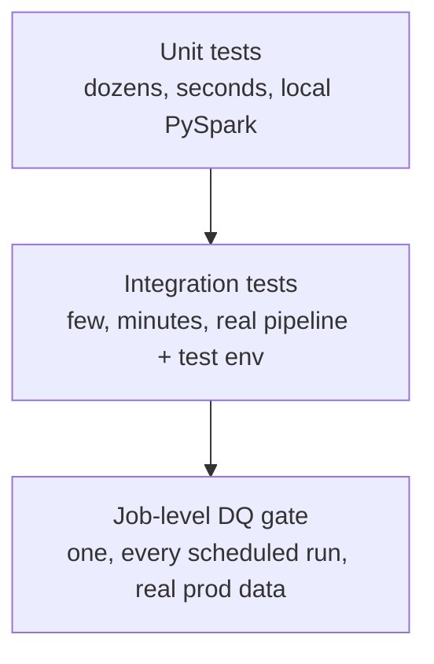

# Design Test Strategy for the Project
{: .no_toc }

*Estimated read: 11 min*

Section 5 built a job that runs the whole pipeline on a schedule and gates it on a real quarantine
threshold -- but nothing in this project yet proves that the *transformation logic itself* is
correct, independent of a live cluster, a running pipeline, or real data in `dev.step_right`. This
lecture designs what a **unit test** means for StepRight specifically, before Lecture 2 refactors
anything and Lectures 3-4 write real test cases.

## Three different kinds of "testing" already exist in this project -- and they're not the same thing

| Layer | What it checks | Needs a cluster? | Built in |
|---|---|---|---|
| Job-level DQ gate | Is *today's actual data* clean enough to proceed | Yes -- reads real bronze tables | Section 5 |
| Unit tests | Does a transformation *function* produce the right output for a known input | No -- pure Python/PySpark, runs locally or in CI | This section |
| Integration tests | Does the *deployed pipeline*, end to end, against a test environment, behave correctly | Yes -- a real (if scaled-down) pipeline run | Section 8 |

Confusing these three is the single most common mistake in how a legacy ETL team thinks about
testing a new platform: `dq_check` proves today's *data* was clean, not that `gold_daily_revenue`'s
*formula* is right, and no amount of production monitoring catches a discount calculation that was
wrong from the day it shipped, if every day's data happens to be structurally valid. A unit test
is the only one of the three that would catch that class of bug, and it's the only one that runs
in milliseconds without touching a workspace at all.

## What a "unit" is here: a pure function, not a pipeline

A **unit test**, for this project, tests one Python function in isolation: given a known input
DataFrame, does it return the exact expected output DataFrame -- no Databricks workspace, no Unity
Catalog table, no SDP runtime involved. That definition matters because of what it deliberately
excludes: the `@dp.table`- and `@dp.materialized_view`-decorated functions themselves aren't
directly unit-testable as written. Two reasons why:

- **The decorator changes what calling the function even means.** `@dp.table` registers a function
  with SDP's pipeline runtime; calling `bronze_orders_tagged()` directly, outside a running
  pipeline, doesn't behave the way it does when SDP's scheduler actually invokes it.
- **Every decorated function reads live tables.** `spark.read.table("dev.step_right.silver_orders")`
  inside a function body means "testing" it actually means hitting real Unity Catalog data --
  which makes it an integration test wearing a unit test's clothing: slow, dependent on whatever
  happens to be in `dev.step_right` today, and not reproducible from a clean checkout.

## What's already testable, unchanged

Section 2's `tag_quality` and Section 3's `tag_business_rules` (both in `transformations/dq_helpers.py`)
were written from the start as **pure functions**: they take a DataFrame and a dictionary of named
checks as arguments, and return a DataFrame -- no `spark.read`, no table names, no pipeline
decorator anywhere inside them. That wasn't an accident; it's what makes them directly unit-testable
today, with zero refactoring, the moment Lecture 3 writes a test against them. Every helper this
project built the same way inherits the same free win.

## What isn't testable yet, and why

Two pieces of real business logic currently live *inside* decorated, table-reading functions
rather than in a separable helper:

- `gold_daily_revenue()` (Section 4, Lecture 1) computes `gross_revenue`, `discount_amount`, and
  `net_revenue` inline, in the same function body that calls `spark.read.table(...)` four times.
- `silver_products()` (Section 3, Lecture 5) computes its "latest wins" dedup with a window
  function, inline, in the same function body that reads `bronze_products_valid` directly.

Neither piece of logic is *wrong* -- both were verified by hand with SQL sanity checks when they
were built. But neither can be unit tested as written, because testing either one means also
standing up real Unity Catalog tables first. Lecture 2 extracts both into standalone functions
that accept DataFrames as arguments, the same shape `tag_quality` already has.

## Local PySpark, not a live cluster, for this section

Unit tests in this section run against a **local PySpark session** -- an ordinary `SparkSession`
created in-process by `conftest.py`, not Databricks Connect and not a workspace cluster. This is a
deliberate boundary: local PySpark is free, starts in seconds, and needs no Databricks credentials
at all, which is exactly what makes it viable to run on every commit, in CI, without provisioning
compute. Databricks Connect and real cluster-backed runs are what Section 8's *integration* tests
use instead, for the different question of whether the actually-deployed pipeline works end to
end -- a legacy analogy worth keeping in mind here: this is the same split a well-run ETL team
already had between a fast, in-memory unit test suite for transformation logic and a slower,
environment-dependent integration suite that only ran nightly or pre-release.

## What `tests/` will hold

```text
steprightproject/
└── tests/
    ├── conftest.py              # Shared local SparkSession fixture (Lecture 3)
    ├── test_dq_helpers.py       # tag_quality, tag_business_rules (Lecture 3)
    ├── test_gold_logic.py       # Revenue and discount calculation (Lecture 3)
    ├── test_silver_logic.py     # Dedup and latest-wins logic (Lecture 4)
    └── test_dq_check.py         # Section 5's quarantine-rate threshold logic (Lecture 4)
```

Five files, each scoped to one module's pure logic -- matching the `tests/` folder Section 1
planned from the project's first lecture, filled in for real starting with Lecture 3.

## The bug class only a unit test catches

Concretely: suppose a future engineer, six months from now, "fixes" `gold_daily_revenue`'s
discount formula -- rounds `discount_pct` to the nearest whole percent before multiplying, say, to
match a finance request -- and introduces a subtle off-by-a-fraction-of-a-cent error across every
row. Every bronze table Section 5's `dq_check` inspects is still perfectly valid: real orders, real
customers, real product IDs, quarantine rate well under 5%. The job runs green every single night.
Finance's dashboard shows a wrong number, quietly, for as long as it takes someone to notice a
number that doesn't reconcile against another system -- which for a metric checked weekly rather
than daily, can be a long time. A unit test asserting `discount_amount == pytest.approx(expected)`
against a known input would have caught this the moment it was written, in CI, before it ever
reached `dev.step_right`, let alone production.

## The cost of skipping this section

None of this is free -- writing and maintaining unit tests is real engineering time, same as
writing the pipeline itself. The trade StepRight is making here is the same one any legacy team
weighing "do we really need a test suite for a stored procedure" eventually has to make: a few
hours writing tests against `compute_daily_revenue` once, versus an unbounded amount of time
someday spent debugging why finance's numbers don't reconcile, with no test suite narrowing down
which of a dozen transformation steps is actually at fault. For logic this central to what every
downstream consumer trusts, that trade is worth making deliberately, in Section 6, rather than
reactively, during an incident.

## The pyramid, drawn out



Each layer up costs more time and infrastructure to run, which is exactly why the shape matters:
many cheap unit tests catch logic bugs before they ever reach a pipeline run; a smaller number of
slower integration tests (Section 8) catch deployment and wiring bugs the unit layer can't see by
design; the single job-level gate (Section 5) catches whatever both earlier layers couldn't --
genuine bad data arriving from a source system, which no amount of testing code in this repo could
have predicted in advance.

## How this fits into CI, later

Every test this section writes runs from a plain `pytest` command with no Databricks connection
required -- which is precisely what makes it possible for Section 8's CI/CD pipeline to run the
full suite automatically on every pull request, before anything gets deployed to `uat` or `prod`.
Nothing about that requires foresight or extra design work now; it's a direct consequence of the
"no cluster, no workspace" constraint this lecture already committed to.

## Common mistakes

- **Treating "the pipeline ran successfully" as proof the logic is correct.** A pipeline run
  succeeding only means no exception was thrown -- it says nothing about whether the numbers it
  produced are the *right* numbers, which is exactly the gap unit tests exist to close.
- **Deciding test strategy after the code is already written, for every future section.** This
  lecture's placement -- right after Section 5's orchestration, before Section 7's monitoring and
  Section 8's packaging -- is deliberate: designing the strategy once, here, means Sections 7 and 8
  can each assume a working test suite already exists to build on, rather than every later section
  needing to reinvent testing conventions from scratch.
{: .important }

## What's next

Lecture 2 does the refactoring this strategy calls for: extracting `gold_daily_revenue`'s
calculation and `silver_products`'s dedup logic into standalone, DataFrame-in/DataFrame-out
functions, without changing what either pipeline actually produces.

<!-- prevnext:start -->

---

| [&larr; Previous: StepRight - Unit Testing]({{ '/02-stepright-capstone-project/06-stepright-unit-testing/' | relative_url }}) | [Next: Refactoring Your Code and Getting Ready for Unit Testing &rarr;]({{ '/02-stepright-capstone-project/06-stepright-unit-testing/refactoring-your-code-and-getting-ready-for-unit-testing/' | relative_url }}) |
|:---|---:|

<!-- prevnext:end -->

