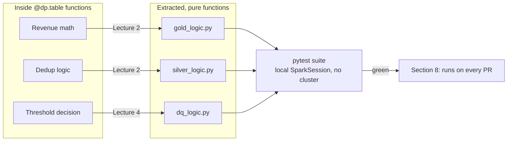

# StepRight - Unit Testing

Section 5's job proves the pipeline *runs*; nothing yet proves the transformation *logic* inside it
is correct, independent of whatever data happens to be sitting in `dev.step_right` on a given day.
This section fixes that: a handful of business-critical calculations -- revenue, discount
allocation, deduplication, the quarantine threshold itself -- get extracted into pure,
DataFrame-in/DataFrame-out functions and covered by a `pytest` suite that runs in seconds, on a
laptop, with no cluster and no live workspace required.

## Lectures

| # | Lecture | Est. Read |
|---|---------|-----------|
| 1 | [Design Test Strategy for the Project]({{ '/02-stepright-capstone-project/06-stepright-unit-testing/design-test-strategy-for-the-project/' | relative_url }}) | 11 min read |
| 2 | [Refactoring Your Code and Getting Ready for Unit Testing]({{ '/02-stepright-capstone-project/06-stepright-unit-testing/refactoring-your-code-and-getting-ready-for-unit-testing/' | relative_url }}) | 7 min read |
| 3 | [Designing and Developing Unit Test Cases]({{ '/02-stepright-capstone-project/06-stepright-unit-testing/designing-and-developing-unit-test-cases/' | relative_url }}) | 17 min read |
| 4 | [Code and Run all Unit Test Case]({{ '/02-stepright-capstone-project/06-stepright-unit-testing/code-and-run-all-unit-test-case/' | relative_url }}) | 12 min read |

<!-- prevnext:start -->

---

| [&larr; Previous: Creating the Orchestration Job]({{ '/02-stepright-capstone-project/05-stepright-orchestration-and-job-scheduling/creating-the-orchestration-job/' | relative_url }}) | [Next: Design Test Strategy for the Project &rarr;]({{ '/02-stepright-capstone-project/06-stepright-unit-testing/design-test-strategy-for-the-project/' | relative_url }}) |
|:---|---:|

<!-- prevnext:end -->

