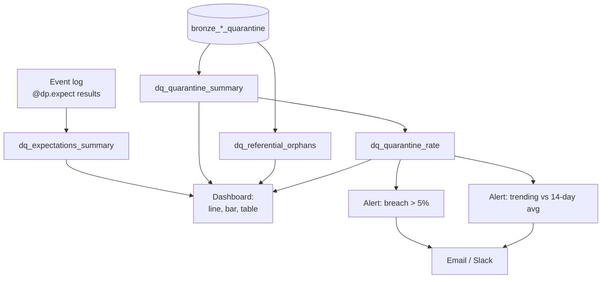

# StepRight - Data Quality Monitoring

Section 5's `dq_check` proves one run's data was clean; it can't show whether quality is drifting
over weeks, and it's visible only to engineers reading job logs. This section builds the layer that
answers both gaps: lightweight SDP expectations feeding the pipeline's own event log, four SQL
views consolidating expectations, quarantine counts, and referential integrity into one queryable
shape, a dashboard the audience who never opens the Jobs UI can actually read, and an alert that
watches for both a sudden breach and a slower trend a fixed threshold alone would miss.

## Lectures

| # | Lecture | Est. Read |
|---|---------|-----------|
| 1 | [Design Your Data Quality Monitoring Requirements]({{ '/02-stepright-capstone-project/07-stepright-data-quality-monitoring/design-your-data-quality-monitoring-requirements/' | relative_url }}) | 5 min read |
| 2 | [Setup Pipeline Event Logs for Expectations Monitoring]({{ '/02-stepright-capstone-project/07-stepright-data-quality-monitoring/setup-pipeline-event-logs-for-expectations-monitoring/' | relative_url }}) | 5 min read |
| 3 | [Prepare DQ Queries for Expectations, Quarantine and Orphans]({{ '/02-stepright-capstone-project/07-stepright-data-quality-monitoring/prepare-dq-queries-for-expectations-quarantine-and-orphans/' | relative_url }}) | 8 min read |
| 4 | [Creating Data Quality Monitoring Dashboard]({{ '/02-stepright-capstone-project/07-stepright-data-quality-monitoring/creating-data-quality-monitoring-dashboard/' | relative_url }}) | 8 min read |
| 5 | [Setup a Real Time Data Quality Monitoring and Alert]({{ '/02-stepright-capstone-project/07-stepright-data-quality-monitoring/setup-a-real-time-data-quality-monitoring-and-alert/' | relative_url }}) | 7 min read |

<!-- prevnext:start -->

---

| [&larr; Previous: Code and Run all Unit Test Case]({{ '/02-stepright-capstone-project/06-stepright-unit-testing/code-and-run-all-unit-test-case/' | relative_url }}) | [Next: Design Your Data Quality Monitoring Requirements &rarr;]({{ '/02-stepright-capstone-project/07-stepright-data-quality-monitoring/design-your-data-quality-monitoring-requirements/' | relative_url }}) |
|:---|---:|

<!-- prevnext:end -->

