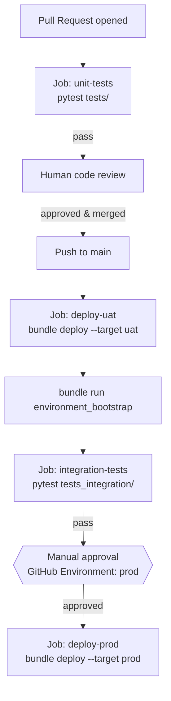

# Develop and Trigger Your CI/CD Pipeline for Deployment and Integration Testing
{: .no_toc }

*Estimated read: 19 min*

Every piece exists independently: a bundle that deploys, a unit suite, an integration suite. This
lecture wires them into one automated pipeline -- **GitHub Actions**, since `steprightproject` has
been a GitHub-backed Git folder since [Section 1, Lecture 2]({{ '/02-stepright-capstone-project/01-stepright-project-foundation/project-structure-planning-the-initial-project-structure/' | relative_url }})
-- so every pull request runs the unit suite, every merge to `main` deploys to `uat` and runs the
integration suite, and `prod` deploys only after an explicit human approval.

## The pipeline's shape



Three automated jobs and one deliberate human checkpoint -- everything up to and including `uat`
runs without anyone clicking anything; `prod` requires a person to explicitly say yes, every time.

## GitHub Actions, briefly, for a team coming from a legacy build server

A legacy team's CI/CD story often ran through Jenkins: a dedicated server, a Jenkinsfile checked
into the repo (or configured separately in the Jenkins UI itself), and a pool of build agents the
team had to provision and maintain. GitHub Actions replaces the dedicated server with
**GitHub-hosted runners** -- ephemeral virtual machines GitHub provisions per job, torn down when
the job finishes -- and replaces the Jenkinsfile with `.github/workflows/*.yml`, version-controlled
alongside the code it builds and deploys, triggered directly by GitHub events (`pull_request`,
`push`) rather than a separate webhook configuration living outside the repo. `steprightproject`
needs no infrastructure of its own for this -- no server to patch, no agent pool to size -- which
is a meaningful operational simplification a capstone project this size genuinely benefits from,
not just a syntax difference from Jenkins.

## `.github/workflows/ci.yml`, job one: unit tests on every PR

```yaml
name: StepRight CI/CD

on:
  pull_request:
    branches: [main]
  push:
    branches: [main]

jobs:
  unit-tests:
    runs-on: ubuntu-latest
    steps:
      - uses: actions/checkout@v4
      - uses: actions/setup-python@v5
        with:
          python-version: "3.11"
      - run: pip install -r requirements-test.txt
      - run: pytest tests/ -v
```

This runs on **every** pull request, regardless of whether it targets `main` -- exactly [Section 6,
Lecture 1]({{ '/02-stepright-capstone-project/06-stepright-unit-testing/design-test-strategy-for-the-project/' | relative_url }})'s
promise that Section 6's suite needs "no Databricks connection required" made good on: `unit-tests`
needs no secrets, no Databricks CLI, no workspace credentials at all, which is what makes it safe
to run against every PR from any contributor without provisioning them workspace access first.

## Requiring `unit-tests` to pass before a PR can even merge

The workflow triggering on `pull_request` only *runs* the check -- a separate GitHub setting,
**Settings -> Branches -> Branch protection rules** for `main`, is what actually makes passing it
mandatory: requiring the `unit-tests` status check before the merge button becomes clickable at
all. Without that branch protection rule, a failing unit suite is merely informational -- visible
as a red X on the PR, but not something that stops a merge from happening anyway. Configuring both
together is what turns "we have tests" into "broken code cannot reach `main`."

## Caching dependencies for faster runs

```yaml
      - uses: actions/setup-python@v5
        with:
          python-version: "3.11"
          cache: "pip"
      - run: pip install -r requirements-test.txt
```

`cache: "pip"` persists the installed package cache between workflow runs, keyed off
`requirements-test.txt`'s contents -- a run against an unchanged dependency list restores from
cache in seconds instead of reinstalling `pyspark` and `pytest` from scratch every single time.
This matters more than it might first appear: `unit-tests` runs on *every* PR and every push, so
a slow dependency install is a cost paid dozens of times a week, not once.

## Preventing overlapping deploys with `concurrency`

```yaml
  deploy-uat:
    needs: unit-tests
    if: github.ref == 'refs/heads/main'
    concurrency: uat-deploy
    runs-on: ubuntu-latest
    environment: uat
    steps: ...
```

Two merges to `main` in quick succession would otherwise trigger two `deploy-uat` jobs racing each
other against the same `uat` catalog -- `concurrency: uat-deploy` queues the second run behind the
first instead, guaranteeing `uat` only ever has one deploy actively in flight, the same "no
overlapping runs" safety [Section 5's job scheduling]({{ '/02-stepright-capstone-project/05-stepright-orchestration-and-job-scheduling/' | relative_url }})
already assumed for the daily pipeline itself, applied here to the deployment pipeline instead.

## Job two: deploy to `uat`, gated on unit tests passing

```yaml
  deploy-uat:
    needs: unit-tests
    if: github.ref == 'refs/heads/main'
    runs-on: ubuntu-latest
    environment: uat
    steps:
      - uses: actions/checkout@v4
      - uses: databricks/setup-cli@main
      - name: Deploy bundle to uat
        env:
          DATABRICKS_HOST: ${{ secrets.UAT_DATABRICKS_HOST }}
          DATABRICKS_TOKEN: ${{ secrets.UAT_DATABRICKS_TOKEN }}
        run: |
          databricks bundle validate --target uat
          databricks bundle deploy --target uat
      - name: Bootstrap environment (idempotent)
        env:
          DATABRICKS_HOST: ${{ secrets.UAT_DATABRICKS_HOST }}
          DATABRICKS_TOKEN: ${{ secrets.UAT_DATABRICKS_TOKEN }}
        run: databricks bundle run environment_bootstrap --target uat
```

`needs: unit-tests` and `if: github.ref == 'refs/heads/main'` together are what make this job run
*only* after a PR has actually merged to `main` -- never on an open PR still under review, since
nothing about an unmerged branch should ever touch a real `uat` deployment. `databricks/setup-cli@main`
is the official GitHub Action installing the same CLI Lectures 1 through 3 used from a local
terminal; every command after it is identical to what a developer would type by hand, just running
on a GitHub-hosted runner instead of a laptop.

## Secrets: GitHub's own store, never the workflow file itself

`${{ secrets.UAT_DATABRICKS_HOST }}` and `${{ secrets.UAT_DATABRICKS_TOKEN }}` reference values
configured once under the repository's **Settings -> Secrets and variables -> Actions**, never
written in plaintext anywhere this workflow file (or any file this Git folder tracks) contains --
the direct continuation of Lecture 1's "secrets never belong in `databricks.yml`" rule, applied here
to CI configuration instead. `UAT_DATABRICKS_TOKEN` is a token issued to the `stepright-uat-sp`
service principal Lecture 1 introduced, not a personal access token belonging to any individual
engineer -- the same reasoning that put a service principal in charge of `uat` and `prod` resources
in the first place extends naturally to which credential CI itself authenticates with.

## Job three: integration tests, against the environment just deployed

```yaml
  integration-tests:
    needs: deploy-uat
    runs-on: ubuntu-latest
    environment: uat
    steps:
      - uses: actions/checkout@v4
      - uses: actions/setup-python@v5
        with:
          python-version: "3.11"
      - run: pip install -r requirements-integration.txt
      - name: Run integration suite against uat
        env:
          DATABRICKS_HOST: ${{ secrets.UAT_DATABRICKS_HOST }}
          DATABRICKS_TOKEN: ${{ secrets.UAT_DATABRICKS_TOKEN }}
          DATABRICKS_CLUSTER_ID: ${{ secrets.UAT_CLUSTER_ID }}
        run: pytest tests_integration/ -v --timeout=1800 --reruns 1 --reruns-delay 30
```

`needs: deploy-uat` is the dependency that makes this whole pipeline coherent: Lecture 5's suite
tests the *deployed* system, so it can only meaningfully run after a deploy has actually happened,
never before or in parallel with it.

## Job four: `prod`, behind a human gate

```yaml
  deploy-prod:
    needs: integration-tests
    runs-on: ubuntu-latest
    environment: prod   # GitHub Environment with required reviewers configured
    steps:
      - uses: actions/checkout@v4
      - uses: databricks/setup-cli@main
      - name: Deploy bundle to prod
        env:
          DATABRICKS_HOST: ${{ secrets.PROD_DATABRICKS_HOST }}
          DATABRICKS_TOKEN: ${{ secrets.PROD_DATABRICKS_TOKEN }}
        run: |
          databricks bundle validate --target prod
          databricks bundle deploy --target prod
          databricks bundle run environment_bootstrap --target prod
```

`environment: prod`, configured under the repository's **Settings -> Environments -> prod ->
Required reviewers**, is what actually creates the human checkpoint -- GitHub pauses this job after
`integration-tests` succeeds and waits for a designated reviewer to explicitly approve before a
single line of it executes, no matter how fast or automatic every job before it was.
{: .important }

## Why prod deploys don't run integration tests against `prod` itself

Notice `deploy-prod` runs no test suite of its own -- the correctness check already happened, in
`integration-tests`, against `uat`. Running `test_dq_check_failure_skips_transformation`'s
deliberately-broken seeded batch against real `prod` data would be actively harmful, not merely
redundant -- `uat` exists specifically so that kind of destructive-by-design test has somewhere
safe to run. `prod`'s own verification is a different, much lighter kind of check: Lecture 7's
smoke test, confirming the deploy itself succeeded, not re-proving business logic already proven
twice over by this point.

## Two GitHub Environments, two different secret sets

`uat` and `prod` each get their own **GitHub Environment**, each with its own scoped secrets
(`UAT_DATABRICKS_TOKEN` vs. `PROD_DATABRICKS_TOKEN`) -- a job declared `environment: uat` can only
read `uat`'s secrets, never `prod`'s, which is what makes it structurally impossible for a bug in
this workflow file to accidentally deploy `uat`'s code using `prod`'s credentials, or vice versa.

## Walking one change through the whole pipeline

Concretely: an engineer fixes a bug in `compute_daily_revenue`'s discount rounding, pushes a branch,
and opens a pull request against `main`. `unit-tests` fires immediately, finishes in under five
seconds, and shows green on the PR -- a reviewer sees passing tests alongside the diff itself,
without needing to pull the branch locally and run anything by hand. The PR gets approved and
merged. `deploy-uat`, gated on `unit-tests` and the merge itself, deploys the fixed code to `uat`
via the exact same bundle used throughout this section, then runs `environment_bootstrap`
(finding everything already in place, a fast no-op). `integration-tests` triggers the real `uat`
job, confirms the fix didn't break the DQ gate or any table's row-count relationships, and confirms
`report`'s output still reads correctly -- all without the engineer touching a terminal after
merging. Only then does `deploy-prod` sit waiting on a reviewer's explicit approval, the one step
in this entire sequence that isn't automatic by design.

## Common mistakes

- **Putting a Databricks token directly in the workflow YAML "temporarily, to test."** Every commit
  is permanent Git history -- a token committed even once, then removed in a later commit, is
  still recoverable from history and should be treated as compromised and rotated immediately.
- **Skipping `environment: prod`'s required reviewers "since the pipeline already passed every
  test."** The entire point of the human gate is a check *independent* of automated test results --
  a business reason to delay a release (a freeze window, an unrelated incident in progress) that no
  test suite could ever know to check for.
- **Running `deploy-uat` and `integration-tests` as one combined job instead of two dependent
  ones.** Splitting them is what makes GitHub's own UI show which stage actually failed --
  deployment itself, or the tests that ran against it -- rather than one undifferentiated failure
  covering both.

## What's next

The pipeline is fully automated, from PR to `uat` to a gated `prod` deploy. Lecture 7 covers what
happens the moment `prod` actually goes live -- the smoke test that confirms the deploy itself
worked, closing out the capstone.

<!-- prevnext:start -->

---

| [&larr; Previous: Developing your Integration Test for the UAT]({{ '/02-stepright-capstone-project/08-stepright-integration-testing-packaging-and-deployment/developing-your-integration-test-for-the-uat/' | relative_url }}) | [Next: Final Stage - Production Deployment and Smoke Testing Your Project &rarr;]({{ '/02-stepright-capstone-project/08-stepright-integration-testing-packaging-and-deployment/final-stage-production-deployment-and-smoke-testing-your-project/' | relative_url }}) |
|:---|---:|

<!-- prevnext:end -->

