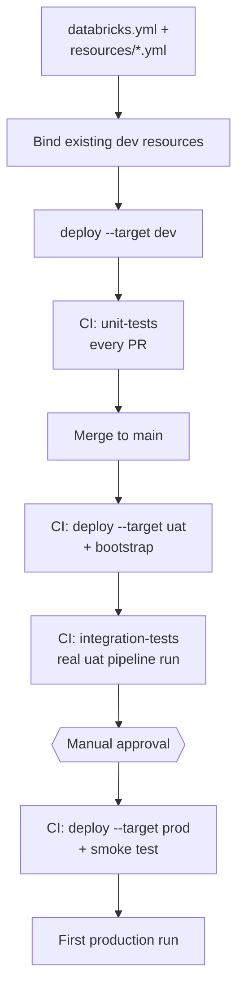

# StepRight - Integration Testing, Packaging and Deployment

Every pipeline, job, and dashboard StepRight has built so far exists only in `dev`, deployed by
hand. This closing section packages the whole project as a **Databricks Asset Bundle**, adds the
integration tests that verify a real deployment (not just isolated logic) works end to end, and
automates the entire `dev` -> `uat` -> `prod` promotion path through CI/CD -- so that shipping a
change to production is a reviewed pull request and one approval click, not a checklist of manual
commands.

## Lectures

| # | Lecture | Est. Read |
|---|---------|-----------|
| 1 | [Package your project using Declarative Automation Bundle]({{ '/02-stepright-capstone-project/08-stepright-integration-testing-packaging-and-deployment/package-your-project-using-declarative-automation-bundle/' | relative_url }}) | 18 min read |
| 2 | [Define your Automation Bundle Resources and Setup Job]({{ '/02-stepright-capstone-project/08-stepright-integration-testing-packaging-and-deployment/define-your-automation-bundle-resources-and-setup-job/' | relative_url }}) | 13 min read |
| 3 | [Test Your Deployment Bundle in Dev Environment]({{ '/02-stepright-capstone-project/08-stepright-integration-testing-packaging-and-deployment/test-your-deployment-bundle-in-dev-environment/' | relative_url }}) | 12 min read |
| 4 | [Planning and Designing Integration Testing Approach]({{ '/02-stepright-capstone-project/08-stepright-integration-testing-packaging-and-deployment/planning-and-designing-integration-testing-approach/' | relative_url }}) | 6 min read |
| 5 | [Developing your Integration Test for the UAT]({{ '/02-stepright-capstone-project/08-stepright-integration-testing-packaging-and-deployment/developing-your-integration-test-for-the-uat/' | relative_url }}) | 20 min read |
| 6 | [Develop and Trigger Your CI/CD Pipeline for Deployment and Integration Testing]({{ '/02-stepright-capstone-project/08-stepright-integration-testing-packaging-and-deployment/develop-and-trigger-your-ci-cd-pipeline-for-deployment-and-integration-testing/' | relative_url }}) | 19 min read |
| 7 | [Final Stage - Production Deployment and Smoke Testing Your Project]({{ '/02-stepright-capstone-project/08-stepright-integration-testing-packaging-and-deployment/final-stage-production-deployment-and-smoke-testing-your-project/' | relative_url }}) | 10 min read |

<!-- prevnext:start -->

---

| [&larr; Previous: Setup a Real Time Data Quality Monitoring and Alert]({{ '/02-stepright-capstone-project/07-stepright-data-quality-monitoring/setup-a-real-time-data-quality-monitoring-and-alert/' | relative_url }}) | [Next: Package your project using Declarative Automation Bundle &rarr;]({{ '/02-stepright-capstone-project/08-stepright-integration-testing-packaging-and-deployment/package-your-project-using-declarative-automation-bundle/' | relative_url }}) |
|:---|---:|

<!-- prevnext:end -->

