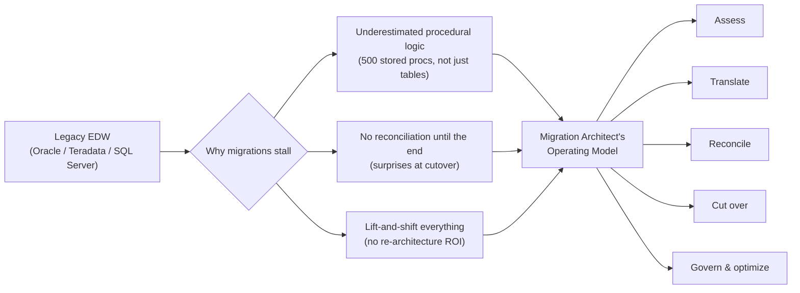

# Why Enterprise Migrations Fail (And the Architect Who Stops It)

Roughly a third of large enterprise data warehouse migrations stall or get scrapped before cutover
-- not because the target platform was wrong, but because the team ran a data movement project when
what they actually had was a business-logic archaeology project. This section sets the frame for
everything that follows: why migrations really fail, what Lakebridge automates well and what it
can never automate, and the operating model -- assess, translate, reconcile, cut over, govern,
optimize -- that the rest of this part is structured around. By the end you'll know what toolkit
you're building toward (a TCO calculator, reconciliation scripts, an ABAC tag taxonomy, a go/no-go
matrix) and why each one earns its place.

## Lectures

| # | Lecture | Est. Read |
|---|---------|-----------|
| 1 | [The Migration Graveyard: Why 1 in 3 EDW Migrations Stall]({{ '/03-legacy-migration-to-databricks/01-why-enterprise-migrations-fail-and-the-architect-who-stops-it/the-migration-graveyard-why-1-in-3-edw-migrations-stall/' | relative_url }}) | 3 min read |
| 2 | [The 80/20 Truth: What Lakebridge Does and the 20% It Never Will]({{ '/03-legacy-migration-to-databricks/01-why-enterprise-migrations-fail-and-the-architect-who-stops-it/the-80-20-truth-what-lakebridge-does-and-the-20-it-never-will/' | relative_url }}) | 3 min read |
| 3 | [The Migration Architect's Operating Model]({{ '/03-legacy-migration-to-databricks/01-why-enterprise-migrations-fail-and-the-architect-who-stops-it/the-migration-architects-operating-model/' | relative_url }}) | 3 min read |
| 4 | [How This Course Works and Your Downloadable Toolkit]({{ '/03-legacy-migration-to-databricks/01-why-enterprise-migrations-fail-and-the-architect-who-stops-it/how-this-course-works-and-your-downloadable-toolkit/' | relative_url }}) | 3 min read |
| 5 | [Check Your Knowledge]({{ '/03-legacy-migration-to-databricks/01-why-enterprise-migrations-fail-and-the-architect-who-stops-it/check-your-knowledge/' | relative_url }}) | Quiz |

<!-- prevnext:start -->

---

| [&larr; Previous: Legacy Migration to Databricks]({{ '/03-legacy-migration-to-databricks/' | relative_url }}) | [Next: The Migration Graveyard: Why 1 in 3 EDW Migrations Stall &rarr;]({{ '/03-legacy-migration-to-databricks/01-why-enterprise-migrations-fail-and-the-architect-who-stops-it/the-migration-graveyard-why-1-in-3-edw-migrations-stall/' | relative_url }}) |
|:---|---:|

<!-- prevnext:end -->

