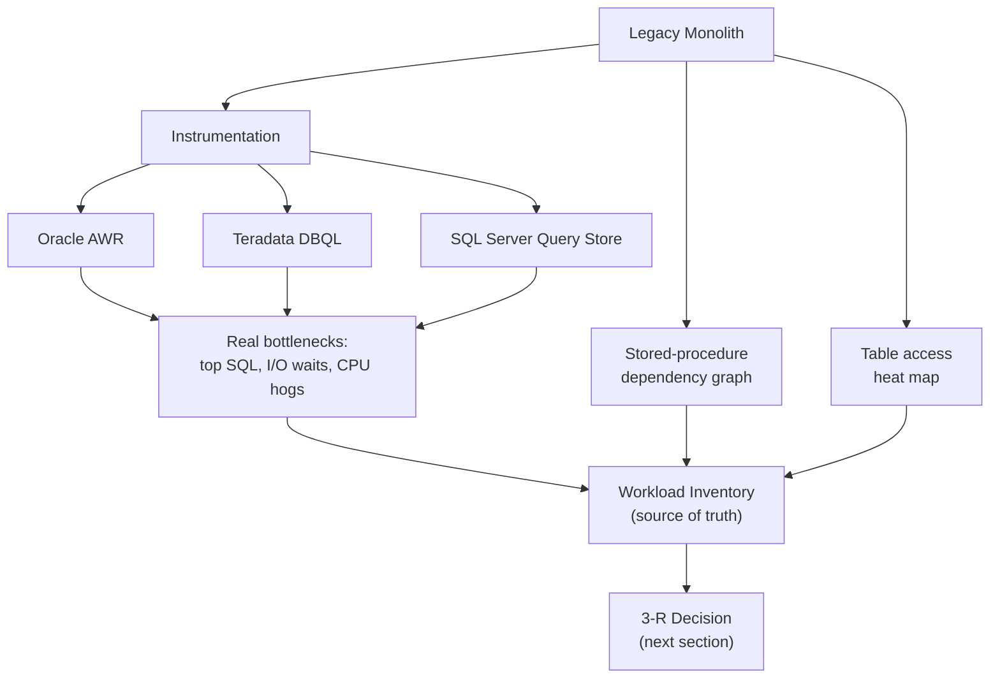

# The Autopsy: Profiling the Legacy Monolith

Every migration proposal starts with someone counting terabytes and tables. That count answers the
wrong question. This section is the diagnostic work that has to happen before a single line of DDL
gets translated: reading the legacy platform's own instrumentation -- Oracle AWR reports, Teradata
DBQL, SQL Server Query Store -- to find out which objects are actually driving load and cost, mapping
stored-procedure dependencies and table access patterns so you know what breaks if you touch what,
and rolling all of it into one workload inventory that becomes the source of truth every later
decision -- the 3-R call, the sequencing plan, the go/no-go matrix -- traces back to. Skipping this
autopsy is the single most common reason migrations blow their budget, so treat it as the foundation
the rest of this part stands on, not a formality before the "real" work starts.

## Lectures

| # | Lecture | Est. Read |
|---|---------|-----------|
| 1 | [The Iceberg Assessment: 20% Data, 80% Everything Else]({{ '/03-legacy-migration-to-databricks/02-the-autopsy-profiling-the-legacy-monolith/the-iceberg-assessment-20-data-80-everything-else/' | relative_url }}) | 3 min read |
| 2 | [Reading Oracle AWR Reports to Find the Real Bottlenecks]({{ '/03-legacy-migration-to-databricks/02-the-autopsy-profiling-the-legacy-monolith/reading-oracle-awr-reports-to-find-the-real-bottlenecks/' | relative_url }}) | 3 min read |
| 3 | [Teradata DBQL and SQL Server Query Store: Same Job, Different Dialect]({{ '/03-legacy-migration-to-databricks/02-the-autopsy-profiling-the-legacy-monolith/teradata-dbql-and-sql-server-query-store-same-job-different-dialect/' | relative_url }}) | 3 min read |
| 4 | [Stored-Procedure Dependency Graphs and Table Heat Maps]({{ '/03-legacy-migration-to-databricks/02-the-autopsy-profiling-the-legacy-monolith/stored-procedure-dependency-graphs-and-table-heat-maps/' | relative_url }}) | 4 min read |
| 5 | [The Workload Inventory: Your Source of Truth]({{ '/03-legacy-migration-to-databricks/02-the-autopsy-profiling-the-legacy-monolith/the-workload-inventory-your-source-of-truth/' | relative_url }}) | 4 min read |
| 6 | [Check Your Knowledge]({{ '/03-legacy-migration-to-databricks/02-the-autopsy-profiling-the-legacy-monolith/check-your-knowledge/' | relative_url }}) | Quiz |

<!-- prevnext:start -->

---

| [&larr; Previous: Check Your Knowledge]({{ '/03-legacy-migration-to-databricks/01-why-enterprise-migrations-fail-and-the-architect-who-stops-it/check-your-knowledge/' | relative_url }}) | [Next: The Iceberg Assessment: 20% Data, 80% Everything Else &rarr;]({{ '/03-legacy-migration-to-databricks/02-the-autopsy-profiling-the-legacy-monolith/the-iceberg-assessment-20-data-80-everything-else/' | relative_url }}) |
|:---|---:|

<!-- prevnext:end -->

