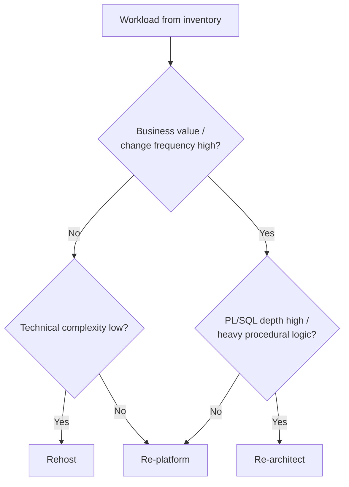

# Rehost vs Re-platform vs Re-architect: The Decision Tree
{: .no_toc }

*Estimated read: 3 min*

The workload inventory gave you Lift, Redesign, or Retire per object. The **3-R decision** is where
that first-pass verdict becomes a concrete migration strategy, chosen per workload rather than
declared once for the entire estate:

| Strategy | What it means | Legacy-world equivalent |
|---|---|---|
| **Rehost** | Move the workload with minimal change -- same logical schema, same procedural structure, translated but not redesigned | A hardware refresh: same application, new box |
| **Re-platform** | Move the workload and take advantage of platform-native features where they're cheap to adopt (Delta table instead of a heap table, a Lakeflow job instead of `DBMS_SCHEDULER`) without redesigning the core logic | Upgrading from on-prem Oracle to Oracle Autonomous, keeping the schema but gaining managed features |
| **Re-architect** | Redesign the workload around lakehouse-native patterns -- decompose a monolithic procedure into a medallion pipeline, replace row-by-row cursor logic with set-based DataFrame operations | The rewrite you'd do if you were building this workload from scratch today |

None of these is inherently "better" -- each is the right call for a different combination of
factors, and applying one strategy to your entire estate is the anti-pattern the last lecture in
this section covers in detail. The decision tree that separates them:

Walk through the reasoning behind each branch:

- **Low value, low complexity -> Rehost.** A rarely-changed reporting table with a handful of
  simple procedures isn't worth redesign effort. Translate it, validate it, move on -- the ROI on
  re-architecting something nobody asks to change doesn't clear the bar.
- **Low value, high complexity -> Re-platform.** Complex but static logic (a settled, mature batch
  job that hasn't needed a change in years) gets platform-native table format and orchestration
  without the risk of touching business logic nobody currently on the team fully remembers writing.
- **High value, low PL/SQL depth -> Re-platform.** A workload that matters and changes often, but
  is mostly straightforward SQL, benefits from lakehouse features (Liquid Clustering, Auto Loader)
  without needing a structural rewrite.
- **High value, high procedural depth -> Re-architect.** This is where the investment pays off
  fastest: heavily-used, frequently-changed, cursor-and-trigger-heavy logic is exactly the workload
  that benefits most from becoming a proper Lakeflow Declarative Pipeline instead of staying a
  procedural relic translated line-for-line.

{: .important }
> Re-architecting a workload nobody asks to change is wasted engineering effort; rehosting a
> workload your business changes weekly just defers the re-architecture cost to every future change
> request, forever. The decision tree exists precisely to stop both mistakes.

The next lecture turns this decision tree into something more rigorous than a diagram: a six-
dimension scorecard that scores every workload numerically, so the 3-R call is defensible in a
steering committee meeting and not just an architect's intuition.

<!-- prevnext:start -->

---

| [&larr; Previous: The 3-R Decision and the TCO That Convinces the CFO]({{ '/03-legacy-migration-to-databricks/03-the-3-r-decision-and-the-tco-that-convinces-the-cfo/' | relative_url }}) | [Next: The Migration Assessment Scorecard &rarr;]({{ '/03-legacy-migration-to-databricks/03-the-3-r-decision-and-the-tco-that-convinces-the-cfo/the-migration-assessment-scorecard/' | relative_url }}) |
|:---|---:|

<!-- prevnext:end -->

