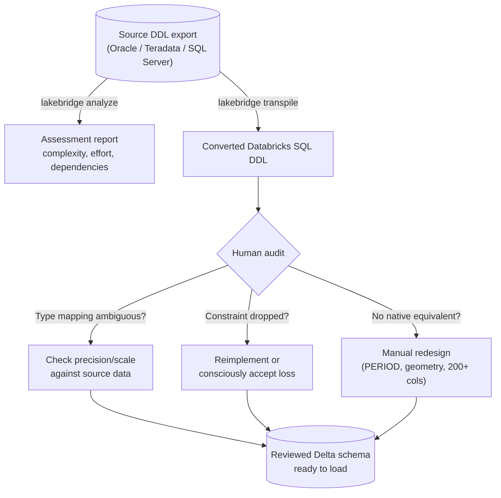

# Schema Translation with Lakebridge (and Its Blind Spots)

Federation buys time; it doesn't get any data physically migrated. Sooner or later, every table in
the workload inventory needs a Delta schema, and getting there means running Lakebridge's analyzer
and converter against real exported DDL -- then treating the output as a strong first draft rather
than a finished migration. This section covers the type-mapping decisions the converter makes on
your behalf, the two failure modes (precision loss, semantic drift) that pass every automated check
while still being wrong, and the specific patterns for the objects that resist mechanical
conversion entirely: 200-column monolith tables and geospatial columns.

## Lectures

| # | Lecture | Est. Read |
|---|---------|-----------|
| 1 | [The Data Type Mapping Matrix]({{ '/03-legacy-migration-to-databricks/05-schema-translation-with-lakebridge-and-its-blind-spots/the-data-type-mapping-matrix/' | relative_url }}) | 3 min read |
| 2 | [Running Lakebridge's Analyzer and Converter on Real DDL]({{ '/03-legacy-migration-to-databricks/05-schema-translation-with-lakebridge-and-its-blind-spots/running-lakebridges-analyzer-and-converter-on-real-ddl/' | relative_url }}) | 3 min read |
| 3 | [The Silent Precision-Loss Bug]({{ '/03-legacy-migration-to-databricks/05-schema-translation-with-lakebridge-and-its-blind-spots/the-silent-precision-loss-bug/' | relative_url }}) | 3 min read |
| 4 | [Auditing Generated DDL for Semantic Drift]({{ '/03-legacy-migration-to-databricks/05-schema-translation-with-lakebridge-and-its-blind-spots/auditing-generated-ddl-for-semantic-drift/' | relative_url }}) | 3 min read |
| 5 | [Migrating the Hard Ones: 200-Column Teradata Tables and Geospatial]({{ '/03-legacy-migration-to-databricks/05-schema-translation-with-lakebridge-and-its-blind-spots/migrating-the-hard-ones-200-column-teradata-tables-and-geospatial/' | relative_url }}) | 3 min read |
| 6 | [Check Your Knowledge]({{ '/03-legacy-migration-to-databricks/05-schema-translation-with-lakebridge-and-its-blind-spots/check-your-knowledge/' | relative_url }}) | Quiz |

<!-- prevnext:start -->

---

| [&larr; Previous: Check Your Knowledge]({{ '/03-legacy-migration-to-databricks/04-lakehouse-federation-migrate-without-migrating/check-your-knowledge/' | relative_url }}) | [Next: The Data Type Mapping Matrix &rarr;]({{ '/03-legacy-migration-to-databricks/05-schema-translation-with-lakebridge-and-its-blind-spots/the-data-type-mapping-matrix/' | relative_url }}) |
|:---|---:|

<!-- prevnext:end -->

