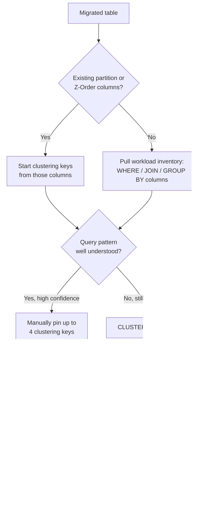

# Physical Design for Delta: Liquid Clustering Over Indexes

Every migrated table lands on Databricks with its Oracle, Teradata, or SQL Server indexing strategy
still fresh in the migration team's head, and rebuilding that strategy one index-shaped structure at
a time is the fastest way to waste compute in the first month after cutover. This section replaces
that reflex with how Liquid Clustering actually works: why Delta's file-skipping model is a
different mechanism than B-tree or bitmap indexing, how it compares to the partitioning and
Z-Ordering techniques older tutorials still teach, how to derive clustering keys from real workload
data instead of guessing, and -- just as important -- when a table shouldn't be clustered at all. It
closes with a one-page decision card that turns the whole judgment call into something repeatable
across the hundreds of tables a real migration touches, rather than a debate re-litigated table by
table.

## Lectures

| # | Lecture | Est. Read |
|---|---------|-----------|
| 1 | [Oracle Has Muscles, Delta Has a Nervous System]({{ '/03-legacy-migration-to-databricks/06-physical-design-for-delta-liquid-clustering-over-indexes/oracle-has-muscles-delta-has-a-nervous-system/' | relative_url }}) | 3 min read |
| 2 | [Liquid Clustering vs Z-Ordering vs Partitioning]({{ '/03-legacy-migration-to-databricks/06-physical-design-for-delta-liquid-clustering-over-indexes/liquid-clustering-vs-z-ordering-vs-partitioning/' | relative_url }}) | 2 min read |
| 3 | [Choosing Cluster Keys from Query Patterns]({{ '/03-legacy-migration-to-databricks/06-physical-design-for-delta-liquid-clustering-over-indexes/choosing-cluster-keys-from-query-patterns/' | relative_url }}) | 3 min read |
| 4 | [Anti-Pattern: Over-Clustering Every Table]({{ '/03-legacy-migration-to-databricks/06-physical-design-for-delta-liquid-clustering-over-indexes/anti-pattern-over-clustering-every-table/' | relative_url }}) | 3 min read |
| 5 | [The Physical Design Decision Card]({{ '/03-legacy-migration-to-databricks/06-physical-design-for-delta-liquid-clustering-over-indexes/the-physical-design-decision-card/' | relative_url }}) | 3 min read |
| 6 | [Check Your Knowledge]({{ '/03-legacy-migration-to-databricks/06-physical-design-for-delta-liquid-clustering-over-indexes/check-your-knowledge/' | relative_url }}) | Quiz |

<!-- prevnext:start -->

---

| [&larr; Previous: Check Your Knowledge]({{ '/03-legacy-migration-to-databricks/05-schema-translation-with-lakebridge-and-its-blind-spots/check-your-knowledge/' | relative_url }}) | [Next: Oracle Has Muscles, Delta Has a Nervous System &rarr;]({{ '/03-legacy-migration-to-databricks/06-physical-design-for-delta-liquid-clustering-over-indexes/oracle-has-muscles-delta-has-a-nervous-system/' | relative_url }}) |
|:---|---:|

<!-- prevnext:end -->

