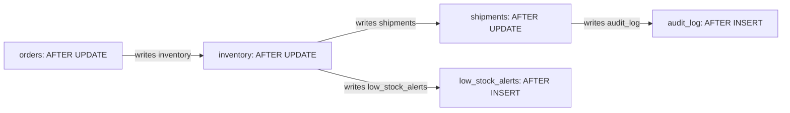

# Mapping a Cascading-Trigger Package
{: .no_toc }

*Estimated read: 3 min*

A single stored procedure is hard enough to autopsy on its own. A package of **cascading triggers**
-- `AFTER UPDATE` on `orders` fires a trigger that updates `inventory`, which fires its own trigger
that updates `shipments`, which fires a trigger that writes an audit row -- is harder for a different
reason: the execution order isn't written down anywhere. It's an emergent property of which triggers
are defined on which tables, discoverable only by reading every trigger definition in the schema and
reconstructing the chain by hand.

## Why triggers are the worst case for the autopsy method

The color-coding method from two lectures ago works within one procedure body. Cascading triggers
break that unit of analysis: the "procedure" you actually need to understand is scattered across
however many separate `CREATE TRIGGER` statements fire on each other, often written by different
people at different times, with no single file showing the full sequence. Databricks has no
trigger-cascade mechanism to replicate this behavior in -- Delta tables don't fire code on write --
so a triggers package can't be ported piece by piece. It has to be **reconstructed as an explicit
graph first, then re-expressed as an ordered set of Lakeflow Declarative Pipeline flows.**

## Building the dependency graph

For each trigger, record three things: the table it fires on, the event that fires it
(`INSERT`/`UPDATE`/`DELETE`), and every table its body writes to. Each of those writes is a
directed edge to the next trigger (if any) defined on that target table.



Once the graph exists, two things fall out of it immediately that weren't visible from reading any
single trigger body in isolation: the **true execution order** (a topological sort of the graph --
`orders` before `inventory` before `shipments` and `low_stock_alerts` before `audit_log`), and any
**fan-out** points where one trigger's write fans into more than one downstream trigger, which is
exactly what happens at `inventory` in the diagram above.

## From graph to pipeline

A topologically sorted trigger graph maps directly onto a Lakeflow Declarative Pipeline's flow
dependencies: each node becomes a flow (or a step within one), and each edge becomes that flow's
declared source. The cascading, implicit "this fires because that fired" relationship becomes an
explicit, declared dependency instead -- readable from the pipeline definition itself rather than
requiring a schema-wide trigger hunt to reconstruct.

```python
# Explicit flow ordering derived from the trigger graph, instead of
# an implicit AFTER UPDATE cascade
@dlt.append_flow(target="inventory")
def update_inventory_from_orders():
    return spark.readStream.table("orders").filter("updated")

@dlt.append_flow(target="shipments")
def update_shipments_from_inventory():
    return spark.readStream.table("inventory").filter("updated")
```

{: .important }
> Never attempt to migrate a trigger package one trigger at a time as you encounter each one in the
> source schema. Build the full dependency graph first -- including the fan-out points -- because a
> trigger migrated in isolation, before its downstream dependents are known, is how a migration ends
> up rebuilding the same cascade bug the legacy schema had, just in a new language.

The next lecture folds this graph-building step into the same worksheet that tracks business-logic
classification, giving you one document per procedure or trigger package that carries all of this
section's analysis through to the actual translation work in the next section.

<!-- prevnext:start -->

---

| [&larr; Previous: Only the Business Logic Migrates]({{ '/03-legacy-migration-to-databricks/07-the-procedure-autopsy-decomposing-pl-sql/only-the-business-logic-migrates/' | relative_url }}) | [Next: The Decomposition Worksheet &rarr;]({{ '/03-legacy-migration-to-databricks/07-the-procedure-autopsy-decomposing-pl-sql/the-decomposition-worksheet/' | relative_url }}) |
|:---|---:|

<!-- prevnext:end -->

