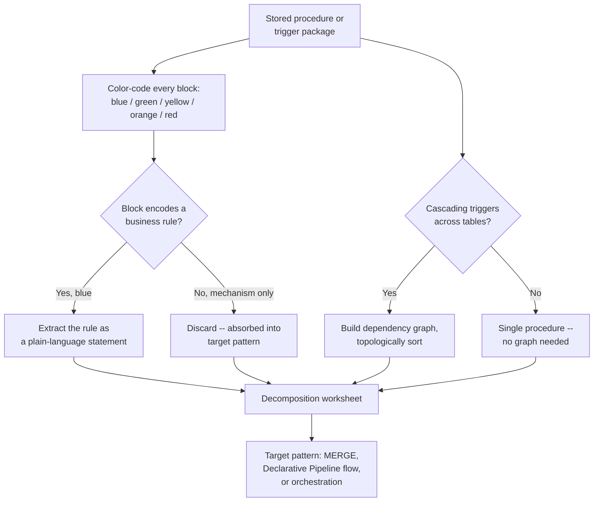

# The Procedure Autopsy: Decomposing PL/SQL

Physical design gets a table's storage right; stored procedures are where a legacy migration's real
risk concentrates, because a procedure's business logic is buried inside cursors, transaction
management, and control flow that have no direct Databricks equivalent. This section builds a
repeatable method for pulling that logic out safely: color-code every block of a procedure by
category, separate genuine business rules from procedural scaffolding the platform makes
unnecessary, reconstruct the hidden execution graph behind a cascading-trigger package, and capture
all of it on a single worksheet before any translation code gets written. That worksheet is the
handoff into the next section, where these classified blocks become actual `MERGE INTO` statements
and Lakeflow Declarative Pipeline flows.

## Lectures

| # | Lecture | Est. Read |
|---|---------|-----------|
| 1 | [Stored Procedures Are Not SQL]({{ '/03-legacy-migration-to-databricks/07-the-procedure-autopsy-decomposing-pl-sql/stored-procedures-are-not-sql/' | relative_url }}) | 3 min read |
| 2 | [The Autopsy Method: Color-Coding Every Block]({{ '/03-legacy-migration-to-databricks/07-the-procedure-autopsy-decomposing-pl-sql/the-autopsy-method-color-coding-every-block/' | relative_url }}) | 3 min read |
| 3 | [Only the Business Logic Migrates]({{ '/03-legacy-migration-to-databricks/07-the-procedure-autopsy-decomposing-pl-sql/only-the-business-logic-migrates/' | relative_url }}) | 3 min read |
| 4 | [Mapping a Cascading-Trigger Package]({{ '/03-legacy-migration-to-databricks/07-the-procedure-autopsy-decomposing-pl-sql/mapping-a-cascading-trigger-package/' | relative_url }}) | 3 min read |
| 5 | [The Decomposition Worksheet]({{ '/03-legacy-migration-to-databricks/07-the-procedure-autopsy-decomposing-pl-sql/the-decomposition-worksheet/' | relative_url }}) | 3 min read |
| 6 | [Check Your Knowledge]({{ '/03-legacy-migration-to-databricks/07-the-procedure-autopsy-decomposing-pl-sql/check-your-knowledge/' | relative_url }}) | Quiz |

<!-- prevnext:start -->

---

| [&larr; Previous: Check Your Knowledge]({{ '/03-legacy-migration-to-databricks/06-physical-design-for-delta-liquid-clustering-over-indexes/check-your-knowledge/' | relative_url }}) | [Next: Stored Procedures Are Not SQL &rarr;]({{ '/03-legacy-migration-to-databricks/07-the-procedure-autopsy-decomposing-pl-sql/stored-procedures-are-not-sql/' | relative_url }}) |
|:---|---:|

<!-- prevnext:end -->

